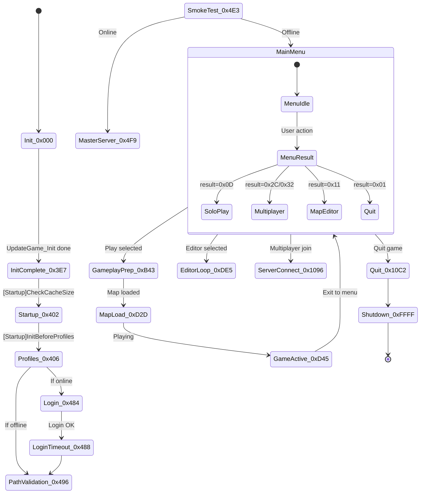

# Game Architecture

The entire Trackmania 2020 game runs through a single massive state machine in `CGameCtnApp::UpdateGame` (34,959 bytes at `0x140b78f10`). This function, called every frame, manages everything from boot to gameplay to shutdown using a coroutine-based fiber system. Understanding this architecture is essential for any recreation effort.

This page covers the architecture at two levels: first the overview of how the engine boots and runs, then a deep dive into the state machine, fiber system, memory model, and frame execution.

## How the engine starts up

The startup chain passes through code protection, CRT bootstrap, and a two-phase engine initialization before reaching the game state machine.

```
entry (0x14291e317)                     -- obfuscated entry in .D." section
  -> WinMainCRTStartup (0x141521c28)   -- MSVC CRT startup (VS2019)
    -> WinMain (0x140aa7470)            -- 640x480 default, profiling init
      -> CGbxApp::Init1 (0x140aa3220)   -- First-phase init (7401 bytes)
        -> CSystemEngine::InitForGbxGame -- File system, config
        -> CVisionEngine init           -- Graphics subsystem
        -> CInputEngine init            -- Input subsystem
        -> CAudioEngine init            -- Audio subsystem
      -> CGbxApp::Init2 (0x140aa5090)   -- DirectX, viewport, first frame
        -> CGameManiaPlanet::Start      -- Game-specific startup
          -> CGameCtnApp::Start         -- Menu/network startup
```

### WinMain sets up profiling first

WinMain at `0x140aa7470` is only 202 bytes. It sets the default window to 640x480, initializes the hierarchical profiling system (75 slots, 128 KB buffer), and transfers control to `CGbxApp::Init1`.

The profiling system instruments nearly every engine function. Each significant function starts with `FUN_140117690(local_buf, "FunctionName")` and ends with `FUN_1401176a0(local_buf, tag_id)`.

### Init1 registers 16 engine subsystems

`CGbxApp::Init1` at `0x140aa3220` (7,401 bytes) registers engine subsystems into a slot-based manager at `DAT_141f9f018`:

| Slot | Subsystem | Size | Init Function |
|---|---|---|---|
| 0x01 | Core/Memory | 0x20 | FUN_141473190 |
| 0x03 | Game Engine | 0x28 | FUN_140b48230 |
| 0x05 | Network | 0x20 | FUN_1413fdc70 |
| 0x06 | Input | 0x30 | FUN_1401ffd60 |
| 0x07 | Plug/Resource | 0xA8 | FUN_140155410 |
| 0x09 | Audio | 0x30 | FUN_140466440 |
| 0x0A | Audio Manager | 0x30 | FUN_1406d3b90 |
| 0x0B | System Config | 0xE0 | FUN_1408f0720 |
| 0x0C | Vision/Render | 0x38 | FUN_140941ee0 |
| 0x11 | Script | 0xD8 | FUN_14086e700 |
| 0x13 | Control/UI | 0x30 | FUN_1402ab310 |

Init1 also checks for "Luna Mode" (an accessibility mode triggered by UUID `41958b32-a08c-4313-a6c0-f49d4fb5a91e`) and parses command-line arguments: `/parsegbx`, `/resavegbx`, `/optimizeskin`, `/strippack`.

### Init2 brings up DirectX

`CGbxApp::Init2` at `0x140aa5090` creates the graphics viewport, initializes DirectX, and renders the first "loading" frame. On DirectX failure, it shows: `"Could not start the game!\r\n  System error, initialization of DirectX failed."`

### CSystemEngine reads game config

`CSystemEngine::InitForGbxGame` at `0x1408f56a0` reads config strings: `"Distro"`, `"WindowTitle"`, `"DataDir"` (defaults to `"GameData\\"`), and `"UGCLogAutoOpen"`. It sets up file system paths for the game data hierarchy.

### CGameManiaPlanet::Start wires up the game

`CGameManiaPlanet::Start` at `0x140cb8870` registers playground types (`"PlaygroundCommonBase"` and `"PlaygroundCommon"`), allocates a 0x208-byte state object, calls `CGameCtnApp::Start`, reads `/startuptitle` and `/title` from config, and sets the game name to `"Trackmania"`.

## How the application class hierarchy works

The application follows a deep inheritance chain from the generic GameBox base to the TrackMania-specific top level.

```
CMwNod                              -- universal base class
  CMwEngine                         -- engine base
    CSystemEngine                   -- system/OS layer
    CVisionEngine                   -- rendering backend
    CInputEngine                    -- input devices
    CNetEngine [UNKNOWN - inferred] -- networking
    CControlEngine                  -- UI controls
    CPlugEngine                     -- asset/resource system
  CGbxApp                           -- application base (Init1, Init2)
    CGameApp                        -- game application
      CGameCtnApp                   -- Creation (CTN) application
        CGameManiaPlanet            -- ManiaPlanet platform layer
          CTrackMania               -- TrackMania-specific logic
```

**Evidence**: `CGbxApp::Init1`/`Init2` provide base initialization. `CGbxGame::InitApp`/`PreInitApp`/`DestroyApp()` manage the lifecycle. `CGameManiaPlanet::Start` calls `CGameCtnApp::Start` (confirmed: `FUN_140b4eba0` called from `FUN_140cb8870`).

## How the game state machine works

The central state machine lives in `CGameCtnApp::UpdateGame`. This function runs every frame with two parameters: the `CGameCtnApp` instance and a coroutine/fiber context pointer. The context is a 0x380-byte heap object.

The current state ID lives at `context + 0x08`. State transitions write new IDs to this location. A sub-coroutine pointer at `context + 0x10` enables nested state machines.

### Coroutine yield pattern

Every state follows the same yield-and-resume pattern:

```c
// Check if sub-coroutine is active
if (*(longlong *)(uVar16 + 0x10) - 1U < 0xfffffffffffffffe) {
    iVar12 = *(int *)(*(longlong *)(uVar16 + 0x10) + 8);  // sub-state
    FUN_someFunction(param_1, uVar16 + 0x10);               // execute sub-coroutine
    if (iVar12 == -1) goto LAB_140b81895;                    // yield up
}
// Check if sub-coroutine completed
if (*(longlong *)(*param_2 + 0x10) != -1) {
    *(undefined4 *)(*param_2 + 8) = CURRENT_STATE;  // stay in this state
    goto LAB_140b81895;                               // yield
}
// Sub-coroutine done, proceed to next state
```

When `*param_2 + 0x10` equals -1, the sub-coroutine has finished. State value -1 (0xFFFFFFFF) means "terminated."

### State map across 11 phases

The 60+ states organize into clear phases:

#### Phase 0: Bootstrap (0x000 - 0x3FF)

| State ID | Purpose | Evidence |
|---|---|---|
| `0x000` | **Game Init** -- Logs `"[Game] starting game."`, allocates context, calls `UpdateGame_Init`. | `FUN_140b76b20(param_1)` |
| `0x3E7` (999) | **Init Complete** -- Set after `UpdateGame_Init` finishes. | `*(undefined4 *)(*param_2 + 8) = 999;` |
| `0x402` | **Startup Sequence** -- Runs startup tasks, logs `"[Startup]InitBeforeProfiles"`. | `FUN_140b63ef0` |
| `0x406` | **Init Before Profiles** -- Calls virtual profile system init, reads user data directories. | Virtual call `(*param_1 + 0x260)` |

#### Phase 1: Startup and validation (0x484 - 0x4F9)

| State ID | Purpose | Evidence |
|---|---|---|
| `0x484` | **Wait for Login** -- Polls authentication status at `context + 0x360`. | `*(uint *)(lVar15 + 0x54) < 2` |
| `0x488` | **Login Timeout Check** -- Verifies login completed within 1000ms. | `DAT_141ffad50 < *(int *)(uVar16 + 0xc) + 1000U` |
| `0x496` | **Network Connection Test** -- Calls `FUN_140b00500`. | State set at line 1540 |
| `0x497` | **User Profile Load** -- Calls virtual `(*param_1 + 0x288)`. | Virtual call |
| `0x4E3` | **Smoke Test Check** -- Checks for `/smoketest` command-line arg. If present, skips to quit. | `/smoketest` string |
| `0x4F9` | **Master Server Connection** -- Shows `"Checking the connection to the game master server.\nPlease wait..."`. | String evidence |

#### Phase 2-4: Connection and online flow (0x501 - 0x852)

These states handle master server connection, dialog waits, online data fetching, and profile initialization. Key states include 0x509 (network probe), 0x6AB (online data fetch), and 0x7DD (profile init).

#### Phase 5: Main menu (label LAB_140b7cdcc)

The main menu is reached by many state transitions. It calls `FUN_140b54b90(param_1, 2)` to set phase 2 ("MainMenu") and logs `"[Game] main menu."`.

#### Phase 6: Menu result dispatch (0x9A5 - 0xAFF)

Menu results dispatch from `*param_2 + 0x174`:

| Menu Result | Action | Phase |
|---|---|---|
| `0x01` | Quit/Exit | -> 0x10C2 |
| `0x07` | Open Map Browser | 0x10 |
| `0x09` | Play Map | 0x0E |
| `0x0D` | Local Play | 0x0A |
| `0x0E` | Multiplayer | 0x13 |
| `0x11` | Map Editor (new) | 0x19 |
| `0x12` | Item Editor | 0x1A |
| `0x16` | Watch Replay | 0x1C |

#### Phase 7: Gameplay loop (0xB43 - 0xCC6)

| State ID | Purpose | Evidence |
|---|---|---|
| `0xBF6` | **Load Map** -- Calls `FUN_140b57d10` with map data. | Line 3033-3047 |
| `0xC12` | **Map Load for Play** -- Calls `FUN_140c0dcc0`, creates gameplay context. | Line 538-583 |
| `0xC22` | **Wait for Play Ready** -- Polls `FUN_140b76aa0`. | Line 585-597 |

#### Phase 8: Map loading and editor (0xCD1 - 0xDE5)

| State ID | Purpose | Evidence |
|---|---|---|
| `0xCD1` | **Load Challenge Init** -- Shows `"Please wait..."` dialog. | Line 2783 |
| `0xCD2` | **Load Challenge Execute** -- Calls `FUN_140b58530` with map list. | Line 769-778 |
| `0xD2D` | **Gameplay Start** -- Creates arena context, starts physics. | Line 804-866 |
| `0xD45` | **Gameplay Active** -- Main play loop, polls readiness each frame. | Line 867-905 |
| `0xDE5` | **Editor Session** -- Calls `FUN_140b827b0` for editor loop. | Line 2332-2348 |

#### Phase 10: Multiplayer (0xF85 - 0x109A)

| State ID | Purpose | Evidence |
|---|---|---|
| `0xFE4` | **Join/Create Game** -- Calls virtual `(*param_1 + 0x350)`. | Line 687-704 |
| `0xFE8` | **Multiplayer Active** -- Dispatches to sub-states for network session. | Line 4202-4221 |
| `0x1013` | **Network Session** -- Server-client synchronization. | Line 4224-4279 |
| `0x1096` | **Server Connect** -- Logs `"Connecting to server..."`. | Line 4044-4089 |
| `0x10C2` | **Quit to Menu** -- Sets phase 5, calls `FUN_140b4d110`. | Line 1756-1761 |

#### Phase 11: Special states

| State ID | Purpose |
|---|---|
| `0xFFFFFFFF` | **Shutdown** -- Cleans up editor context, calls virtual shutdown methods. |
| `0x403` (default) | **Invalid State** -- Error handler that destroys context and terminates. |

### Game phase values

`FUN_140b54b90` sets a high-level phase integer:

| Phase | Meaning |
|---|---|
| 0 | Starting game |
| 1 | Post-init |
| 2 | Main Menu |
| 5 | Quit/shutdown |
| 6 | Multiplayer active |
| 10 (0xA) | Local play |
| 25 (0x19) | New editor |
| 256 (0x100) | Server connection |

### State machine diagram



## How the game state system works

The game uses profiling-tagged state strings for major game states:

| State String | Address |
|---|---|
| `CGameCtnApp::GameState_LocalLoopPlaying` | `0x141c8f308` |
| `CGameCtnApp::GameState_LoadChallenge` | `0x141c8eee8` |
| `CGameCtnApp::GameState_LocalLoopEditor` | `0x141c8f1a8` |
| `CGameCtnApp::GameState_LocalLoopSetUp` | `0x141c8f3c8` |
| `CTrackMania::GameState_LocalLoopSetUp` | `0x141cfb978` |

The state machine follows this high-level flow:

```
[Startup]
  -> UpdateGame_Init
  -> UpdateGame_StartUp
  -> GameState_LocalLoop (main menu / idle)
    -> GameState_LoadChallenge (map loading)
    -> GameState_LocalLoopSetUp (pre-play setup)
    -> GameState_LocalLoopPlaying (active gameplay)
    -> GameState_LocalLoopEditor (map editor)
  -> QuitGameAndExit
```

## How the network state machine works

The network subsystem runs its own state machine in parallel with the game state machine. Three major phases handle menus, connection setup, and gameplay.

### CGameCtnNetwork::MainLoop_Menus (0x140af9a40)

This 1,383-byte function manages the network while you are in menus. Its sub-state machine outputs three signals to the parent:
1. `*param_3 = 0` -- Stay at current state
2. `*param_3 = 1` -- Server selected (connect)
3. `*param_3 = 2` -- Exit menus (back to main)

### CGameCtnNetwork::MainLoop_SetUp (0x140afc320)

This 812-byte function prepares the game session after you select a server. It runs through: map preparation (`FUN_140bd1180`), resource loading (`FUN_140b28fa0`), network sync, and final sync.

### CGameCtnNetwork::MainLoop_PlaygroundPlay (0x140aff380)

This is a thin 172-byte pass-through. The actual gameplay network loop runs inside `CSmArenaClient`, not at this level.

### CSmArenaClient MainLoop states

| State String | Address |
|---|---|
| `CSmArenaClient::MainLoop_PlayGameEdition` | `0x141cf13a0` |
| `MainLoop_SoloPlayGameScript` | `0x141cf1438` |
| `MainLoop_PlayGameNetwork` | `0x141cf1500` |
| `MainLoop_RecordGhost` | `0x141cf13f0` |

## How the fiber/coroutine system works

The engine uses a "stackless coroutine" pattern -- NOT Windows fibers. Each fiber stores its state as an integer. Local variables that persist across yields live in heap-allocated context objects (sizes range from 0x18 to 0x380 bytes).

### CMwCmdFiber registration

`CMwCmdFiber::StaticInit` at `0x14002e300` registers the fiber class:

```c
FUN_1402d52e0(&DAT_141ffe4d0, 0x101e000, &DAT_141ffe240, "CMwCmdFiber", 0, 0x58);
atexit(cleanup_func);
```

- Class ID (class ID): `0x101e000`
- Instance size: `0x58` (88 bytes per fiber)
- An `atexit` cleanup handler runs at shutdown.

### Fiber context layout

The `param_2` pointer in UpdateGame is a fiber context:
- `+0x00`: Fiber object pointer (vtable)
- `+0x08`: Current state ID
- `+0x10`: Sub-fiber pointer

Setting `*(param_2 + 8) = stateId` and returning is equivalent to yielding. The next call to UpdateGame resumes at the corresponding case.

### How sub-fibers work

Many states create sub-fibers:

```c
*(undefined8 *)(*param_2 + 0x10) = 0;  // Initialize sub-fiber slot
FUN_someSubCoroutine(param_1, *param_2 + 0x10);
if (*(longlong *)(*param_2 + 0x10) != -1) {
    *(undefined4 *)(*param_2 + 8) = CURRENT_STATE;  // yield, resume here
}
```

### Fiber usage throughout the engine

Fibers follow a naming convention: `ClassName::MethodName_InternalFiberCallback`. They power:

- **Dialog workflows**: `CGameDialogs::FiberFileOpen`, `FiberFileSave`, `FiberFileSaveAs`
- **Editor operations**: `NGameEditors::FiberAskToSaveChanges`, `FiberUnsavedChangesDialogsBeforeQuit`
- **Network operations**: anti-cheat, disconnect, replay upload
- **Build/compilation**: `Build_Fiber`, `RegisterPack_Fiber`
- **Async UI updates**: `CGameManialinkBrowser::UpdateFiber`

### Fiber safety

The engine detects fiber resource exhaustion:
```
"Resource exhaust in fiber enter !!\n"    -- 0x141b67058
```

Operations detected during rendering defer to a fiber:
```
"!! InRender => Run delayed to fiber\n"   -- 0x141b671c8
```

## How ManiaScript executes

ManiaScript runs at specific points within the frame, always on the main thread. `CScriptEngine::Run` at `0x140874270` (316 bytes) drives execution.

### Execution flow

```c
void CScriptEngine_Run(longlong engine, longlong context, uint4 mode) {
    *(context + 0x60) = engine;      // link engine to context
    lVar1 = *(context + 0x10);       // get script program

    // Build dynamic profiling tag with script name
    tag_name = *(lVar1 + 0xf8) ? *(lVar1 + 0xf8) : "CScriptEngine::Run";

    // Set execution parameters
    *(context + 0x30) = *(engine + 0x20);   // copy debug mode
    *(context + 0x58) = has_errors ? 0 : 1; // run flag
    *(context + 0x08) = mode;

    // Clear output and record timestamp
    clear_buffer(context + 0x100);
    *(context + 0xc4) = global_tick_count;

    FUN_1408d1ea0(lVar1, context);  // EXECUTE SCRIPT

    *(engine + 0x60) = 0;           // unlink
}
```

### Script context layout

| Offset | Purpose |
|---|---|
| `+0x08` | Entry point / function ID |
| `+0x10` | Program/bytecode pointer |
| `+0x30` | Debug mode copy |
| `+0x58` | Execution mode (1 = normal, 0 = debug) |
| `+0xC4` | Timestamp at start of execution |
| `+0xE8` | Script name (SSO string) |
| `+0x100` | Output buffer |

### Token types and type system

The binary contains a complete ManiaScript lexer. Key tokens include `SLEEP`, `YIELD`, `WAIT`, and `MEANWHILE` for coroutine control. Built-in types: Void, Boolean, Integer, Real, Text, Vec2, Vec3, Int2, Int3, Iso4, Ident, Class. Directives: `#RequireContext`, `#Setting`, `#Struct`, `#Include`, `#Extends`, `#Command`, `#Const`.

Collection operations available via dot syntax: `add`, `remove_key`, `exists_elem`, `count`, `clear`, `sort`, `sort_rev`, `sortkey`, `from_json`, `to_json`, `slice`, and more.

## What happens during one frame

### Frame begin

Every frame starts in `FUN_140117840`:

1. The profiling context loads from TLS at `+0x1B8`.
2. Per-frame buffers clear.
3. The global frame counter `DAT_141f9cfd0` increments.
4. Delta time computes from the previous frame timestamp.
5. The "Total" profiling tag begins.

### Main update tick

During gameplay (state 0xD45), the frame executes in this order:

```
1. PROFILING BEGIN
   FUN_140117690("CGameCtnApp::UpdateGame")

2. STATE MACHINE DISPATCH
   Read state from *(context + 0x08), dispatch to case 0xD45

3. GAMEPLAY POLL
   FUN_140b76aa0(editor_context)
   -> Returns 0: continue gameplay
   -> Returns non-0: gameplay over

   Within this poll, engine callbacks drive subsystems:

   a. INPUT PROCESSING
      CInputEngine reads hardware state via callback at +0x70

   b. PHYSICS SIMULATION
      CSmArenaClient::MainLoop_* runs physics at fixed timestep

   c. SCRIPT EXECUTION
      CScriptEngine::Run processes ManiaScript (after physics)

   d. NETWORK UPDATE (multiplayer only)
      CGameCtnNetwork::MainLoop_PlaygroundPlay (thin pass-through)

   e. UI/CONTROL ENGINE UPDATE
      CControlEngine phases: ControlsFocus -> ContainersFocus ->
      ContainersValues -> ControlsValues -> ContainersDoLayout ->
      ControlsEffects -> ContainersEffects

4. RENDERING (callback at +0x90)
   NVisionCameraResourceMgr::StartFrame -> scene rendering ->
   texture upload -> HDR bloom -> Dxgi_Present_HookCallback

5. ASYNC UPDATES (worker threads)
   NHmsLightMap, NSceneVFX, NSceneVehicleVis, NSceneFxSystem,
   NSceneParticleVis, NSceneWeather, CSmArenaClient (all UpdateAsync)

6. PROFILING END
```

### Frame budget

The profiling system defines two budgets:
- **Outer**: 20,000 microseconds (20ms = 50 FPS minimum)
- **Inner**: 10,000 microseconds (10ms)

## How memory works

### CMwNod reference counting

All engine objects inherit from CMwNod with this base layout:

```
+0x00: vtable pointer (8 bytes)
+0x08: [UNKNOWN - possibly class ID or flags] (8 bytes)
+0x10: reference count (4 bytes, int32)
```

AddRef increments `*(object + 0x10)`. Release decrements it and calls `FUN_1402cfae0()` (destructor chain) when it reaches zero. This is a classic COM-style pattern.

### Allocator hierarchy

| Allocator | Purpose |
|---|---|
| `thunk_FUN_1408de480` | Primary object allocator (called hundreds of times) |
| `NAllocHeap::FastAllocator_Alloc` | General-purpose fast allocator |
| `NFastBlockAlloc::SAllocator` | Fixed-size block allocator |
| `NFastBucketAlloc::SAllocator` | Bucket-based (size classes) |
| `CFastLinearAllocator` | Linear/bump allocator |
| Frame allocator | Per-frame temporaries, bulk-freed at frame boundaries |

The engine detects out-of-memory with a retry dialog and tracks memory leaks in debug builds.

### SSO string optimization

Strings use a 16-byte structure with Small String Optimization:

```
+0x00: pointer/inline buffer (8 bytes)
+0x0B: SSO flag (1 byte) - if non-zero, +0x00 is a heap pointer
+0x0C: length (4 bytes)
```

Strings up to ~11 bytes store inline. Longer strings allocate on the heap.

## How threads work

The engine uses Thread-Local Storage extensively. Key TLS offsets:

| Offset | Purpose |
|---|---|
| `+0x10` | TLS init flag |
| `+0x148` | Console/log output object |
| `+0x1B8` | Profiling context |

Two thread pool systems exist: the Windows ThreadPool API (timers, waits, work items) and a custom `NClassicThreadPool` (fork-join pattern via `AddJobs`/`TaskWaitComplete`).

Two global flags control execution mode:
- `DAT_141fbbee8`: Headless mode (skip all rendering)
- `DAT_141fbbf0c`: Dedicated server mode

Both skip viewport config, render callbacks, and UI operations when set.

## How errors are handled

The profiling system has special handling for `"AssertDialog"` -- it bypasses normal profiling when an assertion fires.

Key error messages:

| Error | Context |
|---|---|
| `"Could not start the game!\r\n  System error, initialization of DirectX failed."` | DirectX init failure |
| `"You are not connected to an online account."` | No login |
| `"%1 is not part of the official campaign."` | Non-campaign map |
| `"!! Out of memory error !!"` | Memory exhaustion (retry dialog) |

The default state handler (case 0x403) cleanly destroys the fiber and terminates the state machine, preventing infinite loops on unrecognized states.

### Shutdown sequence

`CGameApp::QuitGameAndExit` at `0x140b4d140` logs `"CGameApp::QuitGame...()"`, disconnects the network module, runs cleanup sub-coroutines, logs `"CGameApp::..AndExit()"`, calls engine shutdown, and sets the fiber to -1 (terminated).

## Command-line arguments

| Argument | Purpose |
|---|---|
| `/smoketest` | Automated test mode -- launches, reaches main menu, then quits |
| `/validatepath` | Path validation mode -- verifies game data paths |
| `/startuptitle` | Set initial title/mode at startup |
| `/parsegbx` | Parse GBX files without running game |
| `/resavegbx` | Re-save GBX files (format conversion) |
| `/optimizeskin` | Optimize skin resources |
| `/strippack` | Strip resource packs |

## Key global data addresses

| Address | Description |
|---|---|
| `DAT_141fbbf90` | Engine startup timestamp |
| `DAT_141fbbee8` | Headless mode flag |
| `DAT_141fbbf0c` | Dedicated server flag |
| `DAT_141f9f018` | Engine subsystem table pointer |
| `DAT_141ffad50` | Global tick counter |
| `DAT_141f9cfd0` | Global frame counter |

## Related Pages

- [00-master-overview.md](00-master-overview.md) -- Project overview and navigation
- [01-binary-overview.md](01-binary-overview.md) -- Binary structure and protection
- [02-class-hierarchy.md](02-class-hierarchy.md) -- Class system and subsystem map
- [04-physics-vehicle.md](04-physics-vehicle.md) -- Vehicle physics simulation
- [10-physics-deep-dive.md](10-physics-deep-dive.md) -- Force models and sub-stepping

<details><summary>Analysis metadata</summary>

**Binary**: `Trackmania.exe` (Trackmania 2020 by Nadeo/Ubisoft)
**Date**: 2026-03-27
**Tools**: Ghidra 12.0.4 via PyGhidra bridge
**Data sources**: Entry point analysis, string cross-references, function decompilation, call graph analysis, decompiled architecture functions (34,959-byte `CGameCtnApp::UpdateGame` + 22 supporting functions)

</details>
