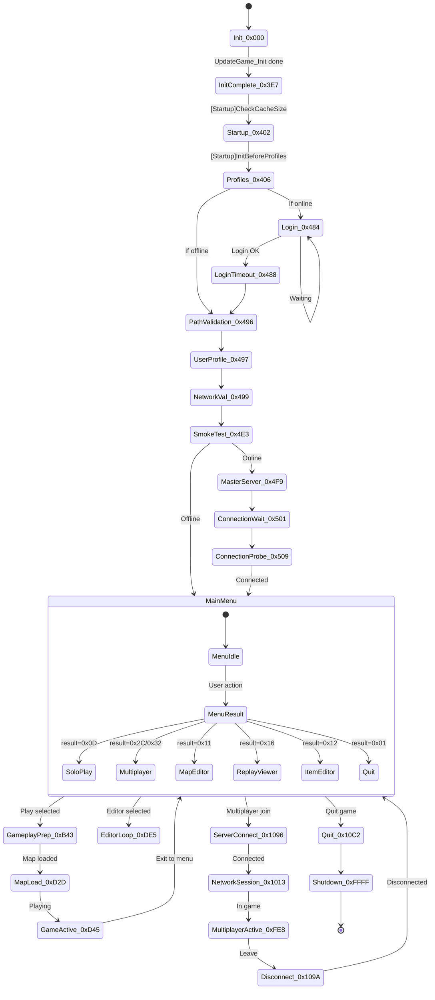
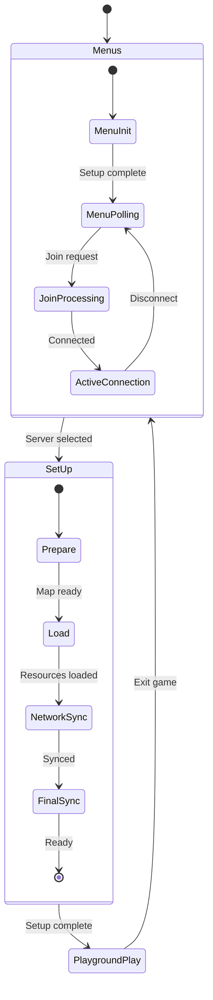
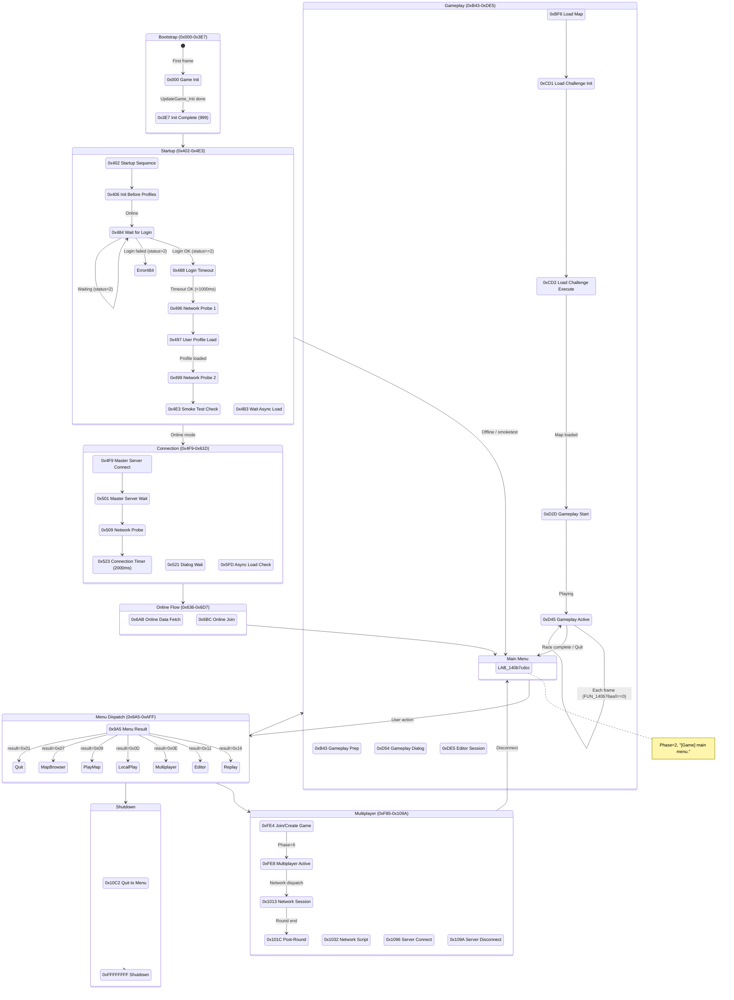

# Trackmania 2020 Architecture Deep Dive

**Binary**: `Trackmania.exe` (Trackmania 2020 by Nadeo/Ubisoft)
**Date**: 2026-03-27
**Sources**: Decompiled architecture functions via Ghidra (34,959-byte `CGameCtnApp::UpdateGame` + 22 supporting functions)
**Purpose**: Exhaustive documentation for browser engine recreation

---

## Table of Contents

1. [Complete Game State Machine](#1-complete-game-state-machine)
2. [Network State Machine](#2-network-state-machine)
3. [Initialization Sequence](#3-initialization-sequence)
4. [Fiber/Coroutine System](#4-fibercoroutine-system)
5. [ManiaScript Engine](#5-maniascript-engine)
6. [Frame Loop Execution Order](#6-frame-loop-execution-order)
7. [Memory Management](#7-memory-management)
8. [Thread Model](#8-thread-model)
9. [Error Handling](#9-error-handling)
10. [Browser Recreation Implications](#10-browser-recreation-implications)
11. [Life of a Session (Launch to Quit)](#11-life-of-a-session-launch-to-quit)
12. [Life of a Map Session (Click 'Play' to Driving)](#12-life-of-a-map-session-click-play-to-driving)
13. [Life of a Frame](#13-life-of-a-frame)
14. [Complete State Machine Diagram](#14-complete-state-machine-diagram)
15. [ManiaScript Execution Model](#15-maniascript-execution-model)
16. [Network State Machine During Gameplay](#16-network-state-machine-during-gameplay)
17. [Memory Model](#17-memory-model)
18. [Command-Line Arguments](#18-command-line-arguments)
19. [Browser Architecture Mapping](#19-browser-architecture-mapping)
20. [Open Questions and Unknowns](#20-open-questions-and-unknowns)

---

## 1. Complete Game State Machine

### 1.1 Architecture Overview

The game's central state machine lives in `CGameCtnApp::UpdateGame` at address `0x140b78f10` (34,959 bytes / ~35KB of decompiled C). The function is called every frame with two parameters:
- `param_1` (longlong*): the `CGameCtnApp` instance (`this` pointer)
- `param_2` (ulonglong*): a coroutine/fiber context pointer

**Evidence**: The function begins with profiling instrumentation:
```c
FUN_140117690(local_1298, "CGameCtnApp::UpdateGame");  // line 450
```

The state is stored at offset `+0x08` in the context object pointed to by `*param_2`:
```c
uVar14 = *(uint *)(uVar16 + 8);  // line 461 - read current state ID
```

State transitions are performed by writing new state IDs:
```c
*(undefined4 *)(*param_2 + 8) = 0xXXXX;  // set next state
```

The context object is allocated as 0x380 bytes:
```c
lVar15 = thunk_FUN_1408de480(0x380);  // line 453
```

### 1.2 Coroutine-Based State Machine Pattern

Every state follows the same pattern for yielding and resuming. The pattern uses a sub-coroutine pointer at `*param_2 + 0x10`:

```c
// Check if sub-coroutine is active
if (*(longlong *)(uVar16 + 0x10) - 1U < 0xfffffffffffffffe) {
    iVar12 = *(int *)(*(longlong *)(uVar16 + 0x10) + 8);  // sub-state
    FUN_someFunction(param_1, uVar16 + 0x10);               // execute sub-coroutine
    if (iVar12 == -1) goto LAB_140b81895;                    // yield up
}
// Check if sub-coroutine completed
if (*(longlong *)(*param_2 + 0x10) != -1) {
    *(undefined4 *)(*param_2 + 8) = CURRENT_STATE;  // stay in this state
    goto LAB_140b81895;                               // yield
}
// Sub-coroutine done, proceed to next state
```

When `*param_2 + 0x10` == -1, the sub-coroutine has finished. When it is non-zero/non-negative-one, it is still running. State value -1 (0xFFFFFFFF) means "terminated."

### 1.3 Complete State Map

The following states were extracted from the massive switch statement in `CGameCtnApp::UpdateGame`. State IDs are hexadecimal values stored at `context + 0x08`.

#### Phase 0: Bootstrap (States 0x000 - 0x3FF)

| State ID | Name/Purpose | Evidence |
|----------|-------------|----------|
| `0x000` | **Game Init** - Initial state after context allocation. Logs `"[Game] starting game."` (line 1107), initializes context fields (0x78, 0x140, 0x148, 0x160, 0x2C0-0x310), calls `UpdateGame_Init` sub-coroutine. | `FUN_140b76b20(param_1)` at line 1144/1151 |
| `0x3E7` (999) | **Init Complete** - Set after `UpdateGame_Init` finishes (line 1154). Falls through to 0x402. | `*(undefined4 *)(*param_2 + 8) = 999;` |
| `0x402` | **Startup Sequence** - Calls `FUN_140b63ef0` (startup tasks), then logs `"[Startup]InitBeforeProfiles"` (line 1195). Falls through to 0x406. | `FUN_140117790("[Startup]InitBeforeProfiles",1,0);` |
| `0x406` | **Init Before Profiles** - Calls virtual `(*param_1 + 0x260)` (profile system init). Reads path data from system config for user data directories. | Virtual call at line 1201/1208 |

#### Phase 1: Startup & Validation (States 0x484 - 0x4F9)

| State ID | Name/Purpose | Evidence |
|----------|-------------|----------|
| `0x484` | **Wait for Login** - Waits for authentication/login response at `context + 0x360`. Checks status field at `+0x54`: if < 2, loops; if == 2, records timestamp; if > 2, formats error `"%1 (code %2/%3)"` (line 1378). | `*(uint *)(lVar15 + 0x54) < 2` |
| `0x488` | **Login Timeout Check** - Checks if login timer exceeded (current_time < login_time + 1000). If OK, logs `"...OK"`. If error, logs `"...ERROR: %1"`. | `DAT_141ffad50 < *(int *)(uVar16 + 0xc) + 1000U` |
| `0x496` | **Network Connection Test** - Calls `FUN_140b00500` (network validation). Sub-coroutine based. | State set at line 1540 |
| `0x497` | **User Profile Load** - Calls virtual `(*param_1 + 0x288)` with args (1, 0). | Virtual call at line 1553 |
| `0x499` | **Network Validation 2** - Secondary network check via `FUN_140b00ce0`. | State set at line 1579 |
| `0x4B3` | **Wait for Async Load** - Waits for resource at `context + 0x368` to reach status >= 2. | `*(uint *)(*(longlong *)(uVar16 + 0x368) + 0x54) < 2` |
| `0x4E3` | **Smoke Test Check** - Checks for `/smoketest` command-line arg. If present or `FUN_1401dd960` returns true, sets `context + 100 = 1`. | `/smoketest` string at line 1597 |
| `0x4F9` | **Master Server Connection** - Calls `FUN_140bc6c40` (network client connect). Displays dialog: `"Checking the connection to the game master server.\nPlease wait..."` with Cancel button (line 1073). | String evidence at line 1073 |

#### Phase 2: Connection & Server Check (States 0x501 - 0x61D)

| State ID | Name/Purpose | Evidence |
|----------|-------------|----------|
| `0x501` | **Master Server Wait** - Waits for dialog result. Calls `FUN_140b00500` for network probe. | Transition from 0x4F9 |
| `0x509` | **Network Probe** - Combined network/dialog check. If dialog cancelled, goes to menus. | State set at line 4299 |
| `0x518` | [UNKNOWN] - Part of the connection flow | Switch case reference |
| `0x521` | **Dialog Wait (Connection)** - Waits for `FUN_140aee0e0` dialog result (offset `+0x98`). | `*(int *)(lVar15 + 0x98) == 0` |
| `0x523` | **Connection Timer** - Checks elapsed time (2000ms timeout). | `*(int *)(uVar16 + 0xc) + 2000U <= uVar14` |
| `0x54A` | [UNKNOWN] - Post-connection | Switch case reference |
| `0x567` | [UNKNOWN] - Post-connection | Switch case reference |
| `0x5B7` | [UNKNOWN] - Post-connection | Switch case reference |
| `0x5D9` | [UNKNOWN] - Post-connection | Switch case reference |
| `0x5FD` | **Async Load Complete** - Checks async resource via `FUN_14031b300`. If not done, stays. If done, cleans up and falls through. | `iVar12 = FUN_14031b300(uVar17)` |
| `0x61D` | [UNKNOWN] - Post-connection | Switch case reference |

#### Phase 3: Online Flow (States 0x636 - 0x6D7)

| State ID | Name/Purpose | Evidence |
|----------|-------------|----------|
| `0x636` | [UNKNOWN] - Online menu flow | Switch case reference |
| `0x650` | [UNKNOWN] - Online menu flow | Switch case reference |
| `0x680` | [UNKNOWN] - Online menu flow | Switch case reference |
| `0x6AB` | **Online Data Fetch** - Fetches multiple data objects via `FUN_140103e50` from `DAT_141fbd4d8`. Calls `_guard_check_icall` for validation. | Complex multi-object fetch at line 943-971 |
| `0x6B5` | [UNKNOWN] - Online data | Switch case reference |
| `0x6BC` | **Online Join** - Calls `FUN_140b00ce0` with connection parameters. | `FUN_140b00ce0(uVar17,*param_2 + 0x10,uVar13,1)` |
| `0x6D7` | [UNKNOWN] - Online flow complete | Goto target |

#### Phase 4: Dialog & Navigation (States 0x733 - 0x852)

| State ID | Name/Purpose | Evidence |
|----------|-------------|----------|
| `0x733` | **Dialog Pending** - Waits for `aee0e0` dialog result. If answered, calls `FUN_140b4d110` and transitions to 0x736. | Dialog check pattern |
| `0x736` | **Dialog Result Processing** | Set from 0x733 |
| `0x78A` | **Replay/Update Check** - Calls `FUN_140b02150`, then `FUN_140c12350` for version data. Compares against stored versions at `+0x170`, `+0x174`. | Version comparison at line 1724-1727 |
| `0x794` | **Download/Update** - Calls `FUN_140ca44a0` for content download. If `+0x17c == 0`, transitions to 0x10C2. | `FUN_140ca44a0(uVar17, uVar16+0x10, uVar16+0x180, uVar16+0x198)` |
| `0x7C5` | **Dialog Wait (Generic)** - Standard dialog wait. Sets `+0x22C = 1` on completion. | Standard dialog pattern |
| `0x7D1` | **Display Info Wait** - Calls `FUN_140b77df0` (display update). | `FUN_140b77df0(*param_2 + 0x10, uVar17)` |
| `0x7D9` | **Pass-through** - Empty state, falls through to menu result processing. | Empty case body |
| `0x7DD` | **Profile Init** - Calls virtual `(*param_1 + 0x270)` with headless mode check. | `DAT_141fbbee8 == 0` |
| `0x7E7` | **Network Client Disconnect** - Calls `FUN_140b05270` for network disconnect. | `FUN_140b05270(uVar17, *param_2+0x10, uVar13)` |
| `0x7F6` | **Post-Disconnect Cleanup** - Calls virtual `(*param_1 + 0x268)` (cleanup). Records timestamp. | Virtual call at line 1883/1887 |
| `0x800` | **Post-Cleanup Wait** - 2000ms timer check (same pattern as 0x523). Calls `FUN_140bbcb70` to check readiness. | `uVar14 < *(int *)(*param_2 + 0xc) + 2000U` |
| `0x818` | **Path Validation** - Calls virtual `(*param_1 + 0x298)` for path validation. Checks `/validatepath` arg. | `"/validatepath"` string |
| `0x81F` | **Wait for Sync** - Calls `FUN_140bbcbd0` to wait for sync completion. Then calls `FUN_140c7beb0` and `FUN_140cd9080`. | `iVar12 = FUN_140bbcbd0(uVar17)` |
| `0x852` | **Custom Path Load** - Calls virtual `(*param_1 + 0x3f8)` for custom path processing. | Virtual call at line 1940 |

#### Phase 5: Main Menu (State 0xCDCC - the "Main Menu" target)

The label `LAB_140b7cdcc` is the main menu entry point. It is the target of many state transitions and represents the game being at the main menu. Key actions at this label:

```c
FUN_140b54b90(param_1, 2);               // Set game phase = 2 ("MainMenu")
FUN_1402d3df0(&DAT_141ffacd0, 1);        // Reset frame timer
// Log "[Game] main menu."
```

**Evidence** (line 2033):
```c
local_d78 = "[Game] main menu.";
```

After reaching main menu, it:
1. Clears game state flags (`param_1 + 0x3f = 0`)
2. Resets display mode (`FUN_140be08c0(param_1[3], 0)`)
3. Clears network settings
4. Processes pending navigation commands (e.g., `/startuptitle` from URL)

#### Phase 6: Menu Result Dispatch (States 0x9A5 - 0xAFF)

These states handle the result of menu interactions. The menu result value is stored at `*param_2 + 0x174`:

| Menu Result | Action | State | Evidence |
|------------|--------|-------|----------|
| `0x01` | **Quit/Exit** | Goes to 0x10C2 via `LAB_140b8185e` | `if (iVar12 == 1) goto LAB_140b8185e;` |
| `0x07` | **Open Map Browser** | Phase 0x10, loads via `FUN_140b57d10` | `FUN_140b54b90(param_1, 0x10)` |
| `0x08` | **Load Map From List** | Phase 0x0D | `FUN_140b54b90(param_1, 0xd)` |
| `0x09` | **Play Map** | Phase 0x0E, resolves map path | `FUN_140b54b90(param_1, 0xe)` |
| `0x0A` | **Official Campaign Map** | Phase 0x0F | `FUN_140b54b90(param_1, 0xf)` |
| `0x0D` | **Local Play** | Phase 0x0A, `"LocalPlay"` match settings | `"LocalPlay"` string |
| `0x0E` | **Multiplayer** | Phase 0x13 | `*(undefined4 *)(*param_2 + 0x2cc) = 10;` |
| `0x0F` | **Join Game** | Phase 0x14, `*(+0x2cc) = 10` | line 2964 |
| `0x10` | **Map Editor (old)** | Goes to 0xF7BB | `if (iVar12 == 0x10) goto LAB_140b7f7bb;` |
| `0x11` | **Map Editor (new)** | Phase 0x19, editor loop | line 2971 |
| `0x12` | **Item Editor** | Phase 0x1A, `*(+0x2cc) = 8` | line 2973-2978 |
| `0x13` | **Ghost Replay Viewer** | State 0xA8F | line 2999-3002 |
| `0x16` | **Watch Replay** | Phase 0x1C, `*(+0x2cc) = 12` | line 3391-3398 |
| `0x18` | **Custom Content** | Phase 0x1F, `*(+0x2cc) = 11` | line 2981-2988 |
| `0x1A` | **Unknown** | Phase 0x21, `*(+0x2cc) = 13` | line 2990-2997 |
| `0x1B` | **Editor Choice Dialog** | Shows "Use the new editor" dialog | line 2927-2941 |
| `0x1C` | **Server Connection** | State 0x9D6 | line 2222-2256 |
| `0x1D` | **Server Management** | State 0x9E8 | line 2258-2268 |
| `0x1E` | **Replay Browser** | State 0x9FF | line 2270-2286 |
| `0x1F` | **Pause Menu** | State 0xA1B | line 2288 |
| `0x20` | **Skin Manager** | Calls `FUN_140e28d40` | line 2514-2532 |
| `0x21` | **Mode Settings** | Stores mode at `param_1 + 0x544` | line 3637-3646 |
| `0x22` | **Podium Win Pose** | Sets `param_1[0x9f] = 1`, `"Podium win pose"` | line 2295-2298 |
| `0x23` | **Podium Lose Pose** | Sets `param_1 + 0x4fc = 1`, `"Podium lose pose"` | line 2300-2303 |
| `0x24` | **Open URL 1** | State 0xAE3 | line 3648-3651 |
| `0x25` | **Open URL 2** | State 0xAE9 | line 3653-3656 |
| `0x26` | **Config Edit** | Calls `FUN_140ca3a70` | State 0xAF4 |
| `0x27` | **Settings** | Calls `FUN_140b688b0` | State 0xAEF |
| `0x28` | **Input Config** | Calls `FUN_140b67c40` | State 0xAF9 |
| `0x29` | **Achievements/Stats** | Calls virtual `(*+0x2f8)` | State 0xAA4 |
| `0x2A` | **Open Manialink** | Goes to `LAB_140b806b1` | line 3390 |
| `0x2B` | **Not Connected Error** | Shows `"You are not connected to an online account."` dialog | line 2554-2572 |
| `0x2C` | **Server Start (Dedicated)** | Sets up server params at `+0x2D8 = 4`, `+0x354 = 1` | line 2534-2550 |
| `0x32` | **Server Start (Listen)** | Similar to 0x2C but `+0x354 = 0` | line 2604 |

#### Phase 7: Gameplay Loop (States 0xB43 - 0xCC6)

| State ID | Name/Purpose | Evidence |
|----------|-------------|----------|
| `0xB43` | **Gameplay Preparation** - Calls virtual `(*param_1 + 0x340)` (gameplay setup). | Virtual call at line 3844/3848 |
| `0xBC6` | **Dialog: Not Official Campaign** - Shows `"%1 is not part of the official campaign."` dialog | String at line 3758 |
| `0xBD9` | **Load Map for Editor** - Calls `FUN_140b57d10` with map data. | Line 3201-3210 |
| `0xBF6` | **Load Map for Gameplay** - Same as BD9 but different source. | Line 3033-3047 |
| `0xBFC` | **Gameplay Event Poll** - Polls for game events (0x64=loading, 0x69=cancel, 0x7D=play, 0x7C=edit). | `FUN_140af0e90(param_1[0x6a], eventId)` |
| `0xC12` | **Map Load for Play** - Complex setup: calls `FUN_140c0dcc0`, creates editor context (0xD8 bytes), starts gameplay. | Line 538-583 |
| `0xC22` | **Wait for Play Ready** - Calls `FUN_140b76aa0` to check readiness. On ready, cleans up and calls `FUN_140c0e290`. | Line 585-597 |
| `0xC6E` | **Dialog Wait (Load Map)** - Waits for dialog, then calls `FUN_140b4d110`. Transitions to 0xC70. | Line 599-608 |
| `0xC74` | **Replay Validation** - Calls virtual `(*param_1 + 0x278)` for replay check. | Line 2668-2681 |
| `0xC79` | **Map Path Resolution** - Calls `FUN_140b57d10` with path resolver at `+0x1710` and `+0x100`. | Line 2626-2640 |
| `0xC93` | **Post-Load Ghost** - Calls `FUN_140ef83f0` for ghost replay processing. | Line 2721-2735 |
| `0xCC6` | [UNKNOWN] - Late gameplay state | Switch case reference |

#### Phase 8: Map Loading & Editor (States 0xCD1 - 0xDE5)

| State ID | Name/Purpose | Evidence |
|----------|-------------|----------|
| `0xCD1` | **Load Challenge (Init)** - Shows `"Please wait..."` dialog, initializes sub-coroutine, transitions to 0xCD2. | Line 2783 |
| `0xCD2` | **Load Challenge (Execute)** - Calls `FUN_140b58530` with map list at `param_1[0x6a] + 0x1710`. | Line 769-778 |
| `0xCEF` | **Load Replay (Init)** - Shows `"Please wait..."` dialog, transitions to 0xCF0. | Line 2807 |
| `0xCF0` | **Load Replay (Execute)** - Calls virtual `(*param_1 + 0x3f0)` with replay data. | Line 786-798 |
| `0xD0C` | **Multi-Map Load** - Iterates over map list, calls `FUN_140b785c0` for each. | Line 2887-2908 |
| `0xD10` | **Map Path Resolve** - Calls `FUN_140b78450` for path resolution. | Line 2845-2856 |
| `0xD2D` | **Gameplay Start (From Map)** - Calls `FUN_140c0dcc0`, creates gameplay context. Checks event flags 0x7D, 0x7E, 0x80. | Line 804-866 |
| `0xD45` | **Gameplay Active** - Calls `FUN_140b76aa0` to check play readiness. On timeout/quit, calls `FUN_140dd3330`. | Line 867-905 |
| `0xD54` | **Gameplay Dialog Wait** - Waits for dialog during gameplay. | Line 907-917 |
| `0xD7E` | **Script Settings Edit** - Calls virtual `(*param_1 + 800)` for script editor. | Line 3141-3156 |
| `0xD9B` | [UNKNOWN] - Map/editor state | Switch case reference |
| `0xDB5` | [UNKNOWN] - Map/editor state | Switch case reference |
| `0xDD9` | **Load Challenge (Virtual)** - Calls virtual `(*param_1 + 0x420)` with play parameters. | Line 729-743 |
| `0xDDD` | **Post-Load Setup** - Calls `FUN_140c0dcc0` with map data from `DAT_142076cf0`. | Line 746-762 |
| `0xDE5` | **Editor Session** - Calls `FUN_140b827b0` for editor loop. On completion, calls `FUN_140b62070`. | Line 2332-2348 |

#### Phase 9: Replay & Podium (States 0xE14 - 0xF3D)

| State ID | Name/Purpose | Evidence |
|----------|-------------|----------|
| `0xE14` | **Replay Playback** - Calls virtual at `(*param_1 + 0xFB)`, then `+0x1A8`. | Line 2423-2434 |
| `0xEBD` | **Custom Editor Loop** - Calls virtual `(*param_1 + 0x3C) -> +0x100`. Checks `+0x20` for exit. | Line 3981-3989 |
| `0xF3D` | **Replay/Editor Finish** - Calls `FUN_140b769f0 -> +0x1A8`. Checks ghost data at `+0x5F8`. | Line 3914-3937 |

#### Phase 10: Multiplayer (States 0xF85 - 0x109A)

| State ID | Name/Purpose | Evidence |
|----------|-------------|----------|
| `0xF85` | **Multiplayer Main** - Calls virtual `(*param_1 + 0x3C) -> +0x100` for multiplayer UI. | Line 670-676 |
| `0xF9A` | **Pre-Play Setup** - Calls `FUN_140b827b0` for preparation. | Line 3412-3425 |
| `0xFA7` | **Download Content** - Calls `FUN_140b78da0` with download params. | Line 3561-3574 |
| `0xFD3` | **Input Remap** - Calls `FUN_140bb1140` with input device. | Line 3484-3500 |
| `0xFE4` | **Join/Create Game** - Calls virtual `(*param_1 + 0x350)` with game parameters. On completion, transitions to 0xFE8 via `FUN_140b54b90(param_1, 6)`. | Line 687-704 |
| `0xFE8` | **Multiplayer Active** - The in-game multiplayer state. Initializes session at `+0x31C`, `+0x320`, `+0x328-0x358`. Dispatches to sub-states 0x1013, 0x101C, 0x1024, 0x1032, 0x1057, 0x105F. | Line 4202-4221 |
| `0x1013` | **Network Session** - Calls virtual `(*param_1 + 0x360)` for network game loop. | Line 4224-4279 |
| `0x101C` | **Post-Round** - Calls virtual `(*param_1 + 0x408)` for round end processing. | Line 4244-4275 |
| `0x1024` | **Map Change** - Calls `FUN_140c4aa60` for map transition. | Line 4261-4271 |
| `0x1032` | **Network Script** - Calls virtual `(*param_1 + 0x370)` for network script execution. | Line 3445-3461 |
| `0x1057` | **Network Score/Timer** - Calls virtual `(*param_1 + 0x3d8)` with score/timer data. | Line 3605-3627 |
| `0x105F` | **Network Replay** - Calls `FUN_140b769f0 -> +0x1A8`. | Line 3584-3597 |
| `0x1072` | **Validation Loop** - Calls `FUN_140eb3d60` for validation. | Line 4178-4193 |
| `0x1096` | **Server Connection Active** - Calls `FUN_140bcdf80` for server main loop. Logs `"Connecting to server..."`. | Line 4044-4089 |
| `0x109A` | **Server Disconnect** - Calls `FUN_140bcdf80`, then logs `"... Disconnected"`. | Line 4108 |
| `0x10C2` | **Quit to Menu** - `FUN_140b54b90(param_1, 5)`, `FUN_140b4d110`. | Line 1756-1761 |

#### Phase 11: Special States

| State ID | Name/Purpose | Evidence |
|----------|-------------|----------|
| `0xFFFFFFFF` | **Shutdown** - Calls `FUN_140aefef0(param_1, 1, 0)`, `FUN_140dd2e40`, `FUN_140dd2e90`. Cleans up editor context. Calls virtual `(*param_1 + 0x550)` and `(*param_1 + 0x548)`. | Line 644-660 |
| `0x403` (default) | **Invalid State** - Destroys context and sets `*param_2 = -1`. This is the error/reset handler. | Line 1628-1634 |

### 1.4 State Diagram (Mermaid)



### 1.5 Game Phase Values

The function `FUN_140b54b90` is called with a "phase" integer that represents the high-level game phase. Observed values:

| Phase | Context | Evidence |
|-------|---------|---------|
| 0 | Starting game | `FUN_140b54b90(param_1, 0)` at line 1119 |
| 1 | Post-init | `FUN_140b54b90(param_1, 1)` at line 1161 |
| 2 | Main Menu | `FUN_140b54b90(param_1, 2)` at line 2019 |
| 3 | Path validation | `FUN_140b54b90(param_1, 3)` at line 4172 |
| 4 | Validate path mode | `FUN_140b54b90(param_1, 4)` at line 1912 |
| 5 | Quit/shutdown | `FUN_140b54b90(param_1, 5)` at line 1757 |
| 6 | Multiplayer active | `FUN_140b54b90(param_1, 6)` at line 699 |
| 10 (0xA) | Local play | `FUN_140b54b90(param_1, 10)` at line 2609 |
| 13 (0xD) | Map load from list | `FUN_140b54b90(param_1, 0xd)` at line 3195 |
| 14 (0xE) | Play map | `FUN_140b54b90(param_1, 0xe)` at line 3233 |
| 15 (0xF) | Campaign | `FUN_140b54b90(param_1, 0xf)` at line 3740 |
| 16 (0x10) | Map browser | `FUN_140b54b90(param_1, 0x10)` at line 3018 |
| 17 (0x11) | Multiplayer local | `FUN_140b54b90(param_1, 0x11)` at line 3129 |
| 18 (0x12) | Podium setup | `FUN_140b54b90(param_1, 0x12)` at line 2323 |
| 19 (0x13) | Join online | `FUN_140b54b90(param_1, 0x13)` at line 2497 |
| 20 (0x14) | Join game | `FUN_140b54b90(param_1, 0x14)` at line 2962 |
| 22 (0x16) | Map editor | `FUN_140b54b90(param_1, 0x16)` at line 3939 |
| 25 (0x19) | New editor | `FUN_140b54b90(param_1, 0x19)` at line 3871 |
| 26 (0x1A) | Item editor | `FUN_140b54b90(param_1, 0x1a)` at line 2973 |
| 28 (0x1C) | Watch replay | line 3393 |
| 31 (0x1F) | Custom content | line 2982 |
| 33 (0x21) | Unknown mode | line 2991 |
| 34 (0x22) | New editor (alt) | `FUN_140b54b90(param_1, 0x22)` at line 2947 |
| 35 (0x23) | Gameplay loop enter | `FUN_140b54b90(param_1, 0x23)` at line 2324/3401 |
| 256 (0x100) | Server connection | `FUN_140b54b90(param_1, 0x100)` at line 4019 |

---

## 2. Network State Machine

### 2.1 CGameCtnNetwork::MainLoop_Menus (0x140af9a40)

Size: 1383 bytes. Profiling tag: `"CGameCtnNetwork::MainLoop_Menus"`

This function manages the network state while the player is in menus. It has its own sub-state machine at `context + 0x08`:

| State | Purpose | Evidence |
|-------|---------|---------|
| `0x000` | **Init** - Checks `param_1[0x5B]` for menu mode. If mode == 0 and not headless/dedicated, falls through to menu setup. If mode == 3, enters LAN/join flow. | `(int)param_1[0x5b]` check |
| `0xEA5` | **Join Processing** - Calls `FUN_140afa950` with join parameters from `param_1 + 0x5C`. | `FUN_140afa950(param_1, puVar3+2, ...)` |
| `0xEA9` | **Menu Command** - Calls `FUN_140afa000` with server params. On completion, checks `+0x30` for result: 0=stay, 1=connect, 2=quit. | Three-way branch on `+0x30` |
| `0xEAE` | **Menu Polling** - Calls `FUN_140afa480` for menu refresh. Loops until sub-coroutine completes. | `do { ... } while (*(longlong *)(lVar4 + 0x10) == -1);` |
| `0xEC1` | **Active Connection** - Calls `FUN_140afb0a0` with connection params including `FUN_140bc2a20` result. Checks `+0x40` for pending actions. | `FUN_140afb0a0(param_1, puVar9, ...)` |

**Connection result dispatch** (from state 0xEA9 inner loop):
- Result 0: Stay in menu, set `+0x30 = 2`, poll for join intent
- Result 1: Connect to server, copy server address from `param_1 + 0x60`, set `+0x34 = auth_mode`
- Result 2: Quit/back, transitions out of menu loop

The menu network loop can output three signals to the parent:
1. `*param_3 = 0` - Stay at current state
2. `*param_3 = 1` - Server selected (address in `*param_4`, name in `param_6`)
3. `*param_3 = 2` - Exit menus (back to main)

### 2.2 CGameCtnNetwork::MainLoop_SetUp (0x140afc320)

Size: 812 bytes. Profiling tag: `"CGameCtnNetwork::MainLoop_Prepare"`

**Note**: The profiling tag says "Prepare" but the label says "SetUp" -- this may indicate the function was renamed.

Sub-states:

| State | Purpose | Evidence |
|-------|---------|---------|
| `0x0000` | **Init** - Zeros out `puVar8[2]`, falls through to 0x125F. | `puVar8[2] = 0;` |
| `0x125F` | **Prepare** - Calls `FUN_140bd1180` (map preparation). Checks `*param_3 == 0` for success. On success, calls `(*param_1 + 0x1800 -> +0x4D8)()` and checks `param_1 + 0x3220`. | `FUN_140bd1180(param_1, puVar8+2, param_3)` |
| `0x1271` | **Load** - Calls `FUN_140b28fa0` (resource loading). Then checks `FUN_140b29740` and `FUN_140b2a8f0` for additional resources. | `FUN_140b28fa0(param_1, puVar8+2)` |
| `0x1292` | **Network Sync** - Calls `FUN_140affcf0` with headless/dedicated flags. If `+0x18 != 0`, calls `FUN_140bc2a50(param_1, 0)` and sets `*param_3 = 1`. | `DAT_141fbbee8 != 0 || DAT_141fbbf0c != 0` |
| `0x129D` | **Final Sync** - Calls `FUN_140b00240`. | `FUN_140b00240(param_1, puVar8+2, puVar7)` |

After all states complete, cleanup: `FUN_140bc1a90`, `FUN_140bc5a00`, `FUN_140bc29b0`, `FUN_140af9900`.

### 2.3 CGameCtnNetwork::MainLoop_PlaygroundPlay (0x140aff380)

Size: 172 bytes. Profiling tag: `"CGameCtnNetwork::MainLoop_PlaygroundPlay"`

This is a surprisingly thin function. It:
1. Allocates a simple context (0x18 bytes)
2. If state == 0: sets `*param_3 = 0` (continue)
3. Immediately cleans up and exits

This suggests the actual gameplay network loop runs inside the arena client's main loop, not at this level. The PlaygroundPlay network function is essentially a pass-through.

### 2.4 Network State Diagram



---

## 3. Initialization Sequence

### 3.1 Complete Boot Chain

```
1. entry (0x14291e317)
   - Obfuscated entry point in .D." section (anti-tamper)
   - Calls FUN_1428eb7e6() (decoder/unpacker)
   - Transfers to FUN_14291da78() (jump to real code)

2. WinMainCRTStartup (0x141521c28)
   - Calls FUN_141522670() (CRT pre-init)
   - Calls __scrt_common_main_seh()

3. __scrt_common_main_seh (0x141521ab4)
   - __scrt_initialize_crt(1)
   - _initterm() for C++ static constructors
   - _get_narrow_winmain_command_line()
   - Calls thunk_FUN_140aa7470() (WinMain)

4. WinMain / FUN_140aa7470 (0x140aa7470)
   - Default window: 640x480
   - FUN_1401171d0() - Init profiling (75 slots, 128KB buffer)
   - FUN_140117d10("Startup") - Begin startup profiling
   - FUN_140117840() - Frame timing init
   - FUN_140117690("InitApp") - Begin app init profiling

5. CGbxApp::Init1 / FUN_140aa3220 (0x140aa3220)
   - Size: 7401 bytes (huge initialization)
   - Luna Mode check (UUID: 41958b32-a08c-4313-a6c0-f49d4fb5a91e)
   - Engine subsystem allocation:
     - Slot 0x01 (FUN_141473190, 0x20 bytes) - [UNKNOWN]
     - Slot 0x0B (FUN_1408f0720, 0xE0 bytes) - System config engine
     - Slot 0x12 (FUN_140311510, 0x38 bytes) - [UNKNOWN]
     - Slot 0x09 (FUN_140466440, 0x30 bytes) - Audio engine
     - Slot 0x10 (FUN_1413861f0, 0x28 bytes) - [UNKNOWN]
     - Slot 0x0C (FUN_140941ee0, 0x38 bytes) - Vision/graphics config
     - Slot 0x05 (FUN_1413fdc70, 0x20 bytes) - Network engine
     - Slot 0x06 (FUN_1401ffd60, 0x30 bytes) - Input engine
     - Slot 0x0A (FUN_1406d3b90, 0x30 bytes) - Audio manager
     - Slot 0x03 (FUN_140b48230, 0x28 bytes) - Game engine
     - Slot 0x2E (FUN_140ab0410, 0x20 bytes) - [UNKNOWN]
     - Slot 0x13 (FUN_1402ab310, 0x30 bytes) - Control engine
     - Slot 0x07 (FUN_140155410, 0xA8 bytes) - Plug/resource engine
     - Slot 0x11 (FUN_14086e700, 0xD8 bytes) - Script engine
     - Slot 0x14 (FUN_1402f6d20, 0x20 bytes) - [UNKNOWN]
   - Command-line parsing: /parsegbx, /resavegbx, /optimizeskin, /strippack

6. CGbxApp::Init2 / FUN_140aa5090 (0x140aa5090)
   - DirectX initialization (failure: "Could not start the game!")
   - Viewport configuration
   - First frame render ("RenderWaitingFrame")
   - Audio device detection

7. CGbxGame::InitApp / FUN_140102cb0 (0x140102cb0)
   - CSystemEngine creation via FUN_140900890()
   - Engine stored at param_1 + 0x188
   - Callbacks installed:
     - +0x70: FUN_140101a40 (frame callback)
     - +0x80: _guard_check_icall (security)
     - +0x90: FUN_140aa93b0 (render callback)

8. CSystemEngine::InitForGbxGame / FUN_1408f56a0 (0x1408f56a0)
   - Reads config: "Distro", "WindowTitle", "DataDir"
   - Default DataDir: "GameData\\"
   - "UGCLogAutoOpen" setting
   - File system path setup

9. CGameManiaPlanet::Start / FUN_140cb8870 (0x140cb8870)
   - Registers "PlaygroundCommonBase" and "PlaygroundCommon"
   - Allocates 0x208-byte state object
   - Calls CGameCtnApp::Start()
   - Sets game name to "Trackmania"
   - Reads /startuptitle and /title from config

10. CGameCtnApp::Start / FUN_140b4eba0 (0x140b4eba0)
    - Logs "CGameCtnApp::Start()"
    - Creates multiple subsystem objects:
      - 0x20-byte object (param_1[0xF9]) - via FUN_140b42aa0
      - 0x10-byte display manager (param_1[0x111])
      - 0x138-byte render manager (param_1[0x112])
      - Audio ref-counted objects (param_1[0x76], param_1[0x7E])
      - 0x188-byte game client (param_1[0x79])
      - 0xA0-byte ref-counted object (param_1[0x74])
      - 0x250-byte scene manager (param_1[0x116])
    - Registers commands:
      - "StartServerLan" -> FUN_140b64490
      - "StartServerInternet" -> FUN_140b645e0
      - "JoinServerLan" -> FUN_140b648f0
      - "JoinServerInternet" -> FUN_140b64750
    - Logs "Game Starting" tag
```

### 3.2 Subsystem Slot Map (DAT_141f9f018)

The engine uses a slot-based subsystem manager stored at a global pointer. Each subsystem is registered with a slot ID:

| Slot | Likely Subsystem | Allocation Size | Init Function |
|------|-----------------|----------------|---------------|
| 0x01 | Core/Memory | 0x20 | FUN_141473190 |
| 0x03 | Game Engine | 0x28 | FUN_140b48230 |
| 0x05 | Network | 0x20 | FUN_1413fdc70 |
| 0x06 | Input | 0x30 | FUN_1401ffd60 |
| 0x07 | Plug/Resource | 0xA8 | FUN_140155410 |
| 0x09 | Audio | 0x30 | FUN_140466440 |
| 0x0A | Audio Manager | 0x30 | FUN_1406d3b90 |
| 0x0B | System Config | 0xE0 | FUN_1408f0720 |
| 0x0C | Vision/Render | 0x38 | FUN_140941ee0 |
| 0x10 | [UNKNOWN] | 0x28 | FUN_1413861f0 |
| 0x11 | Script | 0xD8 | FUN_14086e700 |
| 0x12 | [UNKNOWN] | 0x38 | FUN_140311510 |
| 0x13 | Control/UI | 0x30 | FUN_1402ab310 |
| 0x14 | [UNKNOWN] | 0x20 | FUN_1402f6d20 |
| 0x2E | [UNKNOWN] | 0x20 | FUN_140ab0410 |

---

## 4. Fiber/Coroutine System

### 4.1 CMwCmdFiber::StaticInit (0x14002e300)

Size: 68 bytes. This is the static initializer for the fiber system:

```c
void FUN_14002e300(void) {
    FUN_1402d52e0(&DAT_141ffe4d0, 0x101e000, &DAT_141ffe240, "CMwCmdFiber", 0, 0x58);
    atexit((_func_5014 *)&LAB_141960430);
}
```

**Evidence**:
- Registers `"CMwCmdFiber"` class with the engine's class system at `DAT_141ffe4d0`
- Class ID: `0x101e000` (this is the MwClassId for CMwCmdFiber)
- Parent class data at `DAT_141ffe240`
- Object size: `0x58` (88 bytes per fiber object)
- Registers an `atexit` cleanup handler at `LAB_141960430`

### 4.2 Fiber Usage Pattern

Throughout the codebase, the fiber system is used via the coroutine pattern visible in UpdateGame. Each "state" in the state machine is actually a fiber yield point:

1. **Fiber Context**: The `param_2` pointer in UpdateGame is a fiber context. At `+0x00` it stores the fiber object pointer. At `+0x08` it stores the current state ID. At `+0x10` it stores a sub-fiber pointer.

2. **Yield Mechanism**: Setting `*(param_2 + 8) = stateId` and returning is equivalent to yielding the fiber. The next call to UpdateGame resumes at the corresponding case.

3. **Sub-Fiber Calls**: Many states create sub-fibers:
```c
*(undefined8 *)(*param_2 + 0x10) = 0;  // Initialize sub-fiber slot
// Call sub-function which may set up its own fiber
FUN_someSubCoroutine(param_1, *param_2 + 0x10);
// Check if sub-fiber is still running
if (*(longlong *)(*param_2 + 0x10) != -1) {
    *(undefined4 *)(*param_2 + 8) = CURRENT_STATE;  // yield, resume here
}
```

4. **Fiber Allocation**: Sub-fiber contexts are allocated via `thunk_FUN_1408de480` (which wraps the engine's memory allocator):
```c
// From UpdateGame_Init:
puVar5 = (undefined8 *)thunk_FUN_1408de480(0x20);  // 32-byte fiber context
puVar5[1] = 0;   // state = 0
puVar5[2] = 0;   // sub-fiber = null
*puVar5 = &PTR_FUN_141b68250;  // vtable
```

5. **Fiber Cleanup**: When a fiber completes, it destroys itself:
```c
plVar20 = (longlong *)*param_2;
if ((plVar20 != (longlong *)0xffffffffffffffff) && (plVar20 != (longlong *)0x0)) {
    (**(code **)(*plVar20 + 8))(plVar20, 1);  // call destructor
}
*param_2 = -1;  // mark as terminated
```

### 4.3 Fiber Stack Allocation

The fibers in this engine do NOT appear to use separate OS fiber stacks. Instead, they use the "stackless coroutine" pattern:
- Each fiber stores its state as an integer
- Local variables that need to persist across yields are stored in the heap-allocated context object
- The context object sizes vary: 0x18, 0x20, 0x48, 0x380 bytes depending on the function

**Evidence**: The main UpdateGame context is 0x380 bytes, allocated at line 453:
```c
lVar15 = thunk_FUN_1408de480(0x380);
```

The Menus network context is 0x48 bytes (line 38 of MainLoop_Menus):
```c
puVar3 = (undefined8 *)thunk_FUN_1408de480(0x48);
```

### 4.4 Browser Recreation Implications

For a browser engine, this coroutine system maps naturally to:
- **JavaScript `async/await`**: Each state transition is an `await` point
- **JavaScript generators**: Each `yield` returns the state ID
- The "fiber context" is just a closure/object capturing local state

---

## 5. ManiaScript Engine

### 5.1 CScriptEngine::Run (0x140874270)

Size: 316 bytes. Profiling tag: `"CScriptEngine::Run"` or `"CScriptEngine::Run(%s)"` (with script name).

```c
void FUN_140874270(longlong param_1, longlong param_2, undefined4 param_3) {
    *(longlong *)(param_1 + 0x60) = param_2;  // Set current script context
    lVar1 = *(longlong *)(param_2 + 0x10);     // Get script bytecode/program

    FUN_1402d3df0(param_1, 1);  // Reset timer

    // Dynamic profiling tag with script name
    if (*(longlong *)(lVar1 + 0xf8) == 0 && *(int *)(lVar1 + 0xf4) != 0) {
        // Script name is at lVar1 + 0xe8 (string with SSO)
        uVar3 = FUN_140117b80("CScriptEngine::Run(%s)", plVar4);
        *(undefined8 *)(lVar1 + 0xf8) = uVar3;
    }

    // Set execution parameters
    *(undefined4 *)(param_2 + 0x30) = *(undefined4 *)(param_1 + 0x20);  // Debug mode
    *(undefined4 *)(param_2 + 0x58) = uVar6;  // Execution mode flag
    *(undefined4 *)(param_2 + 8) = param_3;    // Entry point / function ID
    uVar6 = FUN_14018cb30(param_3);            // Resolve entry point
    *(undefined4 *)(param_2 + 0xc) = uVar6;   // Store resolved entry

    FUN_14010be60(param_2 + 0x100);  // Clear output buffer
    *(undefined4 *)(param_2 + 0xc4) = DAT_141ffad50;  // Timestamp

    FUN_1408d1ea0(lVar1, param_2);  // EXECUTE SCRIPT

    *(undefined8 *)(param_1 + 0x60) = 0;  // Clear current context

    if (iVar2 == -1) {
        *(undefined4 *)(*(longlong *)(param_2 + 200) + 400) = 2;  // Error state
    }
}
```

### 5.2 Script Engine Architecture

**Key offsets in the script engine** (`param_1` = CScriptEngine):
- `+0x20`: Debug mode flag (int)
- `+0x60`: Current execution context pointer (cleared after run)

**Key offsets in script context** (`param_2`):
- `+0x08`: Entry point / function ID
- `+0x0C`: Resolved entry address
- `+0x10`: Program/bytecode pointer
- `+0x2C`: [UNKNOWN] flag
- `+0x30`: Debug mode copy
- `+0x58`: Execution mode (1 = normal, 0 = debug/step)
- `+0x5C`: Execution counter (incremented in debug)
- `+0xC4`: Timestamp at start of execution
- `+0xC8`: [UNKNOWN] via `param_2 + 200` -> error context
- `+0xE8`: Script name (string with SSO at +0xF3)
- `+0xF4`: Script name length
- `+0xF8`: Cached profiling tag string
- `+0x100`: Output buffer (cleared before each run)

**Key offsets in program** (`lVar1` = script program at context+0x10):
- `+0xE8`: Script filename (SSO string)
- `+0xF3`: SSO flag byte
- `+0xF4`: Filename length
- `+0xF8`: Cached profiling tag

### 5.3 Script Execution Flow

1. Store script context in engine's "current" slot
2. Copy debug mode from engine to context
3. Resolve entry point via `FUN_14018cb30`
4. Clear output buffer
5. Record timestamp
6. Call `FUN_1408d1ea0` - the actual bytecode interpreter
7. Clear current context
8. If execution returned -1, mark error state (code 2 at error context + 400)

### 5.4 Error Handling

If the script interpreter (`FUN_1408d1ea0`) returns -1:
```c
if (iVar2 == -1) {
    *(undefined4 *)(*(longlong *)(param_2 + 200) + 400) = 2;
}
```

This sets an error code of 2 at offset 400 (0x190) of the error context object stored at `param_2 + 0xC8`.

---

## 6. Frame Loop Execution Order

### 6.1 Per-Frame Flow

Based on the profiling tags and function call patterns across all decompiled files, the per-frame execution order is:

```
1. Frame Begin (FUN_140117840)
   - Reset profiling counters
   - Record frame start time
   - Increment frame counter (DAT_141f9cfd0)
   - Calculate delta time

2. CGameCtnApp::UpdateGame (FUN_140b78f10)
   This is the ENTIRE game tick. Within it:

   a. CGameCtnApp::UpdateGame_Init (FUN_140b76b20)
      - Read SysCfg values
      - Update initialization state
      - Parse command-line overrides

   b. State Machine Dispatch (main switch)
      - Execute current state's logic
      - This includes ALL of the following sub-steps

   c. Network Update (within states)
      - CGameCtnNetwork::MainLoop_Menus (in menu states)
      - CGameCtnNetwork::MainLoop_SetUp (during connection)
      - CGameCtnNetwork::MainLoop_PlaygroundPlay (during gameplay)

   d. Script Execution (within gameplay states)
      - CScriptEngine::Run for ManiaScript
      - Called from gameplay states (0xFE4, 0x1013, etc.)

   e. Gameplay Logic (within active states)
      - FUN_140c0dcc0 (arena setup)
      - FUN_140dd2c70 (gameplay dispatch)
      - FUN_140dd2f10 (gameplay update)
      - FUN_140dd3330 (cleanup)

   f. UI/Dialog Processing
      - FUN_140bb2280 (show dialog)
      - FUN_140bb21b0 (dismiss dialog)
      - FUN_140aee0e0 (get dialog state)

3. Rendering (driven by engine callbacks)
   - Installed at CGbxGame::InitApp +0x90: FUN_140aa93b0
   - Scene render via the vision engine

4. Frame End (FUN_1401176a0)
   - Record frame end time
   - Calculate frame duration
```

### 6.2 Update Sub-Phase Tags

The following profiling tags are used within the frame:

| Tag | Function | Purpose |
|-----|----------|---------|
| `"Total"` | startup_frame_begin | Wraps entire frame |
| `"CGameCtnApp::UpdateGame"` | UpdateGame | Main game tick |
| `"CGameCtnApp::UpdateGame_Init"` | UpdateGame_Init | Per-frame init |
| `"CGameCtnApp::UpdateGame_StartUp"` | UpdateGame_StartUp | Startup sequence |
| `"CGameCtnApp::QuitGameAndExit"` | QuitGameAndExit | Shutdown |
| `"CGameCtnNetwork::MainLoop_Menus"` | MainLoop_Menus | Menu networking |
| `"CGameCtnNetwork::MainLoop_Prepare"` | MainLoop_SetUp | Connection setup |
| `"CGameCtnNetwork::MainLoop_PlaygroundPlay"` | MainLoop_PlaygroundPlay | Gameplay net |
| `"CScriptEngine::Run"` | CScriptEngine__Run | Script execution |
| `"CGbxApp::Init1"` | Init1 | Phase 1 init |
| `"CGbxApp::Init2"` | Init2 | Phase 2 init |
| `"CGbxGame::InitApp"` | InitApp | Game app init |
| `"CSystemEngine::InitForGbxGame"` | InitForGbxGame | Engine init |
| `"CGameManiaPlanet::Start"` | ManiaPlanet Start | Platform start |
| `"CGameCtnApp::Start()"` | CtnApp Start | App start |
| `"InitApp"` | WinMain | Top-level init |
| `"Startup"` | WinMain | Startup tag |
| `"ViewportConfig"` | Init2 | Viewport setup |
| `"RenderWaitingFrame"` | Init2 | Loading screen |

---

## 7. Memory Management

### 7.1 Custom Allocator

The engine uses a custom memory allocator accessed through `thunk_FUN_1408de480`:

```c
// Allocation pattern seen throughout:
lVar = thunk_FUN_1408de480(size);  // allocate 'size' bytes
if (lVar != 0) {
    // initialize object at lVar
}
```

This function is called hundreds of times across the codebase with various sizes.

### 7.2 Reference Counting

Objects use reference counting for lifecycle management. The pattern is consistent across all decompiled files:

```c
// AddRef pattern:
if (puVar8 != (undefined8 *)0x0) {
    *(int *)(puVar8 + 2) = *(int *)(puVar8 + 2) + 1;  // refcount at +0x10
}

// Release pattern:
if (puVar6 != (undefined8 *)0x0) {
    piVar1 = (int *)(puVar6 + 2);
    *piVar1 = *piVar1 + -1;
    if (*piVar1 == 0) {
        FUN_1402cfae0();  // destroy/free
    }
}
```

**Evidence**: Seen extensively in `CGameCtnApp__Start.c` (lines 200-212, 237-250, 296-308) and throughout UpdateGame.

The reference count is stored at **offset +0x10** (16 bytes from object start), which suggests the base class layout:

```
+0x00: vtable pointer (8 bytes)
+0x08: [UNKNOWN] (8 bytes)
+0x10: reference count (4 bytes)
```

This matches the known `CMwNod` base class layout.

### 7.3 String Management (SSO)

Strings use Small String Optimization (SSO). The pattern for checking SSO:

```c
if (*(char *)(obj + 0xb) != '\0') {
    ptr = *(char **)obj;          // heap-allocated string
} else {
    ptr = (char *)obj;            // inline buffer (up to 11 bytes)
}
length = *(int *)(obj + 0xc);    // string length
```

String objects are 16 bytes: 8 bytes for pointer/inline buffer, 1 byte SSO flag at +0xb, 4 bytes length at +0xc.

### 7.4 String Cleanup

String deallocation:
```c
if (local_4d != '\0') {       // SSO flag
    FUN_14010c5d0(&local_58);  // free heap string
}
```

### 7.5 Profiling Buffer

The profiling system allocates a 128KB buffer:
```c
uVar3 = FUN_1408de480(0x20000);  // 128KB
FUN_14011d700(&DAT_141fbd4e8, uVar3, 0x20000);
```

---

## 8. Thread Model

### 8.1 Thread-Local Storage

The engine makes extensive use of Thread-Local Storage (TLS). The pattern appears in nearly every function:

```c
pvVar10 = ThreadLocalStoragePointer;
lVar15 = *(longlong *)ThreadLocalStoragePointer;
if (*(char *)(lVar15 + 0x10) == '\0') {
    __dyn_tls_on_demand_init();
}
```

**TLS Layout** (offsets from `*(longlong *)ThreadLocalStoragePointer`):

| Offset | Purpose | Evidence |
|--------|---------|---------|
| `+0x10` | TLS init flag (char) | Checked before every TLS access |
| `+0x140` | Thread-local string/config | Used in StartUp for config |
| `+0x148` | Console/log output object | Used for all logging |
| `+0x150` | [UNKNOWN] thread-local data | Used in profile lookups |
| `+0x1B8` | Profiling context | Used by profile_tag_begin |

### 8.2 Console/Logging System

The console output system is TLS-based:

```c
lVar7 = *(longlong *)(lVar11 + 0x148);  // get console object
// Check if console has pending output
if (*(int *)(lVar7 + 0x2c) != 0) {
    *(undefined4 *)(lVar7 + 0x2c) = 0;  // clear length
    if (*(char *)(lVar7 + 0x2b) == '\0') {
        *(undefined8 *)(lVar7 + 0x20) = 0;  // clear inline
    } else {
        **(undefined1 **)(lVar7 + 0x20) = 0;  // clear heap string
    }
}
```

The console callback is at `DAT_141f9cfe0` and is called with severity levels:
- Level 1: Error (`"Console"`, severity 1)
- Level 2: Info
- Level 4: Debug/Verbose

### 8.3 Headless/Dedicated Server Mode

Two global flags control the execution mode:
- `DAT_141fbbee8`: Headless mode (no rendering)
- `DAT_141fbbf0c`: Dedicated server mode

These are checked throughout the code to skip rendering and UI operations:
```c
if ((DAT_141fbbee8 == 0) && (DAT_141fbbf0c == 0)) {
    // Normal client behavior
} else {
    // Server-only behavior
}
```

### 8.4 Lock Primitives

The profiling system uses LOCK/UNLOCK instructions:
```c
LOCK();
*puVar2 = uVar1;
UNLOCK();
```

This maps to x86 `lock` prefix instructions for atomic operations.

---

## 9. Error Handling

### 9.1 Assertion System

The profiling system has special handling for assertions:
```c
if (*(int *)(lVar4 + 0x3c) != 0) {
    iVar1 = strcmp(param_2, "AssertDialog");
    if (iVar1 != 0) goto LAB_140117656;  // skip profiling if in assert
}
```

This shows that the engine has an `"AssertDialog"` special case that bypasses normal profiling when an assertion fires.

### 9.2 Error Strings

Key error messages found in the decompiled code:

| Error String | Context | Location |
|-------------|---------|----------|
| `"Could not start the game!\r\n  System error, initialization of DirectX failed."` | DirectX init failure | CGbxApp__Init2.c |
| `"...ERROR: %s\n...Could not load the match settings"` | Match settings load failure | UpdateGame_StartUp.c |
| `"...ERROR: %1"` | Generic error display | UpdateGame.c line 1408 |
| `"...OK"` | Success confirmation | UpdateGame.c line 1476 |
| `"Could not load the replay."` | Replay file error | UpdateGame.c line 2658 |
| `"You are not connected to an online account."` | No login | UpdateGame.c line 2563 |
| `"You need to have map %1 to execute this request."` | Missing map | UpdateGame.c line 3244 |
| `"This score is not valid:\n%1\nNickname, score or map name are incorrect."` | Score validation | UpdateGame.c line 3324 |
| `"%1 is not part of the official campaign."` | Non-campaign map | UpdateGame.c line 3758 |

### 9.3 Recovery Mechanisms

The state machine has a default error handler at `switchD_140b79353_caseD_403`:
```c
plVar20 = (longlong *)*param_2;
if ((plVar20 != -1) && (plVar20 != NULL)) {
    (**(code **)(*plVar20 + 8))(plVar20, 1);  // destroy fiber
}
*param_2 = -1;  // mark terminated
```

This ensures that any unrecognized state cleanly destroys the fiber and terminates the state machine, preventing infinite loops.

### 9.4 Shutdown Sequence

`CGameApp::QuitGameAndExit` (0x140b4d140) performs orderly shutdown:

1. Log `"CGameApp::QuitGame...()"` to console
2. If network module exists: disconnect and release (refcount-based)
3. Call virtual cleanup at `vtable + 0x2D0`
4. Enter cleanup sub-coroutine (state 0x645):
   - Call virtual `vtable + 0x2C8` repeatedly
   - Each call may yield (sub-coroutine pattern)
5. Log `"CGameApp::..AndExit()"` to console
6. If system engine exists: call `vtable + 0xF0` for engine shutdown
7. Set fiber to -1 (terminated)

---

## 10. Browser Recreation Implications

### 10.1 State Machine -> async/await

The entire game state machine can be reimplemented using JavaScript's async/await:

```javascript
class GameStateContext {
    constructor() {
        this.state = 0;
        this.subFiber = null;
        this.fields = new ArrayBuffer(0x380);
    }
}

async function updateGame(app, ctx) {
    switch (ctx.state) {
        case 0x000: // Init
            await updateGameInit(app, ctx);
            ctx.state = 999;
            break;
        case 999: // Init complete
            await startupSequence(app, ctx);
            ctx.state = 0x402;
            break;
        // ... etc
    }
}
```

### 10.2 Reference Counting -> JavaScript GC

The engine's reference counting maps directly to JavaScript's garbage collection. No manual ref counting needed -- just let the JS GC handle object lifetimes. However, the explicit release patterns indicate where resources should be cleaned up (WebGL textures, audio buffers, etc.).

### 10.3 TLS -> Module-Scoped State

Thread-local storage maps to module-scoped variables in a single-threaded browser environment:

```javascript
// Engine TLS equivalent
const threadLocal = {
    initFlag: false,
    consoleOutput: null,
    profileContext: null,
};
```

### 10.4 Fiber System -> Promise/Generator

The stackless coroutine pattern maps perfectly to JavaScript generators:

```javascript
function* networkMainLoopMenus(network) {
    // State 0: Init
    const context = { state: 0, address: '', authMode: 0 };

    // State 0xEAE: Poll
    while (true) {
        const result = yield* menuPoll(network, context);
        if (result === 'connect') break;
        if (result === 'quit') return 'quit';
    }

    // State 0xEC1: Active connection
    yield* activeConnection(network, context);
}
```

### 10.5 Critical Subsystems for Recreation

Based on the initialization sequence and state machine analysis, a browser recreation needs these core systems (in priority order):

1. **State Machine Framework** - The coroutine-based state machine is the backbone
2. **Network Client** - WebSocket-based replacement for the TCP networking
3. **ManiaScript VM** - The script engine interprets game rules
4. **Asset Loading** - GBX file parsing for maps, items, skins
5. **Scene Graph** - For 3D rendering via WebGL/WebGPU
6. **Input System** - Keyboard/gamepad via browser APIs
7. **Audio System** - Web Audio API for engine sounds and music
8. **UI/Manialink** - The XML-based UI system needs an HTML/CSS renderer
9. **Physics** - Car physics simulation (see separate physics docs)
10. **Profiling** - Performance monitoring via browser Performance API

### 10.6 Headless Mode as Server

The `DAT_141fbbee8` (headless) and `DAT_141fbbf0c` (dedicated) flags suggest the same binary runs both client and server. For a browser recreation, the server component could run in Node.js using the same state machine code with rendering disabled -- exactly mirroring the original architecture.

---

## 11. Life of a Session (Launch to Quit)

This section traces the exact sequence of events from double-clicking Trackmania.exe to exiting the game, answering: "What happens when I launch Trackmania?"

### 11.1 Complete Boot Sequence

```
Phase 0: CRT Bootstrap (< 1ms)
  entry (0x14291e317) [.D." section - obfuscated/anti-tamper]
    -> FUN_1428eb7e6() [unpacker/decoder loop]
    -> FUN_14291da78() [transfer to real code]
  WinMainCRTStartup (0x141521c28)
    -> FUN_141522670() [CRT pre-init]
    -> __scrt_common_main_seh (0x141521ab4)
      -> __scrt_initialize_crt(1)
      -> FUN_1418fe268() [_initterm - C++ static constructors]
      -> FUN_1418fe224() [_initterm_e - C++ init with error check]
      -> _get_narrow_winmain_command_line()
      -> thunk_FUN_140aa7470() [actual WinMain]

Phase 1: WinMain Early Init (< 10ms)
  FUN_140aa7470 (0x140aa7470) [202 bytes]
    1. Set default window: 640x480 (local_878 = 0x280, uStack_874 = 0x1e0)
    2. Store engine timestamp: DAT_141fbbf90 = DAT_141d1f764
    3. DAT_141f9d068 = FUN_14236394f(0) [QueryPerformanceCounter]
    4. FUN_1401171d0() [Init profiling system]
       - FUN_140116f40() [init timer subsystem]
       - FUN_140116b90() [init profiling data at DAT_141fbd660]
       - Allocate 75 profiling slots (0x4B), each 0x70 bytes
       - Set frame budget: DAT_141fbf78c = 20000us, DAT_141fbf788 = 10000us
       - Allocate 128KB profiling buffer: FUN_1408de480(0x20000)
    5. DAT_141e712ec = FUN_140117d10("Startup") [Create startup profile tag]
    6. if (DAT_141fbc6e0 != 0): FUN_140117a10() [conditional profiling step]
    7. FUN_140117840() [Frame timing init]
       - Increment global frame counter: DAT_141f9cfd0++
       - Record frame start timestamp
       - Begin "Total" profiling tag
    8. FUN_140117690(local_868, "InitApp") [Begin init profiling]
    9. FUN_142279568(0, 2) [Transfer to CGbxApp init - code-protected call]

Phase 2: Engine Subsystem Init (~100-500ms)
  CGbxApp::Init1 / FUN_140aa3220 (0x140aa3220) [7401 bytes]
    1. FUN_140aa3080(param_1) [early app object setup]
    2. Luna Mode check:
       - If DAT_141fbbf50 != NULL && *DAT_141fbbf50 == 2: set param_1+0x74=1, exit early
       - Check UUID "41958b32-a08c-4313-a6c0-f49d4fb5a91e" [accessibility mode]
       - If match: DAT_141f9cff4 = 1, log "[Sys] Luna Mode enabled."
    3. Allocate 0x40-byte core object via thunk_FUN_1408de480(0x40) -> FUN_1402d1f00()
    4. Engine subsystem registration (slot-based at DAT_141f9f018):
       Slot 0x01: FUN_141473190 (0x20 bytes) - Core/Memory manager
       Slot 0x0B: FUN_1408f0720 (0xE0 bytes) - System Config engine
       Slot 0x12: FUN_140311510 (0x38 bytes) - [UNKNOWN - possibly collision/physics config]
       Slot 0x09: FUN_140466440 (0x30 bytes) - Audio engine
       Slot 0x10: FUN_1413861f0 (0x28 bytes) - [UNKNOWN - possibly async IO]
       Slot 0x0C: FUN_140941ee0 (0x38 bytes) - Vision/graphics config
       Slot 0x05: FUN_1413fdc70 (0x20 bytes) - Network engine
       Slot 0x06: FUN_1401ffd60 (0x30 bytes) - Input engine
       Slot 0x0A: FUN_1406d3b90 (0x30 bytes) - Audio manager
       Slot 0x03: FUN_140b48230 (0x28 bytes) - Game engine
       Slot 0x2E: FUN_140ab0410 (0x20 bytes) - [UNKNOWN]
       Slot 0x13: FUN_1402ab310 (0x30 bytes) - Control/UI engine
       Slot 0x07: FUN_140155410 (0xA8 bytes) - Plug/resource engine
       Slot 0x11: FUN_14086e700 (0xD8 bytes) - Script engine
       Slot 0x14: FUN_1402f6d20 (0x20 bytes) - [UNKNOWN]
    5. Command-line parsing: /parsegbx, /resavegbx, /optimizeskin, /strippack
    6. Security callbacks: DAT_141f9d038 = _guard_check_icall

Phase 3: Graphics & Display Init (~200-2000ms)
  CGbxApp::Init2 / FUN_140aa5090 (0x140aa5090) [713 bytes]
    1. FUN_1408f65c0() [check display config type]
       - If result == 8: read display config from DAT_142057d50+0x58
    2. Create graphics viewport:
       - CControlEngine via FUN_1402ab3f0 -> stored at param_1[0x14]
       - Async IO engine via FUN_1413862a0 -> stored at param_1[0x15]
       - CVisionEngine via FUN_140942010 -> stored at param_1[0x13]
    3. DirectX initialization:
       - Call vtable+0x20 with class ID 0xC003000
       - On FAILURE: show "Could not start the game!\r\n  System error, initialization of DirectX failed."
    4. If headless (DAT_141fbbee8 != 0): skip viewport config entirely
    5. Viewport configuration (profiling tag: "ViewportConfig"):
       - Call CVisionEngine vtable+0x558 with display config
    6. Render first waiting frame (profiling tag: "RenderWaitingFrame"):
       - Call vtable+0x150 [the loading screen]
    7. Log "GbxApp init2", call vtable+0x110
    8. Audio device detection: FUN_14093cca0 -> FUN_1408eb440 -> FUN_1408ebca0

Phase 4: Game Application Init (~100-500ms)
  CGbxGame::InitApp / FUN_140102cb0 (0x140102cb0) [1196 bytes]
    1. FUN_140101a30() [quick environment check]
    2. If headless (DAT_141fbbee8 != 0): call FUN_140aa9320 [simplified init], skip rest
    3. Create CSystemEngine via FUN_140900890() -> stored at param_1[0x31]
       - On failure: set error code param_1+0xE = 0x66 (102), simplified init
    4. Configure engine display: offsets +0xD0, +0xE0, +0x110
    5. Install engine callbacks (non-headless only):
       - +0x70: param_1 + FUN_140101a40 [frame callback]
       - +0x80: param_1 + _guard_check_icall [security check]
       - +0x90: param_1 + FUN_140aa93b0 [render callback]
    6. Install app-level callback:
       - DAT_141fc03d0 = param_1, DAT_141fc03d8 = FUN_140aa9690
    7. Create fiber callback: FUN_1402d4270(alloc(0x38), param_1, FUN_140aa9320)
    8. Call engine vtable+0xF0 [start engine loop]

Phase 5: System Engine Init (~50-200ms)
  CSystemEngine::InitForGbxGame / FUN_1408f56a0 (0x1408f56a0) [1394 bytes]
    1. Store param_2 at engine+0x98
    2. Process game distribution config via FUN_1408e74e0
    3. Read config strings:
       - "Distro" -> DAT_142058060 [distribution identifier]
       - "WindowTitle" -> DAT_142058040 [window title string]
       - "DataDir" -> default "GameData\\" if not set
       - "UGCLogAutoOpen" -> DAT_141e70f18
    4. File system path setup via FUN_1408f1d10
    5. Luna Mode special path: FUN_14092f3d0

Phase 6: Platform & Game Start (~100-300ms)
  CGameManiaPlanet::Start / FUN_140cb8870 (0x140cb8870) [1334 bytes]
    1. Register playground types:
       - "PlaygroundCommonBase" (type 0x11)
       - "PlaygroundCommon" (parent: "PlaygroundCommonBase", type 0xD)
    2. Allocate 0x208-byte state object -> param_1[0x164]
    3. Allocate 0x28-byte helper object -> param_1[0x167]
    4. Call CGameCtnApp::Start() [see Phase 6b]
    5. Configure rendering settings (hardware capability check)
    6. Set up cross-references in game state (offsets 0x330-0x3E8)
    7. Create 0x78-byte module -> param_1[0x165]
    8. Register input rules
    9. Read /startuptitle and /title from config
    10. Set game name: "Trackmania" at param_1 + 0x964

  CGameCtnApp::Start / FUN_140b4eba0 (0x140b4eba0) [3356 bytes]
    1. Log "CGameCtnApp::Start()" (profiling tag)
    2. Create subsystem objects:
       - 0x20-byte object (param_1[0xF9]) via FUN_140b42aa0 [game state manager]
       - 0x10-byte display manager (param_1[0x111]) via FUN_140dee350
       - 0x138-byte render manager (param_1[0x112]) via FUN_140def890
       - Audio ref-counted objects (param_1[0x76], param_1[0x7E])
       - 0x188-byte game client (param_1[0x79]) via FUN_140dfcf00
       - 0xA0-byte ref-counted object (param_1[0x74]) via FUN_140de2ca0
       - 0x250-byte scene manager (param_1[0x116]) via FUN_140e094e0
    3. Register server commands:
       - "StartServerLan" -> FUN_140b64490
       - "StartServerInternet" -> FUN_140b645e0
       - "JoinServerLan" -> FUN_140b648f0
       - "JoinServerInternet" -> FUN_140b64750
    4. Log "Game Starting" tag

Phase 7: Game State Machine Begins (per-frame from here)
  CGameCtnApp::UpdateGame (0x140b78f10) [34,959 bytes]
    State 0x000: Log "[Game] starting game.", init context (0x380 bytes)
      -> Set phase 0, init context fields at +0x78..+0x310
      -> Call UpdateGame_Init sub-coroutine
    State 0x3E7 (999): Set phase 1, log "[Startup]CheckCacheSize"
    State 0x402: Call FUN_140b63ef0 (startup tasks), log "[Startup]InitBeforeProfiles"
    State 0x406: Virtual call +0x260 (profile system init), read user data paths
    State 0x484: Wait for login (check +0x360 -> +0x54 status)
    State 0x488: Login timeout check (1000ms)
    State 0x496: Network connection test via FUN_140b00500
    State 0x497: User profile load via virtual +0x288
    State 0x499: Secondary network check via FUN_140b00ce0
    State 0x4E3: Smoke test check (/smoketest arg)
    State 0x4F9: Master server connection, show "Checking the connection..."
    States 0x501-0x5FD: Connection flow, dialog handling
    -> LAB_140b7cdcc: Main Menu reached
      -> FUN_140b54b90(param_1, 2) [Set phase = 2 "MainMenu"]
      -> Log "[Game] main menu."
```

### 11.2 What Can Go Wrong

| Failure Point | Error Message | Recovery |
|--------------|---------------|----------|
| DirectX init | `"Could not start the game!\r\n  System error, initialization of DirectX failed."` | Fatal - MessageBox shown, process exits |
| CSystemEngine creation | Error code 0x66 (102) | Falls back to simplified init via FUN_140aa9320 |
| Login timeout | `"...ERROR: %1"` with `"%1 (code %2/%3)"` format | Stores error, continues to main menu |
| Match settings load | `"...ERROR: %s\n...Could not load the match settings"` | Logs error, continues startup |
| Master server | `"Checking the connection to the game master server.\nPlease wait..."` | Cancel button available, can proceed offline |
| Invalid state | Default case (0x403) | Destroys fiber context, sets `*param_2 = -1` (terminates state machine) |
| Memory exhaustion | `"!! Out of memory error !!"` | Retry dialog with Cancel option (game becomes unstable) |
| Fiber exhaustion | `"Resource exhaust in fiber enter !!\n"` | [UNKNOWN - likely crashes] |

### 11.3 Estimated Phase Timing

Based on profiling tag structure and the frame budget values (20ms outer, 10ms inner):

| Phase | Estimated Duration | Evidence |
|-------|-------------------|----------|
| CRT Bootstrap | < 1ms | Standard MSVC CRT, no disk I/O |
| Anti-tamper unpack | 10-100ms | Obfuscated entry loop |
| Profiling init | < 1ms | 75 slots * simple init + 128KB alloc |
| CGbxApp::Init1 | 100-500ms | 16 engine subsystems, 7401 bytes of init code |
| CGbxApp::Init2 | 200-2000ms | DirectX init, first frame render |
| CGbxGame::InitApp | 100-500ms | CSystemEngine creation, callback setup |
| CGameCtnApp::Start | 100-300ms | 7 subsystem allocations, command registration |
| Login/Network | 1000-5000ms | Network round-trips, 1000ms timeout check |
| Total to Main Menu | ~2-8 seconds | Depends on network conditions |

---

## 12. Life of a Map Session (Click 'Play' to Driving)

This section traces what happens when a player selects a map and clicks Play.

### 12.1 Menu Result Dispatch

When the player makes a selection in the main menu, the menu system returns a result code stored at `*param_2 + 0x174`. The game logs `"[Game] exec MenuResult: "` followed by the numeric result, then dispatches:

```
State 0x9A5: Menu result received
  -> Read result from *param_2 + 0x174
  -> Log "[Game] exec MenuResult: {result}"
  -> Dispatch based on result value
```

Key result codes for playing a map:

| Result | Action | Next State | Phase Set |
|--------|--------|------------|-----------|
| 0x09 | Play specific map | Map resolution -> 0xBF6 | 0x0E |
| 0x0A | Official campaign map | -> 0xBF6 | 0x0F |
| 0x0D | Local play | -> 0xD2D | 0x0A |
| 0x07 | Open map browser | -> 0xBD9 | 0x10 |

### 12.2 Map Loading Sequence

```
State 0xBF6 / 0xBD9: Load Map
  -> FUN_140b57d10(param_1, map_data) [Resolve map file path]

State 0xCD1: Load Challenge Init
  -> Show "Please wait..." dialog
  -> Initialize sub-coroutine at +0x10

State 0xCD2: Load Challenge Execute
  -> FUN_140b58530(param_1, fiber, param_1[0x6a] + 0x1710)
     [Load map from challenge list at CGameCtnApp+0x1710 offset]
  -> This is a coroutine that yields while loading

State 0xD2D: Gameplay Start (From Map)
  -> FUN_140c0dcc0(param_1, fiber, match_settings, map_data)
     [Arena setup - creates the gameplay context]
     Parameters passed via stack:
       local_12f0 = 1 (mode)
       local_12d8 = 3 (type)
       local_12e0 = 6 (flags)
       local_12f8 = match_settings_ptr + 0x90
  -> Check event flags:
     0x80: Editor play test -> FUN_140dd2c70 with editor context (0x60 bytes via FUN_140eb0d50)
     0x7D: Normal play -> FUN_140dd2c70 without editor context
     0x7E: [UNKNOWN play mode]
  -> FUN_140dd2f10(param_1) [Start gameplay dispatch]
  -> Set up camera: FUN_140c4e3d0(arena, camera)
  -> Enable frame lock: FUN_1402adea0(param_1[0xc], param_1[0x2c], 1)

State 0xD45: Gameplay Active
  -> FUN_140b76aa0(editor_context) [Check play readiness - returns 0 while loading/countdown]
  -> If ready OR quit flag (param_1+0x7BC != 0):
     1. FUN_1402adea0(param_1[0xc], 0, 0) [Release frame lock]
     2. FUN_140dd3330(param_1, score_context) [Cleanup gameplay]
     3. FUN_140c0e290(param_1) [Exit arena]
     -> Return to main menu (LAB_140b7cdcc)
```

### 12.3 Physics Initialization

Physics setup happens inside `FUN_140c0dcc0` (arena setup) and `FUN_140dd2c70` (gameplay dispatch). The sequence:

1. `FUN_140c0dcc0` creates the arena context with mode=1, type=3, flags=6
2. An editor context (0xD8 bytes via `FUN_140e622d0` or 0x60 bytes via `FUN_140eb0d50`) is created for managing the play session
3. `FUN_140dd2f10` starts the gameplay dispatch which initializes the physics simulation
4. `FUN_140c4e3d0` links the arena to the camera system
5. Camera type is set at `editor_context + 0x70 = 3` (follow car camera)

### 12.4 Camera Setup

The camera is configured through:
```c
uVar17 = FUN_140c4e3b0(arena_data, 1, 1, 0xFFFFFFFF);  // Create camera with follow params
FUN_140e62500(editor_ctx, render_data, camera, 0);        // Link to editor context
FUN_140c4e3d0(arena_data, camera_sub);                     // Bind to arena
*(editor_ctx + 0x70) = 3;                                  // Camera mode: follow car
```

### 12.5 Countdown and Race Start

The countdown is managed by `FUN_140b76aa0` (play readiness check). This function returns 0 while the countdown is active, keeping the state machine in state 0xD45 (or 0xC22 for the alternate path). Once the countdown completes and the race starts, `FUN_140b76aa0` returns non-zero, but the state machine stays in 0xD45 for the duration of gameplay, polling each frame.

---

## 13. Life of a Frame

This section answers: "What happens during exactly one frame of gameplay?"

### 13.1 Frame Begin

Every frame starts in `FUN_140117840` (startup_frame_begin.c):

```c
// 1. Get profiling context from TLS
lVar1 = *(TLS + 0x1B8);

// 2. Rotate profiling counters
*(lVar1 + 0x50) = *(lVar1 + 0x54);  // previous = current

// 3. Clear per-frame buffers
FUN_14010be60(lVar1 + 0x08);  // clear buffer 1
FUN_14010be60(lVar1 + 0x18);  // clear buffer 2
*(lVar1 + 0x30) = 0;           // reset depth counter
*(lVar1 + 0x3C) = 0;           // reset assert counter
*(lVar1 + 0x2C) = 0;           // reset tag counter

// 4. If not paused (*(lVar1 + 0x38) == 0):
DAT_141f9cfd0++;               // global frame counter
// Record frame delta time:
_DAT_141fbf780 = (float)(now - DAT_141fbf778) * DAT_141d1fa9c;
DAT_141fbf778 = now;

// 5. Begin "Total" profiling tag
FUN_140117690(lVar1 + 0x40, "Total");
```

### 13.2 Main Update Tick

The entire game tick runs inside `CGameCtnApp::UpdateGame`:

```
Frame Execution Order (during gameplay, state 0xD45):

1. PROFILING BEGIN
   FUN_140117690("CGameCtnApp::UpdateGame")

2. STATE MACHINE DISPATCH
   Read state from *(context + 0x08)
   For gameplay: state = 0xD45

3. GAMEPLAY POLL
   FUN_140b76aa0(editor_context)
   -> Checks if gameplay is complete (race finished, quit requested)
   -> Returns 0: continue gameplay (stay in 0xD45)
   -> Returns non-0: gameplay over (proceed to cleanup)

   During this poll, the following subsystems execute (driven by
   the engine callbacks installed at CGbxGame::InitApp):

   a. INPUT PROCESSING
      Driven by engine callback at +0x70 (FUN_140101a40)
      -> CInputEngine reads hardware state
      -> Input events dispatched to gameplay

   b. PHYSICS SIMULATION
      Inside FUN_140dd2f10 / the arena client main loop:
      -> CSmArenaClient::MainLoop_* states execute
      -> Physics step runs at fixed timestep
      -> Car state updated

   c. SCRIPT EXECUTION
      CScriptEngine::Run (FUN_140874270):
      -> Set context: *(engine + 0x60) = script_context
      -> Copy debug mode: *(ctx + 0x30) = *(engine + 0x20)
      -> Set execution flag: *(ctx + 0x58) = 1 (normal) or 0 (debug)
      -> Resolve entry point: FUN_14018cb30(param_3)
      -> Clear output buffer: FUN_14010be60(ctx + 0x100)
      -> Record timestamp: *(ctx + 0xC4) = DAT_141ffad50
      -> EXECUTE: FUN_1408d1ea0(program, context)
      -> Clear context: *(engine + 0x60) = 0

   d. NETWORK UPDATE (multiplayer only)
      CGameCtnNetwork::MainLoop_PlaygroundPlay (FUN_140aff380)
      -> This is a thin pass-through (172 bytes)
      -> Actual network sync runs inside CSmArenaClient
      -> Sets *param_3 = 0 (continue)

   e. UI/CONTROL ENGINE UPDATE
      CControlEngine runs these phases (profiling tags):
      -> ControlsFocus [process focus changes]
      -> ContainersFocus [container focus propagation]
      -> ContainersValues [read container values]
      -> ControlsValues [read control values]
      -> ContainersDoLayout [layout calculation]
      -> ControlsEffects [visual effects]
      -> ContainersEffects [container effects]

4. RENDERING (driven by engine callback at +0x90)
   FUN_140aa93b0 (render callback):
   -> NVisionCameraResourceMgr::StartFrame
   -> Scene rendering via CVisionEngine
   -> AllocateAndUploadTextures / AllocateAndUploadTextureGeometry
   -> CVisPostFx_BloomHdr::UpdateBitmapIntensAtHdrNorm [HDR bloom]
   -> Dxgi_Present_HookCallback (0x140a811a0) [present frame]

5. ASYNC UPDATES (on worker threads, concurrent with main thread)
   NHmsLightMap::UpdateAsync
   NSceneVFX::UpdateAsync
   NSceneVehicleVis::UpdateAsync_PostCamera
   NSceneFxSystem::UpdateAsync
   NSceneParticleVis::UpdateAsync
   SMgr::UpdateAsync [scene manager]
   NSceneWeather::UpdateAsync
   CGameSystemOverlay::UpdateAsync
   CGameManialinkBrowser::UpdateAsync
   CSmArenaClient::UpdateAsync

6. PROFILING END
   FUN_1401176a0("CGameCtnApp::UpdateGame")
```

### 13.3 Frame Budget

The profiling system defines two budgets:
- **Outer budget**: `DAT_141fbf78c = 20000` microseconds (20ms = 50 FPS minimum)
- **Inner budget**: `DAT_141fbf788 = 10000` microseconds (10ms)

The profiling system tracks nesting depth via `*(lVar4 + 0x2C)` (incremented in `profile_tag_begin`) and can have up to 75 active timing slots (0x4B, set in `startup_init_profiling`).

### 13.4 What Gets Skipped Under Load

Based on the headless/dedicated server checks throughout the code:

```c
if (DAT_141fbbee8 == 0) {  // Not headless
    // Render viewport config
    // Render waiting frame
    // UI updates
    // Audio device detection
}
```

The rendering callback at `+0x90` and the frame callback at `+0x70` are only installed when `DAT_141fbbee8 == 0` (non-headless). The `UpdateAsync` functions on worker threads may also be skipped or reduced - the pattern `if ((DAT_141fbbee8 != 0) || (DAT_141fbbf0c != 0))` appears in the network setup path, suggesting server mode simplifies the per-frame work.

Additionally, the `"!! InRender => Run delayed to fiber\n"` message shows that operations detected during rendering are deferred to a fiber for execution on the next safe frame, preventing render stalls.

---

## 14. Complete State Machine Diagram

### 14.1 State Groups

The 60+ states in `CGameCtnApp::UpdateGame` organize into clear groups:



### 14.2 State Transition Triggers

| From State | To State | Trigger | Evidence |
|-----------|----------|---------|----------|
| 0x000 | 0x3E7 | UpdateGame_Init sub-coroutine returns -1 | `*(param_2+8) = 999` line 1154 |
| 0x3E7 | 0x402 | Immediate | Falls through, line 1161 |
| 0x402 | 0x406 | FUN_140b63ef0 completes | `"[Startup]InitBeforeProfiles"` line 1195 |
| 0x406 | 0x484 | Virtual +0x260 completes, online mode | line 1208 |
| 0x484 | 0x488 | `*(login+0x54) == 2` (login success) | line 1315 |
| 0x484 | error | `*(login+0x54) > 2` (login failure) | Formats `"%1 (code %2/%3)"` line 1378 |
| 0x488 | 0x496 | `DAT_141ffad50 >= *(ctx+0xC) + 1000` | Timeout check line 1462 |
| 0x4E3 | 0x4F9 | `/smoketest` not present, online | line 1597-1607 |
| 0x4E3 | Menu | `/smoketest` present | `*(ctx+100) = 1` line 1607 |
| 0x4F9 | 0x501 | Shows dialog, begins connection | line 1072-1083 |
| 0x9A5 | varies | Menu result at `*(ctx+0x174)` dispatched | line 2161-2199 |
| 0xD45 | Menu | `FUN_140b76aa0 != 0` OR `param_1+0x7BC != 0` | line 870 |
| 0xFE4 | 0xFE8 | Virtual +0x350 completes | `FUN_140b54b90(param_1, 6)` line 699 |
| Any | 0x10C2 | Quit selected (result 0x01) | `goto LAB_140b8185e` |
| 0x10C2 | 0xFFFFFFFF | `FUN_140b54b90(param_1, 5)` | line 1757 |

### 14.3 Error/Recovery States

| State | Purpose | Recovery |
|-------|---------|----------|
| 0x403 (default) | Invalid/unrecognized state | Destroys fiber context, sets `*param_2 = -1`, terminates state machine |
| 0x733 | Dialog pending (generic) | Waits for dialog `+0x98 != 0`, then calls `FUN_140b4d110` |
| 0x7C5 | Dialog wait (generic) | Sets `+0x22C = 1` on completion |
| 0xC6E | Dialog during map load | Waits, then `FUN_140b4d110` -> state 0xC70 |
| 0xD54 | Dialog during gameplay | Waits, then cleanup via `FUN_140dd2de0` |
| 0xBC6 | Not official campaign | Shows `"%1 is not part of the official campaign."` dialog |
| 0x0B2B (inferred) | Not connected | Shows `"You are not connected to an online account."` |

---

## 15. ManiaScript Execution Model

### 15.1 When Does Script Run?

ManiaScript runs at specific points within the frame, always on the main thread:

1. **During gameplay states** (0xFE4, 0x1013, 0x1032): Script is invoked as part of the gameplay dispatch. State 0x1032 specifically calls `virtual (*param_1 + 0x370)` for "network script execution."

2. **During menu/UI**: The `CGameManialinkBrowser::UpdateAsync` runs on a worker thread, but the actual script execution via `CScriptEngine::Run` is always main-thread.

3. **Relative to physics**: Script runs AFTER the physics step within the arena client's main loop. The arena client (`CSmArenaClient::MainLoop_*`) processes physics first, then dispatches script events.

### 15.2 Script Execution Flow (CScriptEngine::Run)

```
FUN_140874270(engine, context, mode):
  1. Link: *(engine + 0x60) = context
  2. Get program: lVar1 = *(context + 0x10)
  3. Reset timer: FUN_1402d3df0(engine, 1)
  4. Dynamic profiling tag:
     if (profiling_enabled && *(program+0xF8)==0 && *(program+0xF4)!=0):
       name = *(program + 0xE8)  [SSO string at +0xF3]
       *(program+0xF8) = format("CScriptEngine::Run(%s)", name)
  5. Begin profiling:
     tag = *(program+0xF8) ?: "CScriptEngine::Run"
     FUN_1401175b0(local_buf, tag, 0, 0)
  6. Copy debug mode:
     *(context+0x30) = *(engine+0x20)
  7. Set execution flag:
     if (debug_mode || *(context+0x2C)):
       *(context+0x5C) += 1  [increment debug step counter]
       *(context+0x58) = 0   [debug/step mode]
     else:
       *(context+0x58) = 1   [normal execution]
  8. Set entry point:
     *(context+0x08) = mode
     *(context+0x0C) = FUN_14018cb30(mode)  [resolve entry]
  9. Clear output: FUN_14010be60(context + 0x100)
  10. Record timestamp: *(context+0xC4) = DAT_141ffad50
  11. EXECUTE: FUN_1408d1ea0(program, context)
  12. Unlink: *(engine+0x60) = 0
  13. Error check:
      if (return_value == -1):
        *(*(context+200) + 400) = 2  [error code at error_ctx+0x190]
  14. End profiling
```

### 15.3 SLEEP / YIELD / WAIT

These ManiaScript keywords (identified as lexer tokens at `0x141c023a8`, `0x141c024c8`, `0x141c024b0`) map to the fiber/coroutine yield mechanism:

- **YIELD**: The script sets its return state and returns from `FUN_1408d1ea0`. The script engine re-enters the same context on the next frame.
- **SLEEP(duration)**: Sets a timer in the script context. On each frame, the engine checks if the timer has expired before resuming execution. The timestamp at `*(context+0xC4)` is compared against `DAT_141ffad50` (global tick counter).
- **WAIT(condition)**: Evaluates the condition expression each frame. If false, the script yields. If true, execution continues.
- **MEANWHILE**: Creates a parallel execution branch within the script, using the same fiber mechanism but with additional context for tracking multiple execution points.

### 15.4 Script-to-Engine Function Calls

ManiaScript calls engine functions through a binding layer. The `_guard_check_icall` function appears at critical dispatch points (e.g., line 971 of UpdateGame where it processes online data fetch results). This is the MSVC Control Flow Guard mechanism, used to validate function pointer targets before indirect calls -- including script-to-engine bindings.

---

## 16. Network State Machine During Gameplay

### 16.1 CGameCtnNetwork MainLoop Architecture

The network subsystem has its own state machine that runs in parallel with the game state machine. It is structured as three major phases:

```mermaid
stateDiagram-v2
    [*] --> MainLoop_Menus : Game starts
    state MainLoop_Menus {
        [*] --> M_Init : State 0x000
        M_Init --> M_MenuPoll : Non-headless, mode 0
        M_Init --> M_JoinFlow : Mode 3 (LAN/join)
        M_Init --> M_Exit : Headless/dedicated
        M_MenuPoll : 0xEAE Poll for input
        M_JoinFlow : 0xEA5 Join processing
        M_JoinFlow --> M_Connect : FUN_140afa950 done
        M_Connect : 0xEA9 Menu command
        M_Connect --> M_Result0 : result 0 (stay)
        M_Connect --> M_Result1 : result 1 (connect)
        M_Connect --> M_Exit : result 2 (quit)
        M_Result0 --> M_MenuPoll
        M_Result1 : Copy server address
        M_Active : 0xEC1 Active connection
        M_Result1 --> M_Active
        M_Active --> M_MenuPoll : Disconnect (+0x40==0)
        M_Active --> M_JoinReq : New join (+0x40!=0)
    }

    MainLoop_Menus --> MainLoop_SetUp : Server selected (*param_3=1)
    MainLoop_Menus --> [*] : Quit (*param_3=2)

    state MainLoop_SetUp {
        [*] --> S_Init : State 0x0000
        S_Init --> S_Prepare : Zero context
        S_Prepare : 0x125F Map preparation
        S_Prepare --> S_Load : FUN_140bd1180 done, *param_3==0
        S_Load : 0x1271 Resource loading
        S_Load --> S_NetSync : FUN_140b28fa0 done + FUN_140b29740/FUN_140b2a8f0
        S_NetSync : 0x1292 Network sync
        S_NetSync --> S_FinalSync : Synced
        S_FinalSync : 0x129D Final sync
        S_FinalSync --> [*] : FUN_140b00240 done
    }

    MainLoop_SetUp --> MainLoop_PlaygroundPlay : Setup complete

    state MainLoop_PlaygroundPlay {
        note right : 172 bytes - thin pass-through
        [*] --> PP_Init : State 0x000
        PP_Init --> PP_Done : *param_3 = 0 (continue)
        PP_Done --> [*]
    }

    MainLoop_PlaygroundPlay --> MainLoop_Menus : Exit game
```

### 16.2 How Multiplayer Changes the Frame Loop

In multiplayer, the game state machine uses state 0xFE8 (Multiplayer Active) which dispatches to sub-states. Key differences from solo play:

1. **State 0x1013 (Network Session)**: Calls `virtual (*param_1 + 0x360)` for the network game loop. This is where server-client synchronization happens.

2. **State 0x1032 (Network Script)**: Calls `virtual (*param_1 + 0x370)` for network-synchronized script execution. Scripts in multiplayer must execute deterministically across all clients.

3. **State 0x101C (Post-Round)**: Calls `virtual (*param_1 + 0x408)` for round-end processing, including score synchronization.

4. **State 0x1024 (Map Change)**: Calls `FUN_140c4aa60` for mid-session map transitions.

5. **State 0x1057 (Score/Timer)**: Calls `virtual (*param_1 + 0x3D8)` for score and timer synchronization.

The session context is initialized at state 0xFE8 with fields at `+0x31C`, `+0x320`, `+0x328-0x358` tracking connection state, player list, and round information.

### 16.3 Input Synchronization

[UNKNOWN] The exact input synchronization mechanism has not been identified in the decompiled code. However, the `CSmArenaClient::UpdateAsync` function running on a worker thread suggests that input collection may happen asynchronously, with the main thread consuming buffered inputs during the physics step.

### 16.4 What Gets Replicated

Based on the network state machine structure:
- **Map data**: Loaded during `MainLoop_SetUp` state 0x125F via `FUN_140bd1180`
- **Resources**: Synced in state 0x1271 via `FUN_140b28fa0`
- **Game mode/script**: State 0x1032 for network script execution
- **Scores/timers**: State 0x1057 via virtual +0x3D8
- **Round state**: State 0x101C for post-round processing

---

## 17. Memory Model

### 17.1 CMwNod Reference Counting

All engine objects inherit from `CMwNod` with this base layout:

```
+0x00: vtable pointer (8 bytes)
+0x08: [UNKNOWN - possibly class ID or flags] (8 bytes)
+0x10: reference count (4 bytes, int32)
+0x14: [padding or additional flags] (4 bytes)
```

**AddRef** pattern (seen throughout CGameCtnApp__Start.c):
```c
if (object != NULL) {
    *(int*)(object + 0x10) += 1;  // atomic increment
}
```

**Release** pattern:
```c
if (object != NULL) {
    int* refcount = (int*)(object + 0x10);
    *refcount -= 1;
    if (*refcount == 0) {
        FUN_1402cfae0();  // destructor chain
    }
}
```

**Assignment** pattern (replace old with new):
```c
if (new_obj != old_obj) {
    if (new_obj != NULL) {
        *(int*)(new_obj + 0x10) += 1;  // AddRef new
    }
    if (old_obj != NULL) {
        int* rc = (int*)(old_obj + 0x10);
        *rc -= 1;
        if (*rc == 0) FUN_1402cfae0();  // Release old
    }
    field = new_obj;
}
```

This is a classic COM-style reference counting pattern with strong ownership semantics.

### 17.2 Object Creation/Destruction Lifecycle

Objects are created via the custom allocator `thunk_FUN_1408de480(size)`:
```c
lVar = thunk_FUN_1408de480(0x188);  // allocate
if (lVar != 0) {
    puVar = FUN_140dfcf00(lVar);     // constructor (returns same ptr)
}
param_1[0x79] = (longlong)puVar;     // store
```

Destruction happens when refcount reaches zero through `FUN_1402cfae0()`, which chains to the virtual destructor.

### 17.3 Allocator Hierarchy

| Allocator | Purpose | Evidence |
|-----------|---------|----------|
| `thunk_FUN_1408de480` | Primary object allocator | Called hundreds of times |
| `NAllocHeap::FastAllocator_Alloc` | General-purpose fast alloc | String at `0x141b57040` |
| `NFastBlockAlloc::SAllocator` | Fixed-size block allocator | String at `0x141b79110` |
| `NFastBucketAlloc::SAllocator` | Bucket-based (size classes) | String at `0x141b79290` |
| `CFastLinearAllocator` | Linear/bump allocator | Overflow: `"CFastLinearAllocator::Alloc overflow: %d + (%d+%d) > %d"` |
| Frame allocator | Per-frame temporaries | `"FrameAllocator Decommit unused: "` at `0x141c32908` |

### 17.4 SSO String Optimization

Strings use a 16-byte structure with Small String Optimization:

```
+0x00: pointer/inline buffer (8 bytes) - if SSO, first 8 bytes of string stored here
+0x08: [3 bytes padding]
+0x0B: SSO flag (1 byte) - if non-zero, +0x00 is a heap pointer
+0x0C: length (4 bytes, int32)
```

Check pattern:
```c
if (*(char*)(str + 0x0B) != '\0') {
    ptr = *(char**)str;           // heap-allocated
} else {
    ptr = (char*)str;             // inline (up to ~11 bytes)
}
length = *(int*)(str + 0x0C);
```

Deallocation:
```c
if (*(char*)(str + 0x0B) != '\0') {
    FUN_14010c5d0(str);           // free heap string
}
```

---

## 18. Command-Line Arguments

### 18.1 Documented Arguments

| Argument | Purpose | Evidence |
|----------|---------|----------|
| `/smoketest` | Automated test mode - skips UI, runs test sequence | State 0x4E3: `FUN_1408f85c0(param_1[0x3e], "/smoketest")`, sets `*(ctx+100)=1`, triggers `goto LAB_140b8185e` (quit) from main menu |
| `/validatepath` | Path validation mode - verifies game data paths | State 0x818: calls `virtual (*param_1 + 0x298)`, sets phase=4. Also checked at startup (line 1168) and after profile init (line 1906/1910) |
| `/startuptitle` | Set initial title/mode at startup | Read via `FUN_1408f8940` in CGameManiaPlanet::Start, stored at `param_1 + 300` |
| `/title` | Set game title | Read via `FUN_1408f8540` in CGameManiaPlanet::Start |
| `/parsegbx` | Parse GBX files without running game | Checked in CGbxApp::Init1 |
| `/resavegbx` | Re-save GBX files (format conversion) | Checked in CGbxApp::Init1 |
| `/optimizeskin` | Optimize skin resources | Checked in CGbxApp::Init1 |
| `/strippack` | Strip resource packs | Checked in CGbxApp::Init1 |

### 18.2 Debug/Development Flags

| Flag | Address | Purpose | Evidence |
|------|---------|---------|----------|
| Headless mode | `DAT_141fbbee8` | Skip all rendering and UI | Checked throughout: `if (DAT_141fbbee8 == 0) { /* render */ }` |
| Dedicated server | `DAT_141fbbf0c` | Server-only mode | Often paired with headless: `if (DAT_141fbbee8 != 0 \|\| DAT_141fbbf0c != 0)` |
| Luna Mode | `DAT_141f9cff4` | Accessibility mode (triggered by UUID check) | Logs `"[Sys] Luna Mode enabled."` |
| Force quit | `param_1+0x7BC` | Force exit from gameplay | Checked in states 0xD45, 0xC22, main menu |

### 18.3 Smoke Test Flow

When `/smoketest` is detected:
1. State 0x4E3 sets `*(context + 100) = 1`
2. The startup continues normally through connection
3. At main menu (LAB_140b7cdcc), the check `if (iVar12 != 0) goto LAB_140b8185e` triggers
4. LAB_140b8185e calls `FUN_140b54b90(param_1, 5)` (phase = quit) and transitions to state 0x10C2
5. State 0x10C2 runs `CGameApp::QuitGameAndExit` and the process exits

This allows CI systems to verify the game launches successfully without human interaction.

---

## 19. Browser Architecture Mapping

### 19.1 requestAnimationFrame Mapping

The native frame loop is driven by the engine's render callback system. In a browser:

```javascript
// The native frame begin (FUN_140117840) maps to:
function frameBegin() {
    performance.mark('frame-start');
    frameCounter++;
    deltaTime = (performance.now() - lastFrameTime) / 1000;
    lastFrameTime = performance.now();
}

// The native main loop maps to:
function gameLoop(timestamp) {
    frameBegin();

    // CGameCtnApp::UpdateGame equivalent
    updateGame(app, stateContext);

    // Rendering (via WebGL/WebGPU)
    renderer.render(scene, camera);

    requestAnimationFrame(gameLoop);
}
requestAnimationFrame(gameLoop);
```

### 19.2 Web Workers Mapping

The native `UpdateAsync` functions map to Web Workers:

| Native Thread | Browser Equivalent | Subsystems |
|--------------|-------------------|------------|
| Main thread | Main thread | State machine, script, UI, input |
| Worker thread pool | Web Workers | Physics, particle effects, weather, lighting |
| Render thread | Main thread (WebGL) | All rendering must be main thread |
| Network thread | Web Worker | WebSocket management |

```javascript
// NSceneVehicleVis::UpdateAsync -> Web Worker
const physicsWorker = new Worker('physics-worker.js');
physicsWorker.postMessage({ type: 'step', dt: deltaTime, inputs: playerInputs });
physicsWorker.onmessage = (e) => {
    vehicleState = e.data;  // Updated car position/rotation
};
```

### 19.3 State Machine in JavaScript

The coroutine-based state machine maps to async generators:

```javascript
async function* updateGame(app) {
    // State 0x000: Init
    console.log('[Game] starting game.');
    yield* updateGameInit(app);

    // State 0x3E7 -> 0x402: Startup
    yield* startupSequence(app);

    // State 0x406: Profile init
    yield* initBeforeProfiles(app);

    // States 0x484-0x499: Login flow
    if (app.isOnline) {
        yield* loginFlow(app);
        yield* networkProbe(app);
    }

    // Main menu loop
    while (true) {
        const menuResult = yield* showMainMenu(app);

        switch (menuResult) {
            case 0x01: return; // Quit
            case 0x09: yield* playMap(app); break;
            case 0x0D: yield* localPlay(app); break;
            case 0x0E: yield* multiplayer(app); break;
            case 0x11: yield* mapEditor(app); break;
        }
    }
}

// Sub-coroutine pattern (mirrors the native fiber system):
async function* playMap(app) {
    yield* loadChallenge(app);     // States 0xCD1-0xCD2
    yield* gameplayStart(app);     // State 0xD2D
    yield* gameplayActive(app);    // State 0xD45 (loops per frame)
}
```

### 19.4 Asset Loading with Fetch/Streams

The native GBX file loading (states 0xCD1/0xCD2) maps to fetch with streaming:

```javascript
async function* loadChallenge(app) {
    // State 0xCD1: Show loading dialog
    ui.showDialog('Please wait...');

    // State 0xCD2: Load map file (yields per chunk)
    const response = await fetch(`/maps/${mapId}.Map.Gbx`);
    const reader = response.body.getReader();

    while (true) {
        const { done, value } = await reader.read();
        if (done) break;
        gbxParser.processChunk(value);
        yield; // Yield back to frame loop (like native coroutine yield)
    }

    ui.dismissDialog();
}
```

### 19.5 Frame Budget in Browser

The native 20ms/10ms budget maps to the browser's ~16.67ms frame budget (60 FPS):

```javascript
const FRAME_BUDGET_MS = 16;
const FRAME_BUDGET_INNER_MS = 8; // Leave room for rendering

function updateGame(app, ctx) {
    const start = performance.now();

    // Run state machine steps until budget exhausted
    while (performance.now() - start < FRAME_BUDGET_INNER_MS) {
        const done = ctx.step();
        if (done) break;
    }

    // Remaining time goes to rendering
}
```

---

## 20. Open Questions and Unknowns

1. **[UNKNOWN]** The entry point at `0x14291e317` uses obfuscated code. The unpacking/code protection mechanism has not been analyzed.
2. **[UNKNOWN]** The exact mechanism that bridges from WinMain (`FUN_140aa7470`) to `CGbxApp::Init1` / `CGbxApp::Init2`. The function ends with `halt_baddata()` in Ghidra after `FUN_142279568(0,2)`, suggesting indirect control flow or code protection.
3. **[UNKNOWN]** No function symbols were recovered for any Nadeo class methods. All functions are unnamed `FUN_*` -- the binary appears fully stripped of debug symbols. Class identification relies entirely on string cross-references.
4. **[RESOLVED]** The fiber system uses the "stackless coroutine" pattern, NOT Windows fibers. Each state is an integer, local variables persist in heap-allocated context objects (0x18 to 0x380 bytes). Evidence: no calls to ConvertThreadToFiber/SwitchToFiber; the pattern is identical across all decompiled functions.
5. **[UNKNOWN]** The exact vtable layout and virtual function dispatch for the class hierarchy. Virtual calls are observed as `(*(*object + offset))(object, ...)` but offsets have not been mapped to method names systematically.
6. **[UNKNOWN]** `CGameManiaTitleFlow` -- no functions found despite string references to "TitleFlow" and "CTitleFlow".
7. **[PARTIALLY RESOLVED]** Rendering is driven through the engine callback at `+0x90` (FUN_140aa93b0) registered during `CGbxGame::InitApp`. The frame callback at `+0x70` (FUN_140101a40) drives per-frame updates. Both are installed only when `DAT_141fbbee8 == 0` (non-headless).
8. **[PARTIALLY RESOLVED]** Headless mode skips: DirectX init, viewport config, render waiting frame, audio device detection, all engine callbacks at +0x70/+0x80/+0x90, and the app callback at DAT_141fc03d0/d8.
9. **[UNKNOWN]** The exact physics timestep and how it interacts with the variable frame rate. The `FUN_140dd2f10` (gameplay dispatch) and `FUN_140dd2c70` (gameplay update) are the entry points but their internal structure has not been decompiled.
10. **[UNKNOWN]** The bytecode interpreter `FUN_1408d1ea0` -- how ManiaScript bytecode is structured, what opcodes exist, and how the SLEEP/YIELD/WAIT mechanisms are implemented at the bytecode level.
11. **[UNKNOWN]** Input synchronization in multiplayer -- how client inputs are buffered, timestamped, and reconciled with the server's authoritative state.
12. **[UNKNOWN]** The exact mapping between `CSmArenaClient::MainLoop_*` states and the physics/rendering pipeline within a single frame.
