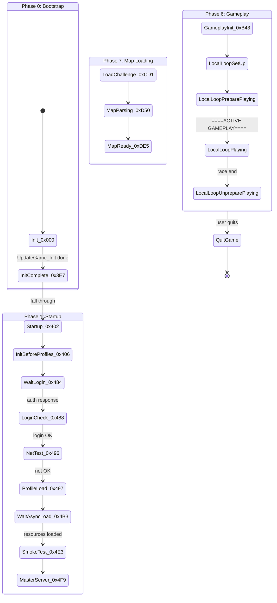

# Visual Reference, Glossary & Cross-Document Index

This document provides ASCII architecture diagrams, a comprehensive glossary, an address reference table, and a cross-document index for all reverse engineering documentation. Use it as a visual map of the engine and a lookup for any address or term.

---

## Engine Architecture Diagram

### Full System Overview

```
╔═══════════════════════════════════════════════════════════════════════════════╗
║                           TRACKMANIA 2020 ENGINE                             ║
║                     ManiaPlanet / GameBox Engine (C++)                        ║
╠═══════════════════════════════════════════════════════════════════════════════╣
║                                                                               ║
║  ┌─────────────────────────────────────────────────────────────────────────┐  ║
║  │                        APPLICATION LAYER                                │  ║
║  │                                                                         │  ║
║  │   CTrackMania                                                           │  ║
║  │     └── CGameManiaPlanet                                                │  ║
║  │           └── CGameCtnApp           216 KB UpdateGame state machine     │  ║
║  │                 └── CGameApp                                            │  ║
║  │                       └── CGbxApp   Init1 (80 KB) + Init2               │  ║
║  │                             └── CGbxGame                                │  ║
║  │                                                                         │  ║
║  │  ┌──────────┐ ┌──────────┐ ┌──────────┐ ┌─────────────────────────┐    │  ║
║  │  │ Editors  │ │  Menus   │ │ Gameplay │ │   Online Services       │    │  ║
║  │  │  (15+)   │ │ CGameCtn │ │  CSm*    │ │  CWebServices* (297)   │    │  ║
║  │  │ Map/Item │ │  Menus*  │ │  Arena*  │ │  CNetNadeoServices*    │    │  ║
║  │  │ Mesh/Mat │ │          │ │  Player  │ │  CNetUbiServices*      │    │  ║
║  │  │ Skin/Veh │ │          │ │  Physics │ │  CNetMasterServer*     │    │  ║
║  │  └────┬─────┘ └────┬─────┘ └────┬─────┘ └────┬────────────────────┘    │  ║
║  │       │             │            │             │                          │  ║
║  └───────┴─────────────┴────────────┴─────────────┴──────────────────────────┘  ║
║                                    │                                             ║
║                          ┌─────────┴──────────┐                                  ║
║                          │  State Machine Core │                                  ║
║                          │  CGameCtnApp::      │                                  ║
║                          │    UpdateGame       │                                  ║
║                          │  60+ states, 9      │                                  ║
║                          │  phases, coroutines │                                  ║
║                          └─────────┬──────────┘                                  ║
║                                    │                                             ║
║  ┌─────────────────────────────────┴─────────────────────────────────────────┐  ║
║  │                           ENGINE LAYER (12 Singletons)                     │  ║
║  │                                                                             │  ║
║  │  ┌───────────┐ ┌───────────┐ ┌───────────┐ ┌──────────┐ ┌───────────┐    │  ║
║  │  │ CScene    │ │ CVision   │ │ CSystem   │ │ CNet     │ │ CScript   │    │  ║
║  │  │ Engine    │ │ Engine    │ │ Engine    │ │ Engine   │ │ Engine    │    │  ║
║  │  │ 3D scene  │ │ D3D11     │ │ File sys  │ │ TCP/UDP  │ │ Mania-    │    │  ║
║  │  │ Entities  │ │ Deferred  │ │ Fid/Pak   │ │ libcurl  │ │ Script VM │    │  ║
║  │  │ Physics   │ │ Shaders   │ │ GBX       │ │ OpenSSL  │ │ 12 types  │    │  ║
║  │  └───────────┘ └───────────┘ └───────────┘ └──────────┘ └───────────┘    │  ║
║  │                                                                             │  ║
║  │  ┌───────────┐ ┌───────────┐ ┌───────────┐ ┌──────────┐ ┌───────────┐    │  ║
║  │  │ CInput    │ │ CAudio    │ │ CControl  │ │ CPlug    │ │ CMw       │    │  ║
║  │  │ Engine    │ │ Engine    │ │ Engine    │ │ Engine   │ │ Engine    │    │  ║
║  │  │ DInput8   │ │ OpenAL    │ │ UI layout │ │ Assets   │ │ Core      │    │  ║
║  │  │ XInput    │ │ Vorbis    │ │ Effects   │ │ Material │ │ Class reg │    │  ║
║  │  │ Keyboard  │ │ Spatial   │ │ Focus     │ │ Meshes   │ │ MwClassId │    │  ║
║  │  │ Gamepad   │ │ Zones     │ │ Frames    │ │ Anims    │ │ Fibers    │    │  ║
║  │  └───────────┘ └───────────┘ └───────────┘ └──────────┘ └───────────┘    │  ║
║  │                                                                             │  ║
║  │  ┌───────────┐ ┌───────────┐                                               │  ║
║  │  │ CHms      │ │ CGame     │                                               │  ║
║  │  │ Engine    │ │ Engine    │                                               │  ║
║  │  │ Zone/     │ │ Game      │                                               │  ║
║  │  │ Portal    │ │ Logic     │                                               │  ║
║  │  │ Renderer  │ │ Orchestr. │                                               │  ║
║  │  └───────────┘ └───────────┘                                               │  ║
║  └─────────────────────────────────────────────────────────────────────────────┘  ║
║                                    │                                             ║
║  ┌─────────────────────────────────┴─────────────────────────────────────────┐  ║
║  │                            CMwNod BASE LAYER                               │  ║
║  │  ┌──────────────┐  ┌──────────────────┐  ┌──────────────────────────┐     │  ║
║  │  │ Class System  │  │ Serialization    │  │ Fiber / Coroutine        │     │  ║
║  │  │ 2,027 classes │  │ CClassicArchive  │  │ CMwCmdFiber (88 bytes)  │     │  ║
║  │  │ MwClassIds    │  │ GBX read/write   │  │ Cooperative multitask   │     │  ║
║  │  │ 200+ remaps   │  │ Chunk system     │  │ Render-safe yielding    │     │  ║
║  │  └──────────────┘  └──────────────────┘  └──────────────────────────┘     │  ║
║  └─────────────────────────────────────────────────────────────────────────────┘  ║
║                                                                               ║
╠═══════════════════════════════════════════════════════════════════════════════╣
║                         EXTERNAL DEPENDENCIES                                 ║
║  ┌────────────────┐ ┌───────────────┐ ┌─────────────┐ ┌───────────────────┐  ║
║  │ Ubisoft Connect │ │ Vivox         │ │ XMPP        │ │ Nadeo Services    │  ║
║  │ upc_r2_loader64│ │ VoiceChat.dll │ │ *.chat.     │ │ core.trackmania.  │  ║
║  │ DRM, auth      │ │ Voice chat    │ │ maniaplanet │ │ nadeo.live        │  ║
║  └────────────────┘ └───────────────┘ └─────────────┘ └───────────────────┘  ║
╚═══════════════════════════════════════════════════════════════════════════════╝
```

### Data Flow Between Subsystems

```
                     ┌──────────────────┐
                     │    User Input     │
                     │  Keyboard/Gamepad │
                     └────────┬─────────┘
                              │
                              v
                     ┌──────────────────┐
                     │   CInputEngine    │
                     │  DInput8 + XInput │
                     └────────┬─────────┘
                              │ InputSteer, InputGas, InputBrake
                              v
              ┌───────────────┴───────────────┐
              │                               │
              v                               v
    ┌──────────────────┐           ┌──────────────────┐
    │   CScriptEngine   │           │  CSmArenaPhysics  │
    │   ManiaScript VM  │◄─────────│  Per-player state  │
    │   Game rules      │  events  │  Input processing  │
    └────────┬─────────┘           └────────┬─────────┘
             │ modifiers                     │ forces
             v                               v
    ┌──────────────────┐           ┌──────────────────┐
    │  Game Logic       │           │  NSceneVehiclePhy │
    │  State machine    │           │  7 force models   │
    │  Score/time       │           │  Turbo/boost      │
    └────────┬─────────┘           └────────┬─────────┘
             │                               │ vehicle state
             │                               v
             │                     ┌──────────────────┐
             │                     │  NSceneDyna       │
             │                     │  Rigid body sim   │
             │                     │  Forward Euler    │
             │                     └────────┬─────────┘
             │                               │ positions, velocities
             │                               v
             │                     ┌──────────────────┐
             │                     │  NHmsCollision    │
             │                     │  Static/Dynamic/  │
             │                     │  Continuous (CCD) │
             │                     └────────┬─────────┘
             │                               │ contacts
             v                               v
    ┌──────────────────────────────────────────────────┐
    │                   CSceneEngine                     │
    │              Scene graph + entities                 │
    └────────────────────────┬─────────────────────────┘
                              │ visual state
                              v
    ┌──────────────────────────────────────────────────┐
    │                  CVisionEngine                     │
    │             D3D11 Deferred Pipeline                │
    │     G-buffer -> Lighting -> Post-FX -> Present    │
    └────────────────────────┬─────────────────────────┘
                              │ audio triggers
                              v
    ┌──────────────────────────────────────────────────┐
    │                  CAudioEngine                      │
    │         OpenAL spatial audio + Vorbis              │
    └──────────────────────────────────────────────────┘
```

### Startup Sequence

```
entry (0x14291e317)                     [.D." section, obfuscated]
  │
  v
WinMainCRTStartup (0x141521c28)        [MSVC CRT VS2019]
  │
  v
WinMain (0x140aa7470)                   [640x480 default window]
  │
  v
CGbxGame::InitApp (0x1400a6ec0)
  │
  ├── CSystemEngine::InitForGbxGame     File system, config, platform
  │
  v
CGbxApp::Init1 (0x140aaac00)            [80 KB function!]
  │
  ├── CVisionEngine init
  ├── CInputEngine init
  ├── CAudioEngine init
  ├── CNetEngine init
  │
  v
CGbxApp::Init2 (0x140ab00a0)
  │
  ├── D3D11 device creation
  ├── Viewport configuration
  │
  v
CGameManiaPlanet::Start (0x140cb8870)
  │
  v
CGameCtnApp::Start (0x140b4eba0)
  │
  v
CGameCtnApp::UpdateGame (0x140b78f10)   [Main loop begins, 216 KB]
```

---

## Complete Class Hierarchy Tree

### Core Engine Hierarchy

```
CMwNod (universal base class) ─── 2,027 known subclasses
  │
  ├── CMwEngine (engine base)
  │     ├── CMwEngineMain, CGameEngine, CPlugEngine, CSceneEngine
  │     ├── CVisionEngine, CNetEngine, CInputEngine, CSystemEngine
  │     ├── CScriptEngine, CControlEngine, CAudioSourceEngine
  │
  ├── CMwCmd (command/binding system)
  │     ├── CMwCmdFastCall, CMwCmdFastCallStatic
  │     └── CMwCmdFiber (88 bytes, coroutine)
  │
  ├── CMwId (interned string/identifier)
  └── CMwStatsValue (statistics tracking)
```

### Application Hierarchy

```
CMwNod
  └── CGbxApp -> CGbxGame -> CGameApp -> CGameCtnApp -> CGameManiaPlanet -> CTrackMania
```

### Game Logic Classes (CGame*, 728 classes)

```
CGame*
  ├── CGameCtn* (162)                  Maps, blocks, editors, replays
  │     ├── CGameCtnChallenge          Map file (class 0x03043000)
  │     ├── CGameCtnBlock              Placed block instance
  │     ├── CGameCtnBlockInfo          Block type definition (11+ subclasses)
  │     ├── CGameCtnAnchoredObject     Placed item
  │     ├── CGameCtnEditor*            Editor types (Map, Mesh, etc.)
  │     ├── CGameCtnMediaBlock* (65+)  MediaTracker blocks
  │     ├── CGameCtnReplayRecord       Replay file
  │     └── CGameCtnGhost              Ghost data
  │
  ├── CGameEditor* (54)               Editor mode controllers
  ├── CGameDataFileTask_* (44)        Async file loading tasks
  ├── CGameScript* (42)               ManiaScript API bindings
  ├── CGamePlayground* (39)           Gameplay session management
  ├── CGameControl* (33)              Game-specific UI controls
  │     └── CGameControlCamera* (12)  Camera controllers
  ├── CGameModule* (31)               HUD modules
  └── CGameManialink* (28)            ManiaLink UI controls
```

### Resource/Asset Classes (CPlug*, 391 classes)

```
CPlug*
  ├── CPlugAnim* (77)                  Animation system
  ├── CPlugFile* (36)                  File format handlers
  ├── CPlugBitmap* (28)                Textures
  ├── CPlugVehicle* (18)               Vehicle physics/visuals
  ├── CPlugVisual* (15)                Visual primitives
  ├── CPlugFx* (15)                    Visual effects
  ├── CPlugMaterial* (12)              Materials + shaders
  ├── CPlugParticle* (9)               Particle system
  ├── CPlugSolid2Model                 Primary 3D mesh format
  ├── CPlugStaticObjectModel           Static objects (items, scenery)
  ├── CPlugEntRecordData               Ghost replay data
  └── CPlugSurface                     Collision surfaces
```

### Networking Classes (CNet*, 262 classes)

```
CNet*
  ├── Core (17): CNetClient, CNetServer, CNetConnection, CNetEngine, CNetHttpClient
  ├── CNetNadeoServicesTask_* (157)    Nadeo API calls
  ├── CNetUbiServicesTask_* (38)       Ubisoft Connect API calls
  ├── CNetMasterServer* (24)           Legacy master server
  ├── CNetForm* (7)                    Typed network messages
  └── CNetFileTransfer* (5)            File upload/download
```

---

## Deferred Rendering Pipeline Diagram

### Complete 19-Pass Pipeline

```
 FRAME START
     │
     v
┌─────────────────────────────────────────────────────────────────┐
│                    EARLY PASSES (Setup)                          │
│  SetCst_Frame -> SetCst_Zone -> GenAutoMipMap                   │
│  ShadowCreateVolumes -> ShadowRenderCaster -> ShadowRenderPSSM │
│  ShadowCacheUpdate -> CreateProjectors -> UpdateTexture         │
│  Decal3dDiscard -> ParticlesUpdateEmitters -> ParticlesUpdate   │
└───────┬─────────────────────────────────────────────────────────┘
        │
        v
┌─────────────────────────────────────────────────────────────────┐
│               G-BUFFER FILL (Deferred Write)                    │
│     Pass 1: DipCulling        Frustum/occlusion culling         │
│     Pass 2: DeferredWrite     G-buffer fill (albedo, material)  │
│     Pass 3: DeferredWriteFN   Face normal generation            │
│     Pass 4: DeferredWriteVN   Vertex normal pass                │
│     Pass 5: DeferredDecals    Deferred decal projection         │
│     Pass 6: DeferredBurn      Burn mark effects                 │
│                                                                  │
│  G-Buffer Layout:                                                │
│  ┌─────────────┬──────────────┬──────────────┬───────────────┐  │
│  │ MDiffuse    │ MSpecular    │ PixelNormal  │ LightMask     │  │
│  │ R8G8B8A8?   │ R8G8B8A8?    │ R16G16B16A16?│ R8G8B8A8?     │  │
│  └─────────────┴──────────────┴──────────────┴───────────────┘  │
│  ┌─────────────┬──────────────┬──────────────┬───────────────┐  │
│  │ FaceNormal  │ VertexNormal │ PreShade     │ DeferredZ     │  │
│  │ camera space│ camera space │ [UNKNOWN]    │ D24S8 VERIFIED│  │
│  └─────────────┴──────────────┴──────────────┴───────────────┘  │
└───────┬─────────────────────────────────────────────────────────┘
        │
        v
┌─────────────────────────────────────────────────────────────────┐
│              SHADOW & OCCLUSION (Reads G-Buffer)                │
│     Pass 7: DeferredShadow    PSSM shadow map sampling          │
│     Pass 8: DeferredAmbOcc    SSAO / HBAO+ pass                │
│     Pass 9: DeferredFakeOcc   Fake occlusion (far objects)      │
└───────┬─────────────────────────────────────────────────────────┘
        │
        v
┌─────────────────────────────────────────────────────────────────┐
│                  DEFERRED LIGHTING                               │
│     Pass 10: CameraMotion     Motion vector generation          │
│     Pass 11: DeferredRead     G-buffer read (start lighting)    │
│     Pass 12: DeferredReadFull Full G-buffer resolve             │
│     Pass 13: Reflects_Cull    Reflection probe culling          │
│     Pass 14: DeferredLighting Light accumulation                │
│              Point/Spot/Sphere/Cylinder lights, SSR             │
└───────┬─────────────────────────────────────────────────────────┘
        │
        v
┌─────────────────────────────────────────────────────────────────┐
│                FORWARD / TRANSPARENT                             │
│  Alpha01 (alpha-tested) -> AlphaBlend -> GhostLayer             │
│  ForestRender -> GrassRender -> ParticlesRender                 │
└───────┬─────────────────────────────────────────────────────────┘
        │
        v
┌─────────────────────────────────────────────────────────────────┐
│                   POST-PROCESSING                                │
│     Pass 15: CustomEnding     Custom post-lighting effects      │
│     Pass 16: DeferredFogVol   Volumetric fog (ray marching)     │
│     Pass 17: DeferredFog      Global fog                        │
│     Pass 18: LensFlares       Lens flare effects                │
│     Pass 19: FxTXAA           Temporal anti-aliasing            │
│                                                                  │
│  Additional: FxDepthOfField -> FxMotionBlur -> FxBlur ->        │
│  FxColors -> FxColorGrading -> FxToneMap -> FxBloom -> FxFXAA   │
└───────┬─────────────────────────────────────────────────────────┘
        │
        v
┌─────────────────────────────────────────────────────────────────┐
│                    FINAL OUTPUT                                  │
│  ResolveMsaaHdr -> StretchRect -> Overlays -> GUI               │
│                              -> SwapChainPresent                 │
└─────────────────────────────────────────────────────────────────┘
```

### Shader Organization (200+ HLSL files)

```
Shaders/
  ├── Tech3/           (~100+ files) Block geometry, car skin, deferred pipeline
  ├── Effects/         (~60+ files)  Post-FX, particles, fog, temporal AA
  ├── Engines/         (~60+ files)  Low-level utilities
  ├── Lightmap/        (~30+ files)
  ├── Garage/          Menu/garage reflections
  ├── Painter/         Skin/livery editor
  └── Clouds/          Cloud/sky rendering
```

---

## Physics Pipeline Diagram

### Per-Frame Physics Pipeline

```
 FRAME START (every tick, ~100 Hz)
     │
     v
 CSmArenaPhysics::Players_BeginFrame (0x1412c2cc0)
     │
     v
 CSmArenaPhysics::UpdatePlayersInputs (0x1412bf000)
     │
     v
 CSmArenaPhysics::Players_UpdateTimed (0x1412c7d10)
     │
     │  FOR EACH VEHICLE:
     │    ArenaPhysics_CarPhyUpdate (0x1412e8490)
     │        │
     │        v
     │    PhysicsStep_TM (0x141501800)
     │        ├── Convert tick to microseconds (* 1,000,000)
     │        ├── Check vehicle status nibble (offset +0x128C)
     │        └── ADAPTIVE SUB-STEPPING LOOP (1 to 1000 steps):
     │              ├── Collision check (FUN_141501090)
     │              ├── NSceneVehiclePhy::ComputeForces (0x1408427d0)
     │              ├── Force application (FUN_1414ffee0)
     │              └── Integration: Forward Euler (FUN_14083df50)
     │
     v
 NSceneDyna::PhysicsStep (0x1407bd0e0) -> PhysicsStep_V2 (0x140803920)
     │
     v
 Post-Physics: Gates_UpdateTimed, Players_ObjectsInContact, Players_EndFrame
```

### Vehicle Force Model Dispatch

```
NSceneVehiclePhy::ComputeForces (0x1408427d0)
     │
     ├── Speed clamping (maxSpeed at vehicle_model+0x2F0)
     │
     ├── Switch on vehicle_model+0x1790:
     │   Case 0,1,2: FUN_140869cd0  (Base/legacy)
     │   Case 3:     FUN_14086b060  (M4 model)
     │   Case 4:     FUN_14086bc50  (M5/TMNF-era)
     │   Case 5:     FUN_140851f00  (CarSport/Stadium)
     │   Case 6:     FUN_14085c9e0  (Snow/Rally)
     │   Case 0xB:   FUN_14086d3b0  (Desert)
     │
     └── Turbo/boost: (elapsed/duration) * strength * modelScale
         Applied via FUN_1407bdf40
```

### Rigid Body Dynamics (NSceneDyna)

```
NSceneDyna::PhysicsStep_V2 (0x140803920)
     │
     ├── InternalPhysicsStep (0x1408025a0, 4991 bytes)
     │   ├── ComputeGravityAndSleepStateAndNewVels (0x1407f89d0)
     │   │   ├── Sleep check (damping if |vel| < threshold)
     │   │   ├── Gravity: force = mass * dt * gravity_vector
     │   │   └── Body stride: 0x38 (56 bytes) per body
     │   ├── ComputeExternalForces / ComputeWaterForces
     │   ├── Static collision detection
     │   └── Friction solver (static + dynamic iterations)
     │
     └── Clear accumulated forces
```

---

## Game State Machine Diagram

### Complete State Transition Map



### Normal Gameplay Flow

```
STARTUP -> LOGIN -> CONNECT -> MENUS
                                 │
                       ┌─────────┴─────────┐
                       v                    v
                 ┌─────────────┐    ┌──────────────┐
                 │ LOAD MAP    │    │   EDITOR     │
                 │ (22 stages) │    │   (15+ types)│
                 └──────┬──────┘    └──────┬───────┘
                        v                   │
                 ┌─────────────┐            │
                 │  SET UP     │ <──────────┘ test play
                 │  Playground │
                 └──────┬──────┘
                        v
              ╔═══════════════════════╗
              ║   ACTIVE GAMEPLAY     ║
              ║   Physics at ~100 Hz  ║
              ║   Rendering 60+ FPS   ║
              ╚═══════════╤═══════════╝
                        │
                 ┌──────┴──────┐
                 v              v
          ┌────────────┐  ┌────────────┐
          │  REPLAY     │  │  NEXT MAP  │
          │  VALIDATE   │  │  /MENUS    │
          └──────┬──────┘  └────────────┘
                 v
            PODIUM -> RESULTS
```

---

## Network Protocol Stack Diagram

```
┌─────────────────────────────────────────────┐
│  MainLoop_Menus (0x140af9a40)               │
│  MainLoop_SetUp (0x140afc320)               │
│  MainLoop_PlaygroundPlay (0x140aff380)      │
│                                              │
│  CSmArenaClient Sub-Loop:                    │
│    MainLoop_RecordGhost                      │
│    MainLoop_SoloCommon                       │
│    MainLoop_PlayGameNetwork                  │
│    MainLoop_PlayGameScript                   │
└─────────────────────────────────────────────┘
```

---

## GBX File Format Diagram

```
+========================================+  ◄── Offset 0x00
| Magic: "GBX" (3 bytes)                |
| Version: uint16 LE (6 for TM2020)     |
| Format: "BUCR" (4 bytes, v6+)         |
| Class ID: uint32 LE (e.g. 0x03043000) |
| User Data Size: uint32 LE             |
+========================================+  ◄── If user_data_size > 0
| Num Header Chunks: uint32             |
| Header Chunk Index:                    |
|   [ chunk_id(4) | size_flags(4) ] × N |
| Header Chunk Data (concatenated)       |
+========================================+
| Num Nodes: uint32                      |
+========================================+
| Num External Refs: uint32              |
| [Reference Table entries if > 0]       |
+========================================+  ◄── Body Section
| IF format byte2 == 'C':               |
|   Uncompressed Size: uint32           |
|   Compressed Size: uint32             |
|   [LZO/zlib compressed data]          |
| ELSE (byte2 == 'U'):                  |
|   [Raw chunk stream]                   |
+========================================+
| Body Chunk Stream (decompressed):      |
|   chunk_id (uint32)                    |
|   ["SKIP" + size] or [inline data]     |
|   ...repeating...                      |
|   0xFACADE01 (end sentinel)            |
+========================================+
```

---

## Comprehensive Glossary

| Term | Definition |
|------|-----------|
| **BVH** | Bounding Volume Hierarchy -- tree structure for fast spatial queries in collision detection |
| **CCD** | Continuous Collision Detection -- prevents fast objects from tunneling through thin geometry |
| **CMwNod** | Universal base class for all 2,027 engine classes. "Nod" = Node |
| **D3D11** | Direct3D 11 -- the graphics API used by TM2020 |
| **Deferred rendering** | Two-pass rendering: first fill G-buffer with geometry data, then compute lighting from the buffer |
| **FACADE01** | `0xFACADE01` -- the end-of-body sentinel in GBX chunk streams |
| **Fiber** | Cooperative coroutine (CMwCmdFiber, 88 bytes). Yields at safe points during rendering |
| **Forward Euler** | Integration method: `position += velocity * dt`. Simple, fast, used by TM physics |
| **G-buffer** | Geometry buffer -- multiple render targets storing albedo, normals, depth, etc. for deferred lighting |
| **GBX** | GameBox -- Nadeo's proprietary binary file format for all game data |
| **HBAO+** | Horizon-Based Ambient Occlusion Plus -- NVIDIA's SSAO algorithm used for ambient shadow |
| **iso4** | 3x3 rotation matrix + vec3 position (48 bytes). The engine's transform representation |
| **LookbackString** | String interning system in GBX: stores strings once, references by index afterward |
| **LZO** | Lempel-Ziv-Oberhumer -- fast compression algorithm used for GBX body data |
| **ManiaScript** | Nadeo's scripting language for game modes and UI. C-like syntax with coroutines |
| **MRT** | Multiple Render Targets -- writing to several textures simultaneously in one draw call |
| **MwClassId** | 32-bit identifier for every class: `engine(8) | class(12) | chunk(12)` |
| **NadeoPak** | Binary pack file format (NOT GBX). Uses "NadeoPak" magic, version 18 |
| **PSSM** | Parallel-Split Shadow Maps -- 4 shadow map cascades at different distances |
| **RTTI** | Run-Time Type Information -- metadata about classes embedded in the binary |
| **SKIP** | `0x534B4950` ("SKIP" in ASCII) -- marker for skippable chunks in GBX body streams |
| **Sub-stepping** | Running multiple physics iterations per tick. TM2020 uses 1-1000 adaptive sub-steps |
| **TXAA** | Temporal Anti-Aliasing -- uses motion vectors and frame history to reduce aliasing |
| **WGSL** | WebGPU Shading Language -- the shader language for WebGPU (browser equivalent of HLSL) |
| **zlib** | Compression library used for ghost sample data and some internal GBX data |

---

## Address Reference Table

### Key Function Addresses

| Address | Function | Subsystem | Size | Doc Reference |
|---|---|---|---|---|
| `0x14291e317` | entry (obfuscated, in .D." section) | Architecture | - | [01](01-binary-overview.md) |
| `0x141521c28` | WinMainCRTStartup (MSVC CRT) | Architecture | - | [08](08-game-architecture.md) |
| `0x140aa7470` | WinMain (actual) | Architecture | 202 B | [08](08-game-architecture.md) |
| `0x140aaac00` | CGbxApp::Init1 | Architecture | 80 KB | [00](00-master-overview.md) |
| `0x140ab00a0` | CGbxApp::Init2 | Architecture | - | [00](00-master-overview.md) |
| `0x140b4eba0` | CGameCtnApp::Start | Architecture | - | [08](08-game-architecture.md) |
| `0x140b78f10` | CGameCtnApp::UpdateGame (main loop) | Architecture | 34,959 B | [08](08-game-architecture.md) |
| `0x140cb8870` | CGameManiaPlanet::Start | Architecture | - | [08](08-game-architecture.md) |
| `0x1412c2cc0` | CSmArenaPhysics::Players_BeginFrame | Physics | - | [04](04-physics-vehicle.md) |
| `0x1412bf000` | CSmArenaPhysics::UpdatePlayersInputs | Physics | - | [04](04-physics-vehicle.md) |
| `0x141501800` | PhysicsStep_TM (per-vehicle) | Physics | - | [04](04-physics-vehicle.md) |
| `0x1408427d0` | NSceneVehiclePhy::ComputeForces | Physics | 1,713 B | [04](04-physics-vehicle.md) |
| `0x140851f00` | Force model case 5 (CarSport?) | Physics | - | [04](04-physics-vehicle.md) |
| `0x14085c9e0` | Force model case 6 (Snow/Rally?) | Physics | - | [04](04-physics-vehicle.md) |
| `0x14086d3b0` | Force model case 0xB (Desert?) | Physics | - | [04](04-physics-vehicle.md) |
| `0x1407bd0e0` | NSceneDyna::PhysicsStep | Physics | - | [10](10-physics-deep-dive.md) |
| `0x140803920` | NSceneDyna::PhysicsStep_V2 | Physics | - | [10](10-physics-deep-dive.md) |
| `0x1408025a0` | NSceneDyna::InternalPhysicsStep | Physics | 4,991 B | [10](10-physics-deep-dive.md) |
| `0x140900e60` | GBX header magic/version validation | File Formats | - | [06](06-file-formats.md) |
| `0x140901850` | GBX v6 format flag parsing | File Formats | - | [06](06-file-formats.md) |
| `0x140904730` | CSystemArchiveNod::LoadGbx | File Formats | - | [06](06-file-formats.md) |
| `0x14138c090` | COalAudioPort::InitImplem | Audio | - | [15](15-ghidra-research-findings.md) |
| `0x1402acea0` | CInputPort::Update_StartFrame | Input | - | [15](15-ghidra-research-findings.md) |
| `0x1409aa750` | CDx11Viewport::DeviceCreate | Rendering | - | [05](05-rendering-graphics.md) |

### Key Data Addresses

| Address | Data | Subsystem |
|---|---|---|
| `0x141ebccfc` | Sleep detection enabled flag | Physics |
| `0x141ebcd00` | Sleep velocity damping factor | Physics |
| `0x141ebcd04` | Sleep velocity threshold (squared) | Physics |
| `0x141f9cff4` | Luna Mode flag | Architecture |
| `0x141ff9d58` | Global class registry (two-level) | File Formats |
| `0x141ffad50` | Global tick counter | Input |

---

## Cross-Document Index

| Topic | Primary Doc(s) | Secondary Doc(s) | Depth |
|---|---|---|---|
| **Binary structure** (PE headers, sections) | [01](01-binary-overview.md) | [00](00-master-overview.md) | Comprehensive |
| **Class hierarchy** (2,027 classes, RTTI) | [02](02-class-hierarchy.md) | [00](00-master-overview.md), [13](13-subsystem-class-map.md) | Comprehensive |
| **Physics pipeline** (call chain, sub-stepping) | [04](04-physics-vehicle.md), [10](10-physics-deep-dive.md) | [14](14-tmnf-crossref.md), [15](15-ghidra-research-findings.md) | Deep |
| **Vehicle forces** (7 models, turbo, boost) | [04](04-physics-vehicle.md), [10](10-physics-deep-dive.md) | [14](14-tmnf-crossref.md), [19](19-openplanet-intelligence.md) | Moderate (internals unknown) |
| **Vehicle state** (CSceneVehicleVisState) | [19](19-openplanet-intelligence.md) | [04](04-physics-vehicle.md), [10](10-physics-deep-dive.md) | Comprehensive (VERIFIED) |
| **Rendering pipeline** (deferred, 19 passes) | [05](05-rendering-graphics.md), [15](15-ghidra-research-findings.md) | [11](11-rendering-deep-dive.md) | Deep |
| **G-buffer** (9 render targets) | [05](05-rendering-graphics.md), [15](15-ghidra-research-findings.md) | [11](11-rendering-deep-dive.md) | Moderate |
| **GBX file format** (header, body, chunks) | [06](06-file-formats.md), [16](16-fileformat-deep-dive.md) | [26](26-real-file-analysis.md) | Deep |
| **Map loading** (22-stage pipeline) | [06](06-file-formats.md) | [28](28-map-structure-encyclopedia.md) | Moderate |
| **Networking** (10-layer stack, auth) | [07](07-networking.md), [17](17-networking-deep-dive.md) | [19](19-openplanet-intelligence.md) | Deep |
| **Game architecture** (entry point, main loop) | [08](08-game-architecture.md), [12](12-architecture-deep-dive.md) | [00](00-master-overview.md) | Comprehensive |
| **State machine** (60+ states, 9 phases) | [08](08-game-architecture.md), [12](12-architecture-deep-dive.md) | - | Comprehensive |
| **ManiaScript** (tokens, types) | [08](08-game-architecture.md), [15](15-ghidra-research-findings.md) | - | Moderate (tokens only) |
| **Materials** (208 materials, 19 surface IDs) | [19](19-openplanet-intelligence.md) | [28](28-map-structure-encyclopedia.md) | Comprehensive (VERIFIED) |
| **Ghost/Replay** | [30](30-ghost-replay-format.md) | [13](13-subsystem-class-map.md), [26](26-real-file-analysis.md) | Deep |
| **Browser recreation** | [20](20-browser-recreation-guide.md) | All others | Synthesis |
| **Community knowledge** | [29](29-community-knowledge.md) | - | Cross-reference |

### Document Inventory

| # | Document | Focus Area |
|---|---|---|
| 00 | [Master Overview](00-master-overview.md) | Executive summary, subsystem map, open questions |
| 01 | [Binary Overview](01-binary-overview.md) | PE headers, imports, code protection |
| 02 | [Class Hierarchy](02-class-hierarchy.md) | 2,027 classes, Nadeo RTTI |
| 04 | [Physics & Vehicle](04-physics-vehicle.md) | Simulation pipeline, forces, collision |
| 05 | [Rendering & Graphics](05-rendering-graphics.md) | D3D11, deferred pipeline, shaders |
| 06 | [File Formats](06-file-formats.md) | GBX parsing, serialization, class IDs |
| 07 | [Networking](07-networking.md) | Protocol stack, auth, API domains |
| 08 | [Game Architecture](08-game-architecture.md) | Entry point, state machine, fibers |
| 10 | [Physics Deep Dive](10-physics-deep-dive.md) | Decompiled physics functions |
| 11 | [Rendering Deep Dive](11-rendering-deep-dive.md) | D3D11 device, vertex formats |
| 12 | [Architecture Deep Dive](12-architecture-deep-dive.md) | Complete state map, coroutines |
| 14 | [TMNF Cross-Reference](14-tmnf-crossref.md) | TM2020 vs TMNF comparison |
| 15 | [Ghidra Research Findings](15-ghidra-research-findings.md) | Audio, input, camera, compression |
| 16 | [File Format Deep Dive](16-fileformat-deep-dive.md) | Reference table, chunks, LookbackString |
| 17 | [Networking Deep Dive](17-networking-deep-dive.md) | Protocol details |
| 18 | [Validation Review](18-validation-review.md) | Error analysis, corrections |
| 19 | [Openplanet Intelligence](19-openplanet-intelligence.md) | VERIFIED vehicle state, API, materials |
| 20 | [Browser Recreation Guide](20-browser-recreation-guide.md) | Feasibility, tech mapping, MVP |
| 26 | [Real File Analysis](26-real-file-analysis.md) | Byte-by-byte GBX validation |
| 28 | [Map Structure Encyclopedia](28-map-structure-encyclopedia.md) | Blocks, items, waypoints |
| 29 | [Community Knowledge](29-community-knowledge.md) | Community tools cross-reference |
| 30 | [Ghost Replay Format](30-ghost-replay-format.md) | Ghost samples, replay structure |

---

## Related Pages

- [00-master-overview.md](00-master-overview.md) -- Start here for a high-level summary
- [20-browser-recreation-guide.md](20-browser-recreation-guide.md) -- Actionable implementation guidance
- [18-validation-review.md](18-validation-review.md) -- Corrections and confidence downgrades

<details><summary>Analysis metadata</summary>

- **Binary**: `Trackmania.exe` (Trackmania 2020 by Nadeo/Ubisoft)
- **Date**: 2026-03-27
- **Purpose**: Visual diagrams, comprehensive glossary, address reference, and cross-document index for all reverse engineering documentation

</details>
