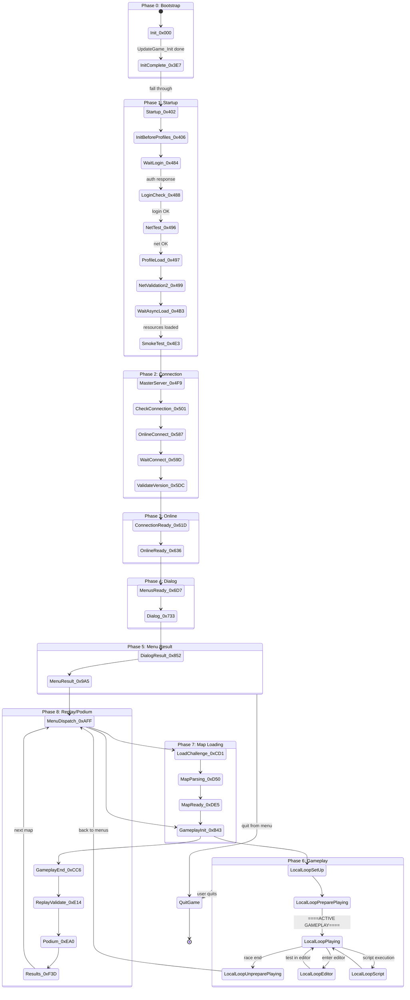

# Visual Reference, Glossary & Cross-Document Index

**Binary**: `Trackmania.exe` (Trackmania 2020 by Nadeo/Ubisoft)
**Date**: 2026-03-27
**Purpose**: Visual diagrams, comprehensive glossary, address reference, and cross-document index for all reverse engineering documentation.

---

## Table of Contents

1. [Engine Architecture Diagram](#1-engine-architecture-diagram)
2. [Complete Class Hierarchy Tree](#2-complete-class-hierarchy-tree)
3. [Deferred Rendering Pipeline Diagram](#3-deferred-rendering-pipeline-diagram)
4. [Physics Pipeline Diagram](#4-physics-pipeline-diagram)
5. [Game State Machine Diagram](#5-game-state-machine-diagram)
6. [Network Protocol Stack Diagram](#6-network-protocol-stack-diagram)
7. [GBX File Format Diagram](#7-gbx-file-format-diagram)
8. [Comprehensive Glossary](#8-comprehensive-glossary)
9. [Address Reference Table](#9-address-reference-table)
10. [Cross-Document Index](#10-cross-document-index)

---

## 1. Engine Architecture Diagram

### 1.1 Full System Overview

```
╔═══════════════════════════════════════════════════════════════════════════════╗
║                           TRACKMANIA 2020 ENGINE                             ║
║                     ManiaPlanet / GameBox Engine (C++)                        ║
╠═══════════════════════════════════════════════════════════════════════════════╣
║                                                                               ║
║  ┌─────────────────────────────────────────────────────────────────────────┐  ║
║  │                        APPLICATION LAYER                                │  ║
║  │                                                                         │  ║
║  │   CTrackMania                                                           │  ║
║  │     └── CGameManiaPlanet                                                │  ║
║  │           └── CGameCtnApp           216 KB UpdateGame state machine     │  ║
║  │                 └── CGameApp                                            │  ║
║  │                       └── CGbxApp   Init1 (80 KB) + Init2               │  ║
║  │                             └── CGbxGame                                │  ║
║  │                                                                         │  ║
║  │  ┌──────────┐ ┌──────────┐ ┌──────────┐ ┌─────────────────────────┐    │  ║
║  │  │ Editors  │ │  Menus   │ │ Gameplay │ │   Online Services       │    │  ║
║  │  │  (15+)   │ │ CGameCtn │ │  CSm*    │ │  CWebServices* (297)   │    │  ║
║  │  │ Map/Item │ │  Menus*  │ │  Arena*  │ │  CNetNadeoServices*    │    │  ║
║  │  │ Mesh/Mat │ │          │ │  Player  │ │  CNetUbiServices*      │    │  ║
║  │  │ Skin/Veh │ │          │ │  Physics │ │  CNetMasterServer*     │    │  ║
║  │  └────┬─────┘ └────┬─────┘ └────┬─────┘ └────┬────────────────────┘    │  ║
║  │       │             │            │             │                          │  ║
║  └───────┴─────────────┴────────────┴─────────────┴──────────────────────────┘  ║
║                                    │                                             ║
║                          ┌─────────┴──────────┐                                  ║
║                          │  State Machine Core │                                  ║
║                          │  CGameCtnApp::      │                                  ║
║                          │    UpdateGame       │                                  ║
║                          │  60+ states, 9      │                                  ║
║                          │  phases, coroutines │                                  ║
║                          └─────────┬──────────┘                                  ║
║                                    │                                             ║
║  ┌─────────────────────────────────┴─────────────────────────────────────────┐  ║
║  │                           ENGINE LAYER (12 Singletons)                     │  ║
║  │                                                                             │  ║
║  │  ┌───────────┐ ┌───────────┐ ┌───────────┐ ┌──────────┐ ┌───────────┐    │  ║
║  │  │ CScene    │ │ CVision   │ │ CSystem   │ │ CNet     │ │ CScript   │    │  ║
║  │  │ Engine    │ │ Engine    │ │ Engine    │ │ Engine   │ │ Engine    │    │  ║
║  │  │           │ │           │ │           │ │          │ │           │    │  ║
║  │  │ 3D scene  │ │ D3D11     │ │ File sys  │ │ TCP/UDP  │ │ Mania-    │    │  ║
║  │  │ Entities  │ │ Deferred  │ │ Fid/Pak   │ │ libcurl  │ │ Script VM │    │  ║
║  │  │ NScene*   │ │ Tech3     │ │ GBX       │ │ OpenSSL  │ │ 12 types  │    │  ║
║  │  │ Physics   │ │ Shaders   │ │ Config    │ │ XMPP     │ │ 50+ tok.  │    │  ║
║  │  └───────────┘ └───────────┘ └───────────┘ └──────────┘ └───────────┘    │  ║
║  │                                                                             │  ║
║  │  ┌───────────┐ ┌───────────┐ ┌───────────┐ ┌──────────┐ ┌───────────┐    │  ║
║  │  │ CInput    │ │ CAudio    │ │ CControl  │ │ CPlug    │ │ CMw       │    │  ║
║  │  │ Engine    │ │ Engine    │ │ Engine    │ │ Engine   │ │ Engine    │    │  ║
║  │  │           │ │           │ │           │ │          │ │           │    │  ║
║  │  │ DInput8   │ │ OpenAL    │ │ UI layout │ │ Assets   │ │ Core      │    │  ║
║  │  │ XInput    │ │ Vorbis    │ │ Effects   │ │ Material │ │ Class reg │    │  ║
║  │  │ Keyboard  │ │ Spatial   │ │ Focus     │ │ Meshes   │ │ MwClassId │    │  ║
║  │  │ Gamepad   │ │ Zones     │ │ Frames    │ │ Anims    │ │ Fibers    │    │  ║
║  │  └───────────┘ └───────────┘ └───────────┘ └──────────┘ └───────────┘    │  ║
║  │                                                                             │  ║
║  │  ┌───────────┐ ┌───────────┐                                               │  ║
║  │  │ CHms      │ │ CGame     │                                               │  ║
║  │  │ Engine    │ │ Engine    │                                               │  ║
║  │  │           │ │           │                                               │  ║
║  │  │ Zone/     │ │ Game      │                                               │  ║
║  │  │ Portal    │ │ Logic     │                                               │  ║
║  │  │ Renderer  │ │ Orchestr. │                                               │  ║
║  │  └───────────┘ └───────────┘                                               │  ║
║  └─────────────────────────────────────────────────────────────────────────────┘  ║
║                                    │                                             ║
║  ┌─────────────────────────────────┴─────────────────────────────────────────┐  ║
║  │                            CMwNod BASE LAYER                               │  ║
║  │                                                                             │  ║
║  │  ┌──────────────┐  ┌──────────────────┐  ┌──────────────────────────┐     │  ║
║  │  │ Class System  │  │ Serialization    │  │ Fiber / Coroutine        │     │  ║
║  │  │ 2,027 classes │  │ CClassicArchive  │  │ CMwCmdFiber (88 bytes)  │     │  ║
║  │  │ MwClassIds    │  │ GBX read/write   │  │ Cooperative multitask   │     │  ║
║  │  │ TLS-cached    │  │ Chunk system     │  │ Render-safe yielding    │     │  ║
║  │  │ 200+ remaps   │  │ FACADE01         │  │ Dialog workflows        │     │  ║
║  │  └──────────────┘  └──────────────────┘  └──────────────────────────┘     │  ║
║  └─────────────────────────────────────────────────────────────────────────────┘  ║
║                                                                               ║
╠═══════════════════════════════════════════════════════════════════════════════╣
║                         EXTERNAL DEPENDENCIES                                 ║
║                                                                               ║
║  ┌────────────────┐ ┌───────────────┐ ┌─────────────┐ ┌───────────────────┐  ║
║  │ Ubisoft Connect │ │ Vivox         │ │ XMPP        │ │ Nadeo Services    │  ║
║  │ upc_r2_loader64│ │ VoiceChat.dll │ │ *.chat.     │ │ core.trackmania.  │  ║
║  │ DRM, auth,     │ │ Voice chat    │ │ maniaplanet │ │ nadeo.live        │  ║
║  │ achievements   │ │               │ │ .com        │ │ REST API          │  ║
║  └────────────────┘ └───────────────┘ └─────────────┘ └───────────────────┘  ║
╚═══════════════════════════════════════════════════════════════════════════════╝
```

### 1.2 Data Flow Between Subsystems

```
                     ┌──────────────────┐
                     │    User Input     │
                     │  Keyboard/Gamepad │
                     └────────┬─────────┘
                              │
                              v
                     ┌──────────────────┐
                     │   CInputEngine    │
                     │  DInput8 + XInput │
                     └────────┬─────────┘
                              │ InputSteer, InputGas, InputBrake
                              v
              ┌───────────────┴───────────────┐
              │                               │
              v                               v
    ┌──────────────────┐           ┌──────────────────┐
    │   CScriptEngine   │           │  CSmArenaPhysics  │
    │   ManiaScript VM  │◄─────────│  Per-player state  │
    │   Game rules      │  events  │  Input processing  │
    └────────┬─────────┘           └────────┬─────────┘
             │ modifiers                     │ forces
             v                               v
    ┌──────────────────┐           ┌──────────────────┐
    │  Game Logic       │           │  NSceneVehiclePhy │
    │  State machine    │           │  7 force models   │
    │  Score/time       │           │  Turbo/boost      │
    └────────┬─────────┘           └────────┬─────────┘
             │                               │ vehicle state
             │                               v
             │                     ┌──────────────────┐
             │                     │  NSceneDyna       │
             │                     │  Rigid body sim   │
             │                     │  Gravity, sleep   │
             │                     │  Forward Euler    │
             │                     └────────┬─────────┘
             │                               │ positions, velocities
             │                               v
             │                     ┌──────────────────┐
             │                     │  NHmsCollision    │
             │                     │  Static/Dynamic/  │
             │                     │  Continuous (CCD) │
             │                     │  Tree broadphase  │
             │                     └────────┬─────────┘
             │                               │ contacts
             v                               v
    ┌──────────────────────────────────────────────────┐
    │                   CSceneEngine                     │
    │              Scene graph + entities                 │
    └────────────────────────┬─────────────────────────┘
                              │ visual state
                              v
    ┌──────────────────────────────────────────────────┐
    │                  CVisionEngine                     │
    │             D3D11 Deferred Pipeline                │
    │     G-buffer -> Lighting -> Post-FX -> Present    │
    └────────────────────────┬─────────────────────────┘
                              │ audio triggers
                              v
    ┌──────────────────────────────────────────────────┐
    │                  CAudioEngine                      │
    │         OpenAL spatial audio + Vorbis              │
    └──────────────────────────────────────────────────┘
```

### 1.3 Startup Sequence

```
entry (0x14291e317)                     [.D." section, obfuscated]
  │
  ├── Unpacker/protector stub
  │
  v
WinMainCRTStartup (0x141521c28)        [MSVC CRT VS2019]
  │
  ├── __scrt_initialize_crt(1)
  ├── _initterm()                       C++ static constructors
  │
  v
WinMain (0x140aa7470)                   [640x480 default window]
  │
  ├── Profiling system init (FUN_1401171d0)
  ├── "Startup" profiling tag
  │
  v
CGbxGame::InitApp (0x1400a6ec0)
  │
  ├── CSystemEngine::InitForGbxGame     File system, config, platform
  │     ├── StaticInit                   Class registration
  │     ├── CaptureInfoOsCpu            Hardware detection
  │     └── InitSysCfgVision            Graphics config
  │
  v
CGbxApp::Init1 (0x140aaac00)            [80 KB function!]
  │
  ├── CVisionEngine init                 Graphics subsystem
  ├── CInputEngine init                  Input subsystem
  ├── CAudioEngine init                  Audio subsystem
  ├── CNetEngine init                    Network subsystem
  │
  v
CGbxApp::Init2 (0x140ab00a0)
  │
  ├── D3D11 device creation              CDx11Viewport::DeviceCreate
  ├── Viewport configuration
  ├── RenderWaitingFrame
  │
  v
CGameManiaPlanet::Start (0x140cb8870)
  │
  ├── Register playground types
  ├── Set game name "Trackmania"
  │
  v
CGameCtnApp::Start (0x140b4eba0)
  │
  ├── Menu/network startup
  │
  v
CGameCtnApp::UpdateGame (0x140b78f10)   [Main loop begins, 216 KB]
```

---

## 2. Complete Class Hierarchy Tree

### 2.1 Core Engine Hierarchy

```
CMwNod (universal base class) ─── 2,027 known subclasses
  │
  ├── CMwEngine (engine base)
  │     ├── CMwEngineMain              Main engine loop
  │     ├── CGameEngine                Game logic orchestration
  │     ├── CPlugEngine                Resource/asset management
  │     ├── CSceneEngine               Scene graph + rendering
  │     ├── CVisionEngine              Low-level rendering (D3D11)
  │     ├── CNetEngine                 Network stack
  │     ├── CInputEngine               Input devices
  │     ├── CSystemEngine              File system, config, OS
  │     ├── CScriptEngine              ManiaScript VM
  │     ├── CControlEngine             UI layout/effects/focus
  │     └── CAudioSourceEngine         Audio source management
  │
  ├── CMwCmd (command/binding system)
  │     ├── CMwCmdFastCall             Fast virtual call
  │     ├── CMwCmdFastCallStatic       Fast static call
  │     ├── CMwCmdFastCallStaticParam  Static call with params
  │     ├── CMwCmdFastCallUser         User-defined call
  │     └── CMwCmdFiber                Fiber/coroutine (88 bytes)
  │
  ├── CMwCmdBuffer
  │     ├── CMwCmdBufferCore           Core command buffer
  │     └── CMwCmdContainer            Container for commands
  │
  ├── CMwId                            Interned string/identifier
  ├── CMwClassInfoViewer               Runtime class introspection
  ├── CMwNetworkEntitiesManager        Networked entity replication
  ├── CMwRefBuffer                     Reference-counted buffer
  └── CMwStatsValue                    Statistics tracking
```

### 2.2 Application Hierarchy

```
CMwNod
  └── CGbxApp                          GameBox application base
        └── CGbxGame                   Game-specific bootstrap
              └── CGameApp             Game application logic
                    └── CGameCtnApp    Creation TrackMania Nations
                          └── CGameManiaPlanet   Platform layer
                                └── CTrackMania   TrackMania-specific
                                      ├── CTrackManiaMenus
                                      ├── CTrackManiaNetwork
                                      └── CTrackManiaIntro
```

### 2.3 Game Logic Classes (CGame*, 728 classes)

```
CGame*
  ├── CGameCtn* (162)                  Maps, blocks, editors, replays
  │     ├── CGameCtnChallenge          Map file (class 0x03043000)
  │     ├── CGameCtnBlock              Placed block instance
  │     ├── CGameCtnBlockInfo          Block type definition
  │     │     ├── CGameCtnBlockInfoClassic
  │     │     ├── CGameCtnBlockInfoClip
  │     │     │     ├── CGameCtnBlockInfoClipHorizontal
  │     │     │     └── CGameCtnBlockInfoClipVertical
  │     │     ├── CGameCtnBlockInfoFlat
  │     │     ├── CGameCtnBlockInfoFrontier
  │     │     ├── CGameCtnBlockInfoPylon
  │     │     ├── CGameCtnBlockInfoRoad
  │     │     ├── CGameCtnBlockInfoSlope
  │     │     └── CGameCtnBlockInfoTransition
  │     ├── CGameCtnAnchoredObject     Placed item
  │     ├── CGameCtnCollector          Collectible resource
  │     ├── CGameCtnEditor*            Editor types (Map, Mesh, etc.)
  │     ├── CGameCtnMediaBlock* (65+)  MediaTracker blocks
  │     ├── CGameCtnReplayRecord       Replay file
  │     ├── CGameCtnGhost              Ghost data
  │     ├── CGameCtnNetwork            Game-level networking
  │     └── CGameCtnZone*              Zone system
  │
  ├── CGameEditor* (54)               Editor mode controllers
  ├── CGameDataFileTask_* (44)        Async file loading tasks
  ├── CGameScript* (42)               ManiaScript API bindings
  ├── CGamePlayground* (39)           Gameplay session management
  ├── CGameControl* (33)              Game-specific UI controls
  │     └── CGameControlCamera*        Camera controllers (12 types)
  │           ├── CGameControlCameraTrackManiaRace
  │           ├── CGameControlCameraTrackManiaRace2
  │           ├── CGameControlCameraTrackManiaRace3
  │           ├── CGameControlCameraFirstPerson
  │           ├── CGameControlCameraFree
  │           ├── CGameControlCameraOrbital3d
  │           ├── CGameControlCameraEditorOrbital
  │           ├── CGameControlCameraHelico
  │           ├── CGameControlCameraVehicleInternal
  │           ├── CGameControlCameraHmdExternal
  │           ├── CGameControlCameraTarget
  │           └── CGameControlCameraEffectShake
  │
  ├── CGameModule* (31)               HUD modules
  ├── CGameManialink* (28)            ManiaLink UI controls
  ├── CGameUser* (25)                 User management
  ├── CGameMasterServer* (24)         Legacy master server
  ├── CGameScore* (24)                Scores, leaderboards, trophies
  ├── CGamePlayer* (19)               Player profiles
  ├── CGameDirectLinkScript_* (14)    Deep link handlers
  ├── CGameNet* (14)                  Game-level networking
  ├── CGameObject* (7)                Dynamic objects
  └── CGameVehicle* (3)               Vehicle model wrappers
```

### 2.4 Resource/Asset Classes (CPlug*, 391 classes)

```
CPlug*
  ├── CPlugAnim* (77)                  Animation system
  ├── CPlugFile* (36)                  File format handlers
  │     ├── CPlugFileDds, CPlugFilePng, CPlugFileJpg
  │     ├── CPlugFileWav, CPlugFileSndGen
  │     ├── CPlugFileFbx
  │     └── CPlugFileAudioMotors
  ├── CPlugBitmap* (28)                Textures
  ├── CPlugVehicle* (18)               Vehicle physics/visuals
  │     ├── CPlugVehicleCarPhyShape
  │     ├── CPlugVehicleWheelPhyModel
  │     └── CPlugVehicleVisState
  ├── CPlugVisual* (15)                Visual primitives
  │     ├── CPlugVisual2D
  │     │     ├── CPlugVisualLines2D
  │     │     └── CPlugVisualQuads2D
  │     └── CPlugVisual3D
  │           ├── CPlugVisualIndexed
  │           │     ├── CPlugVisualIndexedLines
  │           │     ├── CPlugVisualIndexedStrip
  │           │     └── CPlugVisualIndexedTriangles
  │           └── CPlugVisualLines
  ├── CPlugFx* (15)                    Visual effects
  ├── CPlugMaterial* (12)              Materials + shaders
  ├── CPlugParticle* (9)               Particle system
  │     ├── CPlugParticleEmitterModel
  │     ├── CPlugParticleGpuModel
  │     ├── CPlugParticleGpuSpawn
  │     └── CPlugParticleImpactModel
  ├── CPlugShader* (4)                 Shader programs
  │     ├── CPlugShaderApply
  │     ├── CPlugShaderPass
  │     └── CPlugShaderGeneric
  ├── CPlugSolid2Model                 Primary 3D mesh format
  ├── CPlugStaticObjectModel           Static objects (items, scenery)
  ├── CPlugDynaObjectModel             Dynamic/kinematic objects
  ├── CPlugSkel                        Skeleton
  ├── CPlugEntRecordData               Ghost replay data
  ├── CPlugTree*                       Scene graph nodes
  ├── CPlugPrefab                      Reusable compositions
  └── CPlugSurface                     Collision surfaces
```

### 2.5 Networking Classes (CNet*, 262 classes)

```
CNet*
  ├── Core (17)
  │     ├── CNetClient                 Client connection
  │     ├── CNetServer                 Server connection
  │     ├── CNetConnection             TCP+UDP dual-stack
  │     ├── CNetEngine                 Network stack manager
  │     └── CNetHttpClient             HTTP/REST (wraps libcurl)
  ├── CNetNadeoServicesTask_* (157)    Nadeo API calls
  ├── CNetUbiServicesTask_* (38)       Ubisoft Connect API calls
  ├── CNetMasterServer* (24)           Legacy master server
  ├── CNetUplayPC* (11)                UPlay integration
  ├── CNetForm* (7)                    Typed network messages
  │     ├── CNetFormConnectionAdmin
  │     ├── CNetFormPing / CNetFormNewPing
  │     ├── CNetFormRpcCall
  │     └── CNetFileTransferForm
  └── CNetFileTransfer* (5)            File upload/download
```

### 2.6 Other Major Families

```
CWebServices* (297)                    Online service tasks/results
  ├── CWebServicesTaskResult_* (168)   Typed async result containers
  ├── CWebServicesTask_* (108)         Async task definitions
  └── CWebServices*Service (15)        Service facades

CHms* (41)                             Hierarchical Managed Scene
  ├── CHmsZone*                        Zone/portal management
  ├── CHmsLight*                       Lighting (probes, maps, arrays)
  ├── CHmsViewport                     Render viewport
  ├── CHmsShadowGroup                  Shadow groups
  └── CHmsSolidVisCst_TmCar           Car rendering constants

CScene* (52)                           Scene objects
  ├── CSceneVehicleVis*                Vehicle visualization
  ├── CSceneFx* (14)                   Post-FX (bloom, blur, DOF, etc.)
  └── CSceneMgr*                       Physics/visual managers

CControl* (39)                         UI widget system
  ├── CControlContainer / CControlFrame
  ├── CControlButton / CControlLabel / CControlEntry
  └── CControlEffect*                  UI effects

CSystem* (24)                          System layer
  ├── CSystemFid*                      File ID system
  ├── CSystemConfig*                   Configuration
  ├── CSystemArchiveNod                GBX loading
  └── CSystemPlatform*                 OS abstraction
```

---

## 3. Deferred Rendering Pipeline Diagram

### 3.1 Complete 19-Pass Pipeline

```
 FRAME START
     │
     v
┌─────────────────────────────────────────────────────────────────┐
│                    EARLY PASSES (Setup)                          │
│                                                                  │
│  SetCst_Frame ──> SetCst_Zone ──> GenAutoMipMap                 │
│       │                                                          │
│       v                                                          │
│  ShadowCreateVolumes ──> ShadowRenderCaster ──> ShadowRenderPSSM│
│       │                                                          │
│       v                                                          │
│  ShadowCacheUpdate ──> CreateProjectors ──> UpdateTexture        │
│       │                                                          │
│       v                                                          │
│  Decal3dDiscard ──> ParticlesUpdateEmitters ──> ParticlesUpdate  │
└───────┬─────────────────────────────────────────────────────────┘
        │
        v
┌─────────────────────────────────────────────────────────────────┐
│                  SCENE SETUP (Geometry prep)                     │
│                                                                  │
│  CubeReflect ──> TexOverlay ──> LightFromMap ──> VertexAnim     │
│       │                                                          │
│       v                                                          │
│  Hemisphere ──> LightOcc ──> WaterReflect ──> Underlays         │
└───────┬─────────────────────────────────────────────────────────┘
        │
        v
┌─────────────────────────────────────────────────────────────────┐
│               G-BUFFER FILL (Deferred Write)                    │
│                                                                  │
│     Pass 1: DipCulling        Frustum/occlusion culling         │
│         │                                                        │
│         v                                                        │
│     Pass 2: DeferredWrite     G-buffer fill (albedo, material)  │
│         │                     Writes: MDiffuse, MSpecular       │
│         v                                                        │
│     Pass 3: DeferredWriteFN   Face normal generation            │
│         │                     Writes: FaceNormalInC              │
│         v                                                        │
│     Pass 4: DeferredWriteVN   Vertex normal pass                │
│         │                     Writes: VertexNormalInC            │
│         v                                                        │
│     Pass 5: DeferredDecals    Deferred decal projection         │
│         │                     Reads: DeferredZ; Writes: MDiffuse│
│         v                                                        │
│     Pass 6: DeferredBurn      Burn mark effects                 │
│                                                                  │
│  G-Buffer Layout:                                                │
│  ┌─────────────┬──────────────┬──────────────┬───────────────┐  │
│  │ MDiffuse    │ MSpecular    │ PixelNormal  │ LightMask     │  │
│  │ R8G8B8A8?   │ R8G8B8A8?    │ R16G16B16A16?│ R8G8B8A8?     │  │
│  └─────────────┴──────────────┴──────────────┴───────────────┘  │
│  ┌─────────────┬──────────────┬──────────────┬───────────────┐  │
│  │ FaceNormal  │ VertexNormal │ PreShade     │ DeferredZ     │  │
│  │ camera space│ camera space │ [UNKNOWN]    │ D24S8 VERIFIED│  │
│  └─────────────┴──────────────┴──────────────┴───────────────┘  │
└───────┬─────────────────────────────────────────────────────────┘
        │
        v
┌─────────────────────────────────────────────────────────────────┐
│              SHADOW & OCCLUSION (Reads G-Buffer)                │
│                                                                  │
│     Pass 7: DeferredShadow    PSSM shadow map sampling          │
│         │                     4 cascade splits                   │
│         v                                                        │
│     Pass 8: DeferredAmbOcc    SSAO / HBAO+ pass                │
│         │                     NVIDIA HBAO+ or homemade fallback │
│         v                                                        │
│     Pass 9: DeferredFakeOcc   Fake occlusion (far objects)      │
└───────┬─────────────────────────────────────────────────────────┘
        │
        v
┌─────────────────────────────────────────────────────────────────┐
│                  DEFERRED LIGHTING                               │
│                                                                  │
│     Pass 10: CameraMotion     Motion vector generation          │
│         │                     (feeds TAA and motion blur)        │
│         v                                                        │
│     Pass 11: DeferredRead     G-buffer read (start lighting)    │
│         │                     Reads all G-buffer targets         │
│         v                                                        │
│     Pass 12: DeferredReadFull Full G-buffer resolve             │
│         │                     DiffuseAmbient output              │
│         v                                                        │
│     Pass 13: Reflects_Cull    Reflection probe culling          │
│         │                                                        │
│         v                                                        │
│     Pass 14: DeferredLighting Light accumulation                │
│                               Point/Spot/Sphere/Cylinder lights  │
│                               Ambient + Fresnel + Lightmap       │
│                               SSR (temporal screen-space reflect)│
└───────┬─────────────────────────────────────────────────────────┘
        │
        v
┌─────────────────────────────────────────────────────────────────┐
│                FORWARD / TRANSPARENT                             │
│                                                                  │
│  ShadowRender ──> CustomAfterDecals ──> Alpha01 (alpha-tested)  │
│  ForestRender ──> GrassRender ──> ParticlesRender               │
│  AlphaBlend ──> AlphaBlendSoap ──> BufferRefract                │
│  GhostLayer ──> GhostLayerBlend                                 │
└───────┬─────────────────────────────────────────────────────────┘
        │
        v
┌─────────────────────────────────────────────────────────────────┐
│                   POST-PROCESSING                                │
│                                                                  │
│     Pass 15: CustomEnding     Custom post-lighting effects      │
│         │                                                        │
│         v                                                        │
│     Pass 16: DeferredFogVol   Volumetric fog (box volumes)      │
│         │                     Ray marching compute shader        │
│         v                                                        │
│     Pass 17: DeferredFog      Global fog                        │
│         │                                                        │
│         v                                                        │
│     Pass 18: LensFlares       Lens flare effects                │
│         │                                                        │
│         v                                                        │
│     Pass 19: FxTXAA           Temporal anti-aliasing            │
│                               NVIDIA GFSDK or UBI_TXAA fallback │
│                                                                  │
│  Additional post chain:                                          │
│  FxDepthOfField ──> FxMotionBlur ──> FxBlur ──> FxColors        │
│  FxColorGrading ──> FxToneMap ──> FxBloom ──> FxFXAA            │
└───────┬─────────────────────────────────────────────────────────┘
        │
        v
┌─────────────────────────────────────────────────────────────────┐
│                    FINAL OUTPUT                                  │
│                                                                  │
│  ResolveMsaaHdr ──> ResolveMsaa ──> StretchRect                 │
│  BlurAA ──> DownSSAA ──> Overlays ──> GUI                       │
│                              │                                   │
│                              v                                   │
│                      SwapChainPresent                            │
└─────────────────────────────────────────────────────────────────┘
```

### 3.2 Shader Organization (200+ HLSL files)

```
Shaders/
  ├── Tech3/                            (~100+ files, Nadeo 3rd-gen tech)
  │     ├── Block_TDSN_DefWrite_*.hlsl  Block geometry deferred write
  │     ├── Block_DefReadP1_*.hlsl      Block deferred read pass 1
  │     ├── CarSkin_DefWrite_*.hlsl     Car skin rendering
  │     ├── Deferred*_*.hlsl            Deferred pipeline passes
  │     ├── DeferredGeomLight*_*.hlsl   Deferred light geometry
  │     ├── DeferredShadowPssm_*.hlsl   PSSM shadow sampling
  │     ├── SSReflect_Deferred_*.hlsl   Screen-space reflections
  │     ├── Trees/Tree_*.hlsl           Vegetation
  │     ├── Sea_*.hlsl                  Water surface
  │     └── BodyAnim_*.hlsl             Character animation
  │
  ├── Effects/                          (~60+ files)
  │     ├── PostFx/                     Post-processing effects
  │     │     ├── HBAO_plus/*.hlsl      NVIDIA HBAO+
  │     │     ├── Bloom*.hlsl           HDR bloom
  │     │     ├── TM_*.hlsl             Tone mapping (filmic)
  │     │     ├── FXAA_p.hlsl           FXAA
  │     │     ├── DoF_*.hlsl            Depth of field
  │     │     └── ColorGrading_p.hlsl   LUT color grading
  │     ├── Particles/*.hlsl            GPU particle system
  │     │     └── SelfShadow/*.hlsl     Particle self-shadowing (6 passes)
  │     ├── Fog/*.hlsl                  Volumetric fog
  │     ├── TemporalAA/*.hlsl           TAA
  │     └── MotionBlur2d_p.hlsl         Motion blur
  │
  ├── Engines/                          (~60+ files, low-level utilities)
  ├── Lightmap/                         (~30+ files)
  ├── Garage/                           Menu/garage reflections
  ├── Painter/                          Skin/livery editor
  ├── Bench/                            GPU benchmark
  └── Clouds/                           Cloud/sky rendering
```

---

## 4. Physics Pipeline Diagram

### 4.1 Per-Frame Physics Pipeline

```
 FRAME START (every tick, ~100 Hz PLAUSIBLE)
     │
     v
┌─────────────────────────────────────────────────────────────────┐
│  CSmArenaClient::UpdatePhysics (0x141312870)                    │
│  or CSmArenaServer::UpdatePhysics (0x141339cc0)                 │
└───────┬─────────────────────────────────────────────────────────┘
        │
        v
┌─────────────────────────────────────────────────────────────────┐
│  CSmArenaPhysics::Players_BeginFrame (0x1412c2cc0)              │
│  Initialize per-player physics state for this tick              │
└───────┬─────────────────────────────────────────────────────────┘
        │
        v
┌─────────────────────────────────────────────────────────────────┐
│  CSmArenaPhysics::UpdatePlayersInputs (0x1412bf000)             │
│  Read and apply player inputs (steer, gas, brake)               │
└───────┬─────────────────────────────────────────────────────────┘
        │
        v
┌─────────────────────────────────────────────────────────────────┐
│  CSmArenaPhysics::Players_UpdateTimed (0x1412c7d10)             │
│  Per-player timed update                                        │
│                                                                  │
│  ┌───────────────────────────────────────────────────────────┐  │
│  │  FOR EACH VEHICLE:                                        │  │
│  │                                                            │  │
│  │  ArenaPhysics_CarPhyUpdate (0x1412e8490)                  │  │
│  │      │                                                     │  │
│  │      v                                                     │  │
│  │  PhysicsStep_TM (0x141501800)    ◄── Main per-vehicle loop │  │
│  │      │                                                     │  │
│  │      ├── Convert tick to microseconds (* 1,000,000)        │  │
│  │      │                                                     │  │
│  │      ├── Check vehicle status nibble (offset +0x128C)      │  │
│  │      │   ├── 0x1: Reset/inactive -> zero forces            │  │
│  │      │   ├── 0x2: [UNKNOWN] -> skip                        │  │
│  │      │   └── Other: proceed to simulation                  │  │
│  │      │                                                     │  │
│  │      ├── ┌──────────────────────────────────────────────┐  │  │
│  │      │   │  ADAPTIVE SUB-STEPPING LOOP                  │  │  │
│  │      │   │                                               │  │  │
│  │      │   │  steps = (linear_vel + angular_vel) * scale   │  │  │
│  │      │   │          / threshold                          │  │  │
│  │      │   │  steps = clamp(steps + 1, 1, 1000)            │  │  │
│  │      │   │                                               │  │  │
│  │      │   │  FOR EACH SUB-STEP:                           │  │  │
│  │      │   │    │                                           │  │  │
│  │      │   │    ├── Collision check (FUN_141501090)         │  │  │
│  │      │   │    │                                           │  │  │
│  │      │   │    ├── NSceneVehiclePhy::ComputeForces         │  │  │
│  │      │   │    │   (0x1408427d0) [See 4.2]                │  │  │
│  │      │   │    │                                           │  │  │
│  │      │   │    ├── Force application (FUN_1414ffee0)       │  │  │
│  │      │   │    │                                           │  │  │
│  │      │   │    └── Integration (FUN_14083df50)             │  │  │
│  │      │   │        Forward Euler                           │  │  │
│  │      │   └──────────────────────────────────────────────┘  │  │
│  │      │                                                     │  │
│  │      └── NSceneDyna::PhysicsStep (0x1407bd0e0)             │  │
│  │            └── PhysicsStep_V2 (0x140803920) [See 4.3]      │  │
│  │                                                            │  │
│  └───────────────────────────────────────────────────────────┘  │
└───────┬─────────────────────────────────────────────────────────┘
        │
        v
┌─────────────────────────────────────────────────────────────────┐
│  Post-Physics Updates                                           │
│                                                                  │
│  Bullet_UpdateBeforeMgr (0x141317300)   Projectile updates      │
│  Bullet_AfterMgr                        Post-manager update     │
│  Gates_UpdateTimed                      Gate/checkpoint updates  │
│  Players_ObjectsInContact               Contact response        │
│  BestTargets_BeginFrame                 Target acquisition      │
│  Players_FindBestTarget                 Target finding           │
│  ArmorReplenish_EndFrame                Armor recovery           │
│  Actors_ObjectsBeginFrame               Actor initialization    │
│  Actors_UpdateTimed                     Actor timed updates      │
│  Players_EndFrame                       Frame finalization       │
└─────────────────────────────────────────────────────────────────┘
```

### 4.2 Vehicle Force Model Dispatch

```
NSceneVehiclePhy::ComputeForces (0x1408427d0)
     │
     ├── Check status nibble at vehicle+0x128C
     │   └── If nibble == 1: zero all forces, return
     │
     ├── Speed clamping
     │   └── If |velocity|^2 > maxSpeed^2: scale to maxSpeed
     │       maxSpeed at vehicle_model+0x2F0
     │
     ├── Force model dispatch (switch on vehicle_model+0x1790)
     │
     │   ┌─────────┬─────────────────────────────────────────────────┐
     │   │ Case    │ Function          │ Suspected Model             │
     │   ├─────────┼───────────────────┼─────────────────────────────┤
     │   │ 0, 1, 2 │ FUN_140869cd0    │ Base/legacy car model       │
     │   │ 3       │ FUN_14086b060    │ M4 model                    │
     │   │ 4       │ FUN_14086bc50    │ M5 / TMNF-era model         │
     │   │ 5       │ FUN_140851f00    │ CarSport/Stadium (SPECUL.)  │
     │   │ 6       │ FUN_14085c9e0    │ Snow/Rally (SPECULATIVE)    │
     │   │ 0xB(11) │ FUN_14086d3b0    │ Desert (SPECULATIVE)        │
     │   └─────────┴───────────────────┴─────────────────────────────┘
     │
     └── Turbo/boost force (if active)
         ├── Check boost duration at vehicle+0x16E0
         ├── Check boost start time at vehicle+0x16E8
         ├── Compute: (elapsed/duration) * strength * modelScale
         │   strength at vehicle+0x16E4
         │   modelScale at vehicle_model+0xE0
         └── Apply via FUN_1407bdf40
```

### 4.3 Rigid Body Dynamics (NSceneDyna)

```
NSceneDyna::PhysicsStep_V2 (0x140803920)
     │
     ├── Increment step counter at param_1[0xf4b]
     │
     ├── Compute time step: param_2[2] * DAT_141d1fa9c
     │
     ├── DynamicCollisionCreateCache (0x1407f9da0)
     │   └── Pre-allocate collision cache
     │
     ├── InternalPhysicsStep (0x1408025a0, 4991 bytes)
     │   │
     │   ├── ComputeGravityAndSleepStateAndNewVels (0x1407f89d0)
     │   │   │
     │   │   ├── For each dynamic body:
     │   │   │   ├── Sleep check: if |vel| < threshold -> apply damping
     │   │   │   │   Sleep threshold: DAT_141ebcd04
     │   │   │   │   Sleep damping:   DAT_141ebcd00
     │   │   │   │   Sleep enabled:   DAT_141ebccfc
     │   │   │   │
     │   │   │   ├── Gravity: force = mass * dt * gravity_vector
     │   │   │   │   (gravity is parameterized, NOT hardcoded 9.81)
     │   │   │   │
     │   │   │   ├── Linear velocity integration:
     │   │   │   │   vel.xyz += force.xyz * dt
     │   │   │   │
     │   │   │   └── Angular velocity integration:
     │   │   │       angVel.xyz += torque.xyz * invInertia.xyz * dt
     │   │   │
     │   │   └── Body stride: 0x38 (56 bytes) per body
     │   │
     │   ├── ComputeExternalForces (0x1407f81c0)
     │   │
     │   ├── ComputeWaterForces (0x1407f8290)
     │   │   └── Buoyancy + drag for submerged bodies
     │   │
     │   ├── Static collision detection
     │   │   ├── Dynas_StaticCollisionDetection (0x1407fc730)
     │   │   ├── Dyna_GetItemsForStaticCollision (0x1407fc3c0)
     │   │   └── BroadPhase_BruteForce (fallback)
     │   │
     │   ├── Friction solver
     │   │   ├── FrictionDynaIterCount iterations (dynamic)
     │   │   └── FrictionStaticIterCount iterations (static)
     │   │
     │   └── Collision response
     │
     └── Clear accumulated forces (zero at body+0x08, stride 0x38)
```

---

## 5. Game State Machine Diagram

### 5.1 Complete State Transition Map (Mermaid notation)



### 5.2 Normal Gameplay Flow (Linear)

```
STARTUP ──> LOGIN ──> CONNECT ──> MENUS
                                    │
                          ┌─────────┴─────────┐
                          │                    │
                          v                    v
                   ┌─────────────┐    ┌──────────────┐
                   │ LOAD MAP    │    │   EDITOR     │
                   │ (22 stages) │    │   (15+ types)│
                   └──────┬──────┘    └──────┬───────┘
                          │                   │
                          v                   │
                   ┌─────────────┐            │
                   │  SET UP     │ <──────────┘ test play
                   │  Playground │
                   └──────┬──────┘
                          │
                          v
                   ┌─────────────┐
                   │  PREPARE    │
                   │  PLAYING    │
                   └──────┬──────┘
                          │
                          v
              ╔═══════════════════════╗
              ║   ACTIVE GAMEPLAY     ║ <── Race is running
              ║                       ║
              ║   Physics at ~100 Hz  ║
              ║   Rendering 60+ FPS   ║
              ║   Network sync        ║
              ║   ManiaScript exec    ║
              ╚═══════════╤═══════════╝
                          │
                          v
                   ┌─────────────┐
                   │  UNPREPARE  │
                   │  PLAYING    │
                   └──────┬──────┘
                          │
                ┌─────────┴─────────┐
                │                    │
                v                    v
         ┌────────────┐      ┌────────────┐
         │  REPLAY     │      │  NEXT MAP  │
         │  VALIDATE   │      │  /MENUS    │
         └──────┬──────┘      └────────────┘
                │
                v
         ┌────────────┐
         │   PODIUM    │
         └──────┬──────┘
                │
                v
            RESULTS
```

### 5.3 Network State Machine (Nested)

```
CGameCtnNetwork MainLoop States:
  ┌─────────────────────────────────────────────┐
  │                                              │
  │  MainLoop_Menus (0x140af9a40)               │
  │    ├── MainLoop_Menus_ApplyCommand           │
  │    ├── MainLoop_Menus_Lan                    │
  │    ├── MainLoop_Menus_Internet               │
  │    └── MainLoop_Menus_DialogJoin             │
  │         │                                    │
  │         v                                    │
  │  MainLoop_SetUp (0x140afc320)               │
  │         │                                    │
  │         v                                    │
  │  MainLoop_Prepare                            │
  │         │                                    │
  │         v                                    │
  │  MainLoop_PlaygroundPrepare                  │
  │         │                                    │
  │         v                                    │
  │  MainLoop_PlaygroundPlay (0x140aff380)  <──── Active gameplay
  │         │                                    │
  │         v                                    │
  │  MainLoop_PlaygroundExit                     │
  │         │                                    │
  │         v                                    │
  │  MainLoop_SpectatorSwitch                    │
  │                                              │
  └─────────────────────────────────────────────┘

CSmArenaClient Sub-Loop:
  ┌─────────────────────────────────────────────┐
  │  MainLoop_PlayGameEdition                    │
  │  MainLoop_SoloPlayGameEdition                │
  │  MainLoop_RecordGhost                        │
  │  MainLoop_SoloCommon                         │
  │  MainLoop_SoloPlayGameScript                 │
  │  MainLoop_PlayGameNetwork                    │
  │  MainLoop_RecordGhostUntilSpot               │
  │  MainLoop_TestAnim                           │
  └─────────────────────────────────────────────┘
```

---

## 6. Network Protocol Stack Diagram

### 6.1 Full Protocol Layer Diagram

```
╔═══════════════════════════════════════════════════════════════════════╗
║  LAYER 10: Game Logic / ManiaScript                                  ║
║                                                                       ║
║  CGameManiaPlanetNetwork    CGameCtnNetwork    CPlaygroundClient     ║
║  Game state sync            Map/score sync      Gameplay events       ║
╠═══════════════════════════════════════════════════════════════════════╣
║  LAYER 9: Game Network Forms                                         ║
║                                                                       ║
║  CGameNetFormPlayground     CGameNetFormTimeSync   CGameNetFormAdmin  ║
║  CGameNetFormCallVote       CGameNetFormBuddy      CGameNetFormTunnel ║
║  CGameNetFormVoiceChat      CGameNetFormPlaygroundSync                ║
╠═══════════════════════════════════════════════════════════════════════╣
║  LAYER 8: Nadeo Services (core.trackmania.nadeo.live)                ║
║                                                                       ║
║  CNetNadeoServices (157 task types)                                  ║
║  Maps, Records, Leaderboards, Matchmaking, Season, Zone, Trophy      ║
║  Auth: nadeoservices_token_create_from_ubiservices_v2                ║
║  Token format: "nadeo_v1 t=<token>"                                  ║
╠═══════════════════════════════════════════════════════════════════════╣
║  LAYER 7: Ubisoft Services (public-ubiservices.ubi.com)              ║
║                                                                       ║
║  CNetUbiServices (38 task types)                                     ║
║  Sessions, Profiles, Friends, Party, Notifications, Consent          ║
╠═══════════════════════════════════════════════════════════════════════╣
║  LAYER 6: Ubisoft Connect / UPC (upc_r2_loader64.dll)               ║
║                                                                       ║
║  UPC_TicketGet     UPC_ContextCreate     UPC_Update                  ║
║  UPC_ProductListGet   UPC_Streaming*     UPC_EventRegisterHandler    ║
║  CNetUplayPC (11 task types): achievements, friends, sessions        ║
╠═══════════════════════════════════════════════════════════════════════╣
║  LAYER 5: XML-RPC Protocol (ManiaPlanet server control)              ║
║                                                                       ║
║  CXmlRpc    CGameServerScriptXmlRpc                                  ║
║  22 callbacks: ManiaPlanet.ServerStart, PlayerConnect, BeginMap, etc. ║
╠═══════════════════════════════════════════════════════════════════════╣
║  LAYER 4: Master Server (Legacy ManiaPlanet)                         ║
║                                                                       ║
║  CNetMasterServer    CGameMasterServer                               ║
║  Connect, OpenSession, Subscribe, ImportAccount                      ║
║  GetApplicationConfig, GetClientConfigUrls                           ║
╠═══════════════════════════════════════════════════════════════════════╣
║  LAYER 3: File Transfer                                              ║
║                                                                       ║
║  CNetFileTransfer    CNetFileTransferDownload / Upload / Nod         ║
║  Maps, skins, replays transferred via TCP reliable channel           ║
╠═══════════════════════════════════════════════════════════════════════╣
║  LAYER 2: Network Engine                                             ║
║                                                                       ║
║  CNetEngine     CNetServer     CNetClient     CNetConnection        ║
║  CNetHttpClient (wraps libcurl)                                      ║
║  Dual TCP+UDP per connection                                         ║
║  ├── TCP: Reliable ordered (state, chat, admin, files)               ║
║  └── UDP: Unreliable (positions, inputs, time-critical)              ║
║  Port 2350 (server), 3450 (P2P), dynamic (client)                   ║
╠═══════════════════════════════════════════════════════════════════════╣
║  LAYER 1: Transport / Platform                                       ║
║                                                                       ║
║  WS2_32.DLL (Winsock2)     libcurl (static)    OpenSSL 1.1.1t+quic  ║
║  IPHLPAPI.DLL (IP enum)                                             ║
╠═══════════════════════════════════════════════════════════════════════╣
║  EXTERNAL: Voice & Text Chat                                         ║
║                                                                       ║
║  Vivox (VoiceChat.dll)            XMPP (*.chat.maniaplanet.com)      ║
║  Voice chat rooms                 Text messaging, club chat           ║
╚═══════════════════════════════════════════════════════════════════════╝
```

### 6.2 Authentication Flow

```
┌──────────────┐    ┌──────────────────┐    ┌──────────────────┐
│  Game Client  │    │  Ubisoft Connect  │    │  Nadeo Services   │
│              │    │  (UPC SDK)        │    │  (REST API)       │
└──────┬───────┘    └────────┬─────────┘    └────────┬─────────┘
       │                     │                        │
       │  1. UPC_TicketGet   │                        │
       │────────────────────>│                        │
       │  UPlay auth ticket  │                        │
       │<────────────────────│                        │
       │                     │                        │
       │  2. CreateSession   │                        │
       │────────────────────>│                        │
       │  UbiServices session│                        │
       │<────────────────────│                        │
       │                     │                        │
       │  3. Token exchange  │                        │
       │───────────────────────────────────────────>  │
       │  nadeoservices_token_create_from_ubiservices │
       │  Nadeo access token + refresh token          │
       │<─────────────────────────────────────────────│
       │                     │                        │
       │  4. API calls with: Authorization: nadeo_v1 t=<token>  │
       │───────────────────────────────────────────>  │
       │                     │                        │
       │  5. Token refresh (55 min lifetime + jitter) │
       │───────────────────────────────────────────>  │
       │  nadeoservices_token_refresh_v2              │
       │<─────────────────────────────────────────────│
```

### 6.3 API Domains

```
Production:
  ├── https://prod.trackmania.core.nadeo.online   (Core API, audience: NadeoServices)
  ├── https://live-services.trackmania.nadeo.live  (Live API, audience: NadeoLiveServices)
  ├── https://meet.trackmania.nadeo.club           (Meet API, audience: NadeoLiveServices)
  ├── https://{env}public-ubiservices.ubi.com      (Ubisoft services, templated)
  └── *.chat.maniaplanet.com                       (XMPP text chat)

Test:
  ├── http://test.nadeo.com
  └── http://test2.nadeo.com

Deprecated:
  └── NadeoClubServices (now maps to NadeoLiveServices, deprecated 2024-01-31)
```

---

## 7. GBX File Format Diagram

### 7.1 Binary File Layout

```
Offset    Size     Field                    Notes
──────────────────────────────────────────────────────────────
0x00      3        Magic: "GBX"             FUN_140900e60 reads
0x03      2        Version (uint16)         3-6 supported; 1-2 rejected

  ┌── Version 6+ only (FUN_140901850) ──────────────────────┐
  │ 0x05    1    Format type  'B'=Binary / 'T'=Text         │
  │ 0x06    1    Body compr.  'C'=Compressed / 'U'=Uncompr. │
  │ 0x07    1    Stream compr.'C'=Compressed / 'U'=Uncompr. │
  │ 0x08    1    Ref mode     'R'=With refs / 'E'=No ext    │
  │                                                          │
  │  Common: "BUCR" (binary, uncompr body, compr stream, refs)
  │          "BUCE" (binary, uncompr body, compr stream, no refs)
  └──────────────────────────────────────────────────────────┘

0x09      4        Class ID (uint32)        MwClassId of root node
                                            e.g. 0x03043000 = CGameCtnChallenge
0x0D      4        User data size (uint32)
0x11      4        Header chunk count

  ┌── Header Chunk Index ───────────────────────────────────┐
  │   For each header chunk:                                 │
  │     4    Chunk ID (uint32)                               │
  │     4    Chunk size (uint32, bit 31 = "heavy" skip flag) │
  └──────────────────────────────────────────────────────────┘

  ┌── Header Chunk Data ────────────────────────────────────┐
  │   Concatenated payloads for each header chunk            │
  │                                                          │
  │   Map header chunks (class 0x03043000):                  │
  │     0x03043002  Map info                                 │
  │     0x03043003  Common header (name, mood, size, etc.)   │
  │     0x03043004  Version info                             │
  │     0x03043005  Community reference                      │
  │     0x03043007  Thumbnail (JPEG embedded)                │
  │     0x03043008  Author info                              │
  └──────────────────────────────────────────────────────────┘

  ┌── Node Count ───────────────────────────────────────────┐
  │     4    Node count (uint32)                             │
  └──────────────────────────────────────────────────────────┘

  ┌── Reference Table (FUN_140902530) ──────────────────────┐
  │     4    External ref count (uint32, max 49,999)         │
  │     4    Ancestor level count (uint32, max 99)           │
  │   For each ancestor level:                               │
  │     [string]  Folder path                                │
  │   For each reference:                                    │
  │     4    Chunk ID                                        │
  │     4    Size (v5+)                                      │
  │     [ptr] File reference (via Fid system)                │
  │     0xDEADBEEF placeholder during resolution             │
  └──────────────────────────────────────────────────────────┘

  ┌── Body (FUN_1409031d0) ─────────────────────────────────┐
  │                                                          │
  │   If compressed (format flag byte 2 = 'C'):              │
  │     4    Uncompressed size (uint32)                      │
  │     4    Compressed size (uint32)                        │
  │     [data]  zlib-compressed body                         │
  │                                                          │
  │   Chunk stream (after decompression):                    │
  │   ┌────────────────────────────────────────────────┐     │
  │   │  Repeating:                                     │     │
  │   │    4    Chunk ID (uint32)                       │     │
  │   │    ...  Chunk data (varies by chunk type)       │     │
  │   │                                                 │     │
  │   │  Until sentinel: 0xFACADE01                     │     │
  │   │  (or alternate: 0x01001000 = CMwNod_End)        │     │
  │   └────────────────────────────────────────────────┘     │
  └──────────────────────────────────────────────────────────┘
```

### 7.2 Class ID Structure

```
  Class ID (32-bit):
  ┌────────────┬────────────────────┬──────────────────┐
  │ Bits 31-24 │    Bits 23-12      │    Bits 11-0     │
  │ Engine ID  │    Class Index     │    Sub-index     │
  │  (8 bits)  │     (12 bits)      │    (12 bits)     │
  └────────────┴────────────────────┴──────────────────┘

  Engine IDs:
  ┌─────────┬────────────────┬──────────────────────────────────┐
  │ ID      │ Name           │ Example Classes                   │
  ├─────────┼────────────────┼──────────────────────────────────┤
  │ 0x01    │ System/MwNod   │ CMwNod end marker (0x01001000)   │
  │ 0x03    │ Game           │ CGameCtnChallenge (0x03043000)   │
  │ 0x06    │ [UNKNOWN]      │ 0x06004000, 0x06005000           │
  │ 0x09    │ Plug           │ CPlugSolid2Model (0x090BB000)    │
  │ 0x0A    │ Scene (legacy) │ Remapped to 0x09 in modern       │
  │ 0x0C    │ Control        │ UI controls                       │
  │ 0x11    │ [UNKNOWN]      │ 0x11001000                        │
  │ 0x2E    │ [UNKNOWN]      │ Various legacy remaps             │
  └─────────┴────────────────┴──────────────────────────────────┘

  Class Registry (two-level, at DAT_141ff9d58):
  ┌──────────────────┐
  │  Level 1: Engine  │──> indexed by class_id >> 24
  │  Array of ptrs    │
  └────────┬─────────┘
           │
           v
  ┌──────────────────────────────┐
  │  Level 2: Class Info          │──> indexed by (class_id >> 12) & 0xFFF
  │  +0x08: Class name (char*)   │
  │  +0x10: [UNKNOWN, parent?]   │
  │  +0x30: Factory fn ptr       │    NULL = abstract class
  └──────────────────────────────┘
```

### 7.3 LookbackString Encoding

```
  String flag prefix (2 bits):
  ┌───────┬──────────────────────────────────────────┐
  │ Flag  │ Meaning                                   │
  ├───────┼──────────────────────────────────────────┤
  │ 0b11  │ New string (followed by length + chars)   │
  │ 0b10  │ Reference to previously seen string       │
  │ 0b00  │ Empty string                               │
  │ 0b01  │ [UNKNOWN] (community documentation gap)   │
  └───────┴──────────────────────────────────────────┘
```

### 7.4 File ID (Fid) System Hierarchy

```
CSystemFidsDrive              Mounted drive (e.g., "GameData")
  └── CSystemFidsFolder       Directory
        ├── CSystemFidFile    Individual file entry
        │     └── CSystemFidContainer   File content stream
        └── CSystemFidsFolder  Subdirectory
              └── ...

Pack Types (6):
  ├── .pack.gbx               Generic resource pack
  ├── .skin.pack.gbx           Skin resource pack
  ├── .Title.Pack.Gbx          Title/game pack
  ├── .Media.Pack.Gbx          Media resources
  ├── Model.Pack.Gbx           Model resources
  └── -wip.pack.gbx            Work-in-progress
```

---

## 8. Comprehensive Glossary

### A

**AccelCoef** -- Acceleration coefficient modifier (float 0.0-1.0) applied to vehicle physics with a 250ms delay. Deprecated in favor of `SetPlayer_Delayed_AccelCoef`. Ref: [04-physics-vehicle.md](04-physics-vehicle.md) Section 9.

**AdherenceCoef** -- Grip/adherence coefficient (float 0.0-1.0) modifying tire grip with 250ms delay. Deprecated. Ref: [04-physics-vehicle.md](04-physics-vehicle.md) Section 9.

**Adaptive Sub-stepping** -- Velocity-dependent physics sub-stepping where faster vehicles get more simulation steps per tick. Capped at 1000 sub-steps maximum. Step count = `(linear_vel + angular_vel) * scale / threshold + 1`. Ref: [04-physics-vehicle.md](04-physics-vehicle.md) Section 2.4, [10-physics-deep-dive.md](10-physics-deep-dive.md) Section 1.

### B

**BUCE / BUCR** -- GBX version 6 format flags. "BUCE" = Binary, Uncompressed body, Compressed stream, no External refs. "BUCR" = with References. Ref: [06-file-formats.md](06-file-formats.md) Section 2.

**BroadPhase** -- First stage of collision detection using spatial acceleration (tree-based BVH or k-d tree) to cheaply cull non-interacting pairs. Fallback to brute-force exists. Ref: [04-physics-vehicle.md](04-physics-vehicle.md) Section 6.4.

### C

**CClassicArchive** -- The core serialization class for reading/writing GBX file data. Manages stream access, chunk iteration, error handling. Error flag at offset +0x28. Ref: [06-file-formats.md](06-file-formats.md) Section 4.

**CGameCtnApp** -- The "Creation TrackMania Nations" application class. Contains the central `UpdateGame` function (216 KB, 34,959 bytes decompiled) implementing the main game state machine with 60+ states. Ref: [08-game-architecture.md](08-game-architecture.md) Section 3, [12-architecture-deep-dive.md](12-architecture-deep-dive.md) Section 1.

**CGameCtnChallenge** -- The map file class. Legacy name "Challenge", modern extension `.Map.Gbx`. Class ID `0x03043000`. Has a 22-stage loading pipeline. Ref: [06-file-formats.md](06-file-formats.md) Sections 3, 9.

**CGameCtnNetwork** -- Game-level networking class managing the network state machine (Menus, SetUp, PlaygroundPlay, etc.). Ref: [08-game-architecture.md](08-game-architecture.md) Section 5.

**CGbxApp** -- GameBox application base class. Performs two-phase initialization: Init1 (80 KB, subsystem creation) and Init2 (D3D11 device, viewport). Ref: [08-game-architecture.md](08-game-architecture.md) Section 1.4.

**CHms** -- Hierarchical Managed Scene prefix. 41 classes managing zones, portals, lighting, and scene elements for the rendering pipeline. Ref: [02-class-hierarchy.md](02-class-hierarchy.md) Section 5.5.

**CMwCmdFiber** -- Cooperative fiber/coroutine class (88 bytes per instance). Used for dialog workflows, network operations, editor save/load, and script execution. Includes render-thread safety checks. Ref: [08-game-architecture.md](08-game-architecture.md) Section 7.

**CMwNod** -- Universal base class for all 2,027 Nadeo engine objects. Provides: virtual destructor, `GetMwClassId()`, `Archive()` for serialization, reference counting (`MwAddRef`/`MwRelease`), command/property binding. Ref: [02-class-hierarchy.md](02-class-hierarchy.md) Section 3.

**COalAudioPort** -- OpenAL audio port implementation. Initializes via `alcOpenDevice`, creates ALC context, queries mono/stereo source counts and EFX support. Function pointers are XOR-obfuscated. Ref: [15-ghidra-research-findings.md](15-ghidra-research-findings.md) Section 1.

**CPlugSolid2Model** -- The primary 3D model format class for meshes, materials, and UV layers. Class ID `0x090BB000`. Ref: [02-class-hierarchy.md](02-class-hierarchy.md) Section 5.2, [06-file-formats.md](06-file-formats.md) Section 3.

**CSceneVehicleVisState** -- Vehicle visual state structure mirroring physics state for rendering. Contains input, motion, engine, contact, turbo, reactor, and visual effect fields. Ref: [19-openplanet-intelligence.md](19-openplanet-intelligence.md) Section 1.

**CSmArenaPhysics** -- Per-arena physics manager orchestrating per-player physics state, inputs, timed updates, bullets, gates, and actors. Ref: [04-physics-vehicle.md](04-physics-vehicle.md) Section 2.1.

**CSystemArchiveNod** -- System-level archive managing GBX file loading from the file system. Entry point: `LoadGbx` at `0x140904730`. Thread-safety warnings exist for non-MainThread usage. Ref: [06-file-formats.md](06-file-formats.md) Section 4.

**CreateByMwClassId** -- Factory function at `0x1402cf380` that instantiates objects by their numeric class ID. Uses the two-level class registry at `DAT_141ff9d58`. Ref: [06-file-formats.md](06-file-formats.md) Section 5.

### D

**D3D11** -- Direct3D 11, the sole active graphics API. Feature level 11.0 minimum, SM 5.0. D3D12 shader infrastructure exists but is unused. Vulkan has 1 string reference with no API calls. Ref: [05-rendering-graphics.md](05-rendering-graphics.md) Section 1, [15-ghidra-research-findings.md](15-ghidra-research-findings.md) Section 9.

**Deferred Shading** -- Primary rendering path using a G-buffer with 9 named render targets. Forward path used for transparents. Pipeline selection via `IsDeferred` config flag. Ref: [05-rendering-graphics.md](05-rendering-graphics.md) Section 2.

**DeferredZ** -- Depth buffer render target in the G-buffer. Format: D24_UNORM_S8_UINT (VERIFIED). Ref: [05-rendering-graphics.md](05-rendering-graphics.md) Section 2, [20-browser-recreation-guide.md](20-browser-recreation-guide.md) Section 3.

### E

**EPlugSurfaceGameplayId** -- Enum of 22+ surface gameplay effects: Turbo, Turbo2, NoGrip, NoSteering, NoBrakes, Fragile, Bouncy, Bumper, SlowMotion, ReactorBoost, VehicleTransform (Rally/Snow/Desert), Cruise, FreeWheeling, Reset, ForceAcceleration. Ref: [04-physics-vehicle.md](04-physics-vehicle.md) Section 5.2.

**EPlugSurfaceMaterialId** -- Enum of physical material identities (19 unique types: Asphalt, Concrete, Dirt, Grass, Ice, Metal, Plastic, etc.) affecting friction, sound, and particle effects. Ref: [04-physics-vehicle.md](04-physics-vehicle.md) Section 5.1, [19-openplanet-intelligence.md](19-openplanet-intelligence.md) Section 10.

### F

**FACADE01** -- The hex value `0xFACADE01` used as the end-of-chunks sentinel marker in GBX body chunk streams. When encountered during parsing, it signals that all chunks have been read. The alternate marker `0x01001000` (CMwNod_End) also terminates parsing. Ref: [06-file-formats.md](06-file-formats.md) Section 3.

**Fid** -- File Identifier. The Nadeo engine's virtual file system uses a hierarchy: `CSystemFidsDrive` -> `CSystemFidsFolder` -> `CSystemFidFile` -> `CSystemFidContainer`. Ref: [06-file-formats.md](06-file-formats.md) Section 7.

**Forward Euler** -- The numerical integration method used for physics. Position += velocity * dt, velocity += acceleration * dt. Combined with adaptive sub-stepping for stability. Ref: [10-physics-deep-dive.md](10-physics-deep-dive.md) Section 10.

### G

**G-Buffer** -- Geometry buffer in the deferred rendering pipeline. 9 named targets: MDiffuse, MSpecular, PixelNormalInC, FaceNormalInC, VertexNormalInC, DeferredZ, LightMask, PreShade, DiffuseAmbient. Core MRT is 4 targets + depth. Ref: [05-rendering-graphics.md](05-rendering-graphics.md) Section 2, [15-ghidra-research-findings.md](15-ghidra-research-findings.md) Section 7.

**GBX** -- GameBox, Nadeo's proprietary binary serialization format. Magic bytes "GBX", versions 3-6, chunk-based body with `FACADE01` sentinel. Compression via zlib (LZO not found). 431 known file extensions. Ref: [06-file-formats.md](06-file-formats.md).

**GravityCoef** -- Normalized gravity coefficient (0.0-1.0, not m/s^2). Applied with 250ms smoothed transition. Deprecated in favor of `SetPlayer_Delayed_AccelCoef`. The standard 9.81 float was NOT found in `.rdata`/`.data` sections. Ref: [15-ghidra-research-findings.md](15-ghidra-research-findings.md) Section 5.

### H

**HBAO+** -- Horizon-Based Ambient Occlusion Plus. NVIDIA's SSAO implementation integrated as a post-processing pass, with a fallback "homemade" Nadeo implementation. 20-field configuration struct. Ref: [05-rendering-graphics.md](05-rendering-graphics.md) Section 7.

**HLSL** -- High-Level Shading Language. 200+ shader files organized under Tech3/, Effects/, Engines/, Lightmap/. All five D3D11 stages used (vertex, hull, domain, geometry, pixel) plus compute shaders. Ref: [05-rendering-graphics.md](05-rendering-graphics.md) Section 6.

### I

**iso4** -- Isometric 4x4 transform stored as 48 bytes (3x3 rotation matrix + vec3 position, implicit homogeneous row). Used for `Location` in vehicle state. Ref: [19-openplanet-intelligence.md](19-openplanet-intelligence.md) Sections 1, 9.

### L

**LookbackString** -- String serialization system in GBX files using a 2-bit flag prefix: 0b11 = new string, 0b10 = reference to previous, 0b00 = empty, 0b01 = UNKNOWN. Ref: [20-browser-recreation-guide.md](20-browser-recreation-guide.md) Section 4.

### M

**ManiaScript** -- Nadeo's custom interpreted scripting language. 12 built-in types (Void, Boolean, Integer, Real, Text, Vec2, Vec3, Int2, Int3, Iso4, Ident, Class), 7 directives (#RequireContext, #Setting, #Struct, #Include, #Extends, #Command, #Const), 20+ collection operations, coroutine keywords (sleep, yield, wait, meanwhile). Ref: [08-game-architecture.md](08-game-architecture.md) Section 8, [15-ghidra-research-findings.md](15-ghidra-research-findings.md) Section 10.

**MwClassId** -- 32-bit numeric class identifier used for serialization and factory creation. Hierarchical: Engine ID (bits 31-24), Class index (bits 23-12), Sub-index (bits 11-0). 200+ legacy-to-modern remappings exist for backward compatibility. Ref: [06-file-formats.md](06-file-formats.md) Section 5.

### N

**NClassicThreadPool** -- Custom thread pool with `AddJobs`/`TaskWaitComplete` fork-join pattern. Runs alongside Windows ThreadPool API. Ref: [15-ghidra-research-findings.md](15-ghidra-research-findings.md) Section 6.

**NHmsCollision** -- Collision detection namespace. Three modes: Static (world geometry), Discrete (per-tick dynamic), Continuous (CCD for fast objects). Tree-based broadphase acceleration. Ref: [04-physics-vehicle.md](04-physics-vehicle.md) Section 6.

**NSceneDyna** -- Rigid body dynamics engine namespace. Handles gravity, forces, collision response, velocity integration. Body stride 0x38 (56 bytes). Ref: [04-physics-vehicle.md](04-physics-vehicle.md) Section 7.

**NSceneVehiclePhy** -- Vehicle-specific physics layer namespace. Manages car forces, wheel model, contact points, turbo, stunt tracking. Core function: `ComputeForces` at `0x1408427d0`. Ref: [04-physics-vehicle.md](04-physics-vehicle.md) Section 3.

### O

**OpenAL** -- Audio API used via `OpenAL64_bundled.dll` (dynamically loaded). Provides spatial 3D audio with EFX environmental effects support. Ref: [15-ghidra-research-findings.md](15-ghidra-research-findings.md) Section 1.

**Openplanet** -- Third-party modding framework for Trackmania that provides runtime access to game memory. Source of VERIFIED vehicle state field names and offsets. Ref: [19-openplanet-intelligence.md](19-openplanet-intelligence.md).

### P

**PhysicsStep_TM** -- The main per-vehicle physics step function at `0x141501800`. Converts ticks to microseconds, runs adaptive sub-stepping, dispatches force computation, and calls rigid body integration. Ref: [04-physics-vehicle.md](04-physics-vehicle.md) Section 2, [10-physics-deep-dive.md](10-physics-deep-dive.md) Section 1.2.

**PSSM** -- Parallel-Split Shadow Maps. 4 cascade splits (`MapShadowSplit0` through `MapShadowSplit3`) for the directional light. Primary shadow technique. Ref: [05-rendering-graphics.md](05-rendering-graphics.md) Section 8.

### R

**ReactorBoost** -- Directional boost system distinct from turbo. Types: Legacy (non-oriented), Oriented (direction-sensitive), Level 1 and Level 2. Involves air control vectors, ground mode flag. Ref: [04-physics-vehicle.md](04-physics-vehicle.md) Section 8.2, [19-openplanet-intelligence.md](19-openplanet-intelligence.md) Section 1.

### S

**SPlugVehiclePhyRestStateValues** -- Structure storing vehicle rest state (ride height, default damper values). Ref: [04-physics-vehicle.md](04-physics-vehicle.md) Section 4.3.

### T

**Tech3** -- Nadeo's third-generation rendering technology. The dominant shader prefix `"Tech3/"` organizes HLSL shaders. Internal names use `"T3"` prefix (T3Bloom, T3ToneMap). Block material naming: TDSN = Texture+Diffuse+Specular+Normal. Ref: [05-rendering-graphics.md](05-rendering-graphics.md) Section 6.

**TLS** -- Thread-Local Storage. Used for: (1) TLS callbacks at program entry (3 callbacks for anti-debug/unpacking); (2) TLS-cached class lookups for performance in the class registry (2-entry MRU cache at TLS offsets +0x1190 through +0x11AC). Ref: [01-binary-overview.md](01-binary-overview.md), [06-file-formats.md](06-file-formats.md) Section 5.

**TXAA** -- Temporal Anti-Aliasing. Dual implementation: NVIDIA GFSDK TXAA (hardware path using `GFSDK_TXAA_DX11_ResolveFromMotionVectors`) and Ubisoft custom `UBI_TXAA` (fallback). Fed by `CameraMotion` pass motion vectors. Ref: [15-ghidra-research-findings.md](15-ghidra-research-findings.md) Section 8.

**TurboRoulette** -- Randomized turbo system with levels: None, Roulette_1, Roulette_2, Roulette_3. Separate color coding (TurboColor_Roulette1/2/3). Ref: [04-physics-vehicle.md](04-physics-vehicle.md) Section 8.3.

### U

**UPC** -- Ubisoft Platform Client. DRM/authentication SDK loaded from `upc_r2_loader64.dll`. `UPC_TicketGet` is the only direct import. 20+ functions resolved dynamically. Supports cloud streaming APIs. Ref: [07-networking.md](07-networking.md) Layer 6.

**UpdateGame** -- See CGameCtnApp. The 216 KB main loop function implementing the game state machine. Called every frame. Ref: [08-game-architecture.md](08-game-architecture.md) Section 3.

### V

**VehicleTransform** -- Surface gameplay effect that transforms the vehicle between types: `VehicleTransform_CarRally`, `VehicleTransform_CarSnow`, `VehicleTransform_CarDesert`, `VehicleTransform_Reset`. Ref: [04-physics-vehicle.md](04-physics-vehicle.md) Section 3.3.

**VehicleType** -- Enum: CharacterPilot(0), CarSport(1), CarSnow(2), CarRally(3), CarDesert(4). CarSport (Stadium) is the default. Ref: [19-openplanet-intelligence.md](19-openplanet-intelligence.md) Section 2.

### W

**Wheel Order** -- Memory layout: FL(0), FR(1), RR(2), RL(3) -- clockwise from front-left. Per-wheel fields: DamperLen, WheelRot, WheelRotSpeed, SteerAngle, SlipCoef, GroundContactMaterial, Dirt, Icing01, TireWear01. Ref: [19-openplanet-intelligence.md](19-openplanet-intelligence.md) Section 3.

### X

**XML-RPC** -- Remote procedure call protocol (xmlrpc-c library, statically linked). 22 ManiaPlanet server callbacks (ServerStart, PlayerConnect, BeginMap, etc.). Same protocol as TMNF/TM2 server controllers. Ref: [07-networking.md](07-networking.md) Layer 5.

**XMPP** -- Extensible Messaging and Presence Protocol. Used for text chat via `*.chat.maniaplanet.com`. Ref: [07-networking.md](07-networking.md).

### Z

**zlib** -- Compression library used for GBX body chunk compression. VERIFIED present in binary (`"zlib compression"` string). LZO NOT found (0 matches). TM2020 uses zlib exclusively. Ref: [15-ghidra-research-findings.md](15-ghidra-research-findings.md) Section 4.

---

## 9. Address Reference Table

All known function and data addresses from the documentation, sorted by address.

### 9.1 Functions (Sorted by Address)

| Address | Function / Label | Subsystem | Size | Doc Reference |
|---|---|---|---|---|
| `0x14002e300` | CMwCmdFiber::StaticRegistration | Core | - | [08](08-game-architecture.md) S7 |
| `0x140053250` | CVisPostFx_ToneMapping registration | Rendering | - | [05](05-rendering-graphics.md) S7 |
| `0x140053470` | CVisPostFx_BloomHdr registration | Rendering | - | [05](05-rendering-graphics.md) S7 |
| `0x14006bc80` | [UNKNOWN] Largest function | Unknown | 80,516 B | [01](01-binary-overview.md) S4 |
| `0x140101a30` | CGbxGame::InitApp helper | Architecture | - | [08](08-game-architecture.md) S1 |
| `0x140102cb0` | CGbxGame::InitApp | Architecture | - | [08](08-game-architecture.md) S1 |
| `0x1401171d0` | Profiling system init | Architecture | - | [08](08-game-architecture.md) S1 |
| `0x1401175b0` | Profile tag begin (internal) | Architecture | - | [08](08-game-architecture.md) S1 |
| `0x140117690` | Profile tag begin (wrapper) | Architecture | - | [08](08-game-architecture.md) S1 |
| `0x1401176a0` | Profile tag end | Architecture | - | [08](08-game-architecture.md) S1 |
| `0x14012ba00` | CClassicArchive::ReadData | File Formats | - | [06](06-file-formats.md) S4 |
| `0x140127aa0` | zlib decompression function | File Formats | - | [06](06-file-formats.md) S3 |
| `0x1402a6360` | NHmsCollision::UpdateContinuous | Physics | 328 B | [04](04-physics-vehicle.md) S6 |
| `0x1402a6960` | NHmsCollision::UpdateDiscrete | Physics | 114 B | [04](04-physics-vehicle.md) S6 |
| `0x1402a6da0` | NHmsCollision::UpdateStatic | Physics | 360 B | [04](04-physics-vehicle.md) S6 |
| `0x1402a8a70` | NHmsCollision::MergeContacts | Physics | 1,717 B | [04](04-physics-vehicle.md) S6 |
| `0x1402a9c60` | NHmsCollision::StartPhyFrame | Physics | 297 B | [04](04-physics-vehicle.md) S6 |
| `0x1402acea0` | CInputPort::Update_StartFrame | Input | - | [15](15-ghidra-research-findings.md) S2 |
| `0x1402cf380` | CreateByMwClassId (class factory) | File Formats | - | [06](06-file-formats.md) S5 |
| `0x1402d0c40` | ChunkEndMarker (FACADE01) | File Formats | - | [06](06-file-formats.md) S3 |
| `0x1402d4270` | Fiber callback creation | Architecture | - | [08](08-game-architecture.md) S1 |
| `0x1402d52e0` | Class registration helper | Core | - | [08](08-game-architecture.md) S7 |
| `0x1402f20a0` | ClassIdLookup | File Formats | - | [06](06-file-formats.md) S5 |
| `0x1402f2610` | ClassIdRemap (200+ entries) | File Formats | - | [06](06-file-formats.md) S5 |
| `0x1403050a0` | CNetHttpClient::InternalConnect | Networking | - | [07](07-networking.md) L2 |
| `0x1403089f0` | CNetServer::DoReception | Networking | - | [07](07-networking.md) L2 |
| `0x14030c3f0` | CNetHttpClient::CreateRequest | Networking | - | [07](07-networking.md) L2 |
| `0x1404efe80` | EPlugSurfaceMaterialId handler | Physics | - | [04](04-physics-vehicle.md) S5 |
| `0x14062c780` | Animation FixedStepCount | Animation | - | [04](04-physics-vehicle.md) S2 |
| `0x14064d790` | EPlugSurfaceGameplayId handler | Physics | - | [04](04-physics-vehicle.md) S5 |
| `0x1407bd0e0` | NSceneDyna::PhysicsStep | Physics | 126 B | [04](04-physics-vehicle.md) S7 |
| `0x1407bdf40` | Turbo force application | Physics | - | [04](04-physics-vehicle.md) S3 |
| `0x1407cfce0` | NSceneVehiclePhy::PhysicsStep_BeforeMgrDynaUpdate | Physics | 1,723 B | [04](04-physics-vehicle.md) S3 |
| `0x1407d29a0` | NSceneVehiclePhy::ExtractVisStates | Physics | 338 B | [04](04-physics-vehicle.md) S3 |
| `0x1407d2b90` | NSceneVehiclePhy::ProcessContactPoints | Physics | 339 B | [04](04-physics-vehicle.md) S3 |
| `0x1407f3fc0` | Friction solver config | Physics | 606 B | [04](04-physics-vehicle.md) S5 |
| `0x1407f81c0` | NSceneDyna::ComputeExternalForces | Physics | 202 B | [04](04-physics-vehicle.md) S7 |
| `0x1407f8290` | NSceneDyna::ComputeWaterForces | Physics | 370 B | [04](04-physics-vehicle.md) S7 |
| `0x1407f89d0` | NSceneDyna::ComputeGravityAndSleepStateAndNewVels | Physics | 790 B | [04](04-physics-vehicle.md) S7 |
| `0x1407f9da0` | NSceneDyna::DynamicCollisionCreateCache | Physics | 472 B | [04](04-physics-vehicle.md) S7 |
| `0x1407fc3c0` | NSceneDyna::Dyna_GetItemsForStaticCollision | Physics | 318 B | [04](04-physics-vehicle.md) S7 |
| `0x1407fc730` | NSceneDyna::Dynas_StaticCollisionDetection | Physics | 180 B | [04](04-physics-vehicle.md) S7 |
| `0x1408025a0` | NSceneDyna::InternalPhysicsStep | Physics | 4,991 B | [04](04-physics-vehicle.md) S7 |
| `0x140803920` | NSceneDyna::PhysicsStep_V2 | Physics | 1,351 B | [04](04-physics-vehicle.md) S7 |
| `0x14083df50` | Physics integration step | Physics | - | [10](10-physics-deep-dive.md) S1 |
| `0x1408427d0` | NSceneVehiclePhy::ComputeForces | Physics | 1,713 B | [04](04-physics-vehicle.md) S3 |
| `0x140842ed0` | NSceneVehiclePhy::PairComputeForces | Physics | 635 B | [04](04-physics-vehicle.md) S3 |
| `0x140851f00` | Force model case 5 (CarSport?) | Physics | - | [04](04-physics-vehicle.md) S3 |
| `0x14085c9e0` | Force model case 6 (Snow/Rally?) | Physics | - | [04](04-physics-vehicle.md) S3 |
| `0x140869cd0` | Force model case 0/1/2 (base) | Physics | - | [04](04-physics-vehicle.md) S3 |
| `0x14086b060` | Force model case 3 (M4) | Physics | - | [04](04-physics-vehicle.md) S3 |
| `0x14086bc50` | Force model case 4 (M5/TMNF?) | Physics | - | [04](04-physics-vehicle.md) S3 |
| `0x14086d3b0` | Force model case 0xB (Desert?) | Physics | - | [04](04-physics-vehicle.md) S3 |
| `0x140874270` | CScriptEngine::Run | ManiaScript | - | [08](08-game-architecture.md) S8 |
| `0x1408de480` | Memory allocator (thunk) | Core | - | [08](08-game-architecture.md) S1 |
| `0x1408f1750` | CSystemEngine creation | Architecture | - | [08](08-game-architecture.md) S1 |
| `0x1408f56a0` | CSystemEngine::InitForGbxGame | Architecture | - | [08](08-game-architecture.md) S1 |
| `0x1408f85c0` | SysCfg read function | Architecture | - | [08](08-game-architecture.md) S3 |
| `0x140900560` | Associate node with archive | File Formats | - | [06](06-file-formats.md) S3 |
| `0x140900e60` | GBX header magic/version validation | File Formats | - | [06](06-file-formats.md) S2 |
| `0x140901850` | GBX v6 format flag parsing | File Formats | - | [06](06-file-formats.md) S2 |
| `0x140902530` | Reference table loading | File Formats | - | [06](06-file-formats.md) S3 |
| `0x140903140` | Body type label lookup | File Formats | - | [06](06-file-formats.md) S3 |
| `0x1409031d0` | Body chunk loading | File Formats | - | [06](06-file-formats.md) S3 |
| `0x140904730` | CSystemArchiveNod::LoadGbx (main entry) | File Formats | - | [06](06-file-formats.md) S1 |
| `0x14091f4e0` | HBAO+ config registration | Rendering | - | [05](05-rendering-graphics.md) S7 |
| `0x140925fa0` | XML GBX loader | File Formats | - | [06](06-file-formats.md) S1 |
| `0x140934b80` | JSON GBX loader | File Formats | - | [06](06-file-formats.md) S1 |
| `0x140936810` | CSystemConfigDisplay registration | Rendering | - | [05](05-rendering-graphics.md) S6 |
| `0x14095d430` | CVisionViewport::PrepareShadowAndProjectors | Rendering | - | [05](05-rendering-graphics.md) S5 |
| `0x14097cfb0` | VisionShader::GetOrCreate (shader cache) | Rendering | - | [05](05-rendering-graphics.md) S5 |
| `0x14097ed30` | CVisionViewport::AllShaderBindTextures | Rendering | - | [05](05-rendering-graphics.md) S5 |
| `0x1409a45a0` | CVisPostFx_BloomHdr constructor | Rendering | - | [05](05-rendering-graphics.md) S7 |
| `0x14099dce0` | CVisPostFx_ToneMapping constructor | Rendering | - | [05](05-rendering-graphics.md) S7 |
| `0x1409aa750` | CDx11Viewport::DeviceCreate | Rendering | - | [05](05-rendering-graphics.md) S1 |
| `0x140a43610` | CVisionViewport::Shadow_UpdateGroups | Rendering | - | [05](05-rendering-graphics.md) S5 |
| `0x140a811a0` | Dxgi_Present_HookCallback | Rendering | - | [01](01-binary-overview.md) S2 |
| `0x140aa3220` | CGbxApp::Init1 | Architecture | >0x4000 | [08](08-game-architecture.md) S1 |
| `0x140aa5090` | CGbxApp::Init2 | Architecture | - | [08](08-game-architecture.md) S1 |
| `0x140aa7470` | WinMain (actual) | Architecture | 202 B | [08](08-game-architecture.md) S1 |
| `0x140aaac00` | CGbxApp::Init1 (alt address) | Architecture | 80 KB | [00](00-master-overview.md) S7 |
| `0x140ab00a0` | CGbxApp::Init2 (alt address) | Architecture | - | [00](00-master-overview.md) S7 |
| `0x140af9a40` | CGameCtnNetwork::MainLoop_Menus | Networking | - | [08](08-game-architecture.md) S5 |
| `0x140afc320` | CGameCtnNetwork::MainLoop_SetUp | Networking | - | [08](08-game-architecture.md) S5 |
| `0x140aff380` | CGameCtnNetwork::MainLoop_PlaygroundPlay | Networking | - | [08](08-game-architecture.md) S5 |
| `0x140b00500` | Network validation function | Networking | - | [12](12-architecture-deep-dive.md) S1 |
| `0x140b4d140` | CGameApp::QuitGameAndExit | Architecture | - | [08](08-game-architecture.md) S4 |
| `0x140b4eba0` | CGameCtnApp::Start | Architecture | - | [08](08-game-architecture.md) S2 |
| `0x140b63ef0` | Startup tasks | Architecture | - | [12](12-architecture-deep-dive.md) S1 |
| `0x140b76b20` | CGameCtnApp::UpdateGame_Init | Architecture | 2,414 B | [08](08-game-architecture.md) S3 |
| `0x140b77490` | CGameCtnApp::UpdateGame_StartUp | Architecture | - | [08](08-game-architecture.md) S3 |
| `0x140b78f10` | CGameCtnApp::UpdateGame (main loop) | Architecture | 34,959 B | [08](08-game-architecture.md) S3 |
| `0x140cb8870` | CGameManiaPlanet::Start | Architecture | - | [08](08-game-architecture.md) S2 |
| `0x141071b20` | NGameSlotPhy::SMgr tuning registration | Physics | - | [04](04-physics-vehicle.md) S5 |
| `0x1412bf000` | CSmArenaPhysics::UpdatePlayersInputs | Physics | - | [04](04-physics-vehicle.md) S2 |
| `0x1412c2cc0` | CSmArenaPhysics::Players_BeginFrame | Physics | - | [04](04-physics-vehicle.md) S2 |
| `0x1412c7d10` | CSmArenaPhysics::Players_UpdateTimed | Physics | - | [04](04-physics-vehicle.md) S2 |
| `0x1412e8490` | ArenaPhysics_CarPhyUpdate | Physics | - | [10](10-physics-deep-dive.md) S1 |
| `0x1412e9ea0` | CSmArena::SimulationStep | Physics | - | [04](04-physics-vehicle.md) S2 |
| `0x141312870` | CSmArenaClient::UpdatePhysics | Physics | - | [04](04-physics-vehicle.md) S2 |
| `0x141317300` | CSmArenaPhysics::Bullet_UpdateBeforeMgr | Physics | - | [04](04-physics-vehicle.md) S2 |
| `0x141339cc0` | CSmArenaServer::UpdatePhysics | Physics | - | [04](04-physics-vehicle.md) S2 |
| `0x14138c090` | COalAudioPort::InitImplem | Audio | - | [15](15-ghidra-research-findings.md) S1 |
| `0x1414a1c80` | CNetClient::DoReception | Networking | - | [07](07-networking.md) L2 |
| `0x1414ff9d0` | Post-force update (sub-step) | Physics | - | [10](10-physics-deep-dive.md) S1 |
| `0x1414ffee0` | Force application (sub-step) | Physics | - | [10](10-physics-deep-dive.md) S1 |
| `0x141501090` | Collision check (sub-step) | Physics | - | [10](10-physics-deep-dive.md) S1 |
| `0x141501800` | PhysicsStep_TM (per-vehicle) | Physics | - | [04](04-physics-vehicle.md) S2 |
| `0x1415009d0` | Physics step dispatch (sub-step) | Physics | - | [10](10-physics-deep-dive.md) S1 |
| `0x141521958` | tls_callback_1 | Architecture | - | [01](01-binary-overview.md) S2 |
| `0x141521c28` | WinMainCRTStartup (MSVC CRT) | Architecture | - | [08](08-game-architecture.md) S1 |
| `0x1415223d4` | tls_callback_2 | Architecture | - | [01](01-binary-overview.md) S2 |
| `0x14291e317` | entry (obfuscated, in .D." section) | Architecture | - | [01](01-binary-overview.md) S2 |
| `0x14299e63a` | tls_callback_0 | Architecture | - | [01](01-binary-overview.md) S2 |

### 9.2 Key Data Addresses

| Address | Data | Subsystem | Doc Reference |
|---|---|---|---|
| `0x14201d2ec` | Shader model capability (0x400/0x500) | Rendering | [05](05-rendering-graphics.md) S1 |
| `0x14205c280` | Decompression buffer pool | File Formats | [06](06-file-formats.md) S3 |
| `0x141ebccfc` | Sleep detection enabled flag | Physics | [04](04-physics-vehicle.md) S7 |
| `0x141ebcd00` | Sleep velocity damping factor | Physics | [04](04-physics-vehicle.md) S7 |
| `0x141ebcd04` | Sleep velocity threshold (squared) | Physics | [04](04-physics-vehicle.md) S7 |
| `0x141f9cff4` | Luna Mode flag | Architecture | [08](08-game-architecture.md) S1 |
| `0x141f9d088` | Error callback pointer | File Formats | [06](06-file-formats.md) S4 |
| `0x141fbbee8` | Headless mode flag | Architecture | [08](08-game-architecture.md) S1 |
| `0x141fbbf50` | Luna Mode check | Architecture | [08](08-game-architecture.md) S1 |
| `0x141fbbf90` | Global engine timestamp | Architecture | [08](08-game-architecture.md) S1 |
| `0x141ff9d58` | Global class registry (two-level) | File Formats | [06](06-file-formats.md) S5 |
| `0x141ffad50` | Global tick counter | Input | [15](15-ghidra-research-findings.md) S2 |
| `0x141ffe240` | CMwCmdFiber class data | Core | [08](08-game-architecture.md) S7 |
| `0x141ffe4d0` | CMwCmdFiber class ID | Core | [08](08-game-architecture.md) S7 |

---

## 10. Cross-Document Index

For each major topic, the following table shows which documents discuss it and at what depth.

| Topic | Primary Doc(s) | Secondary Doc(s) | Depth |
|---|---|---|---|
| **Binary structure** (PE headers, sections, protection) | [01](01-binary-overview.md) | [00](00-master-overview.md) | Comprehensive |
| **Class hierarchy** (2,027 classes, naming, RTTI) | [02](02-class-hierarchy.md) | [00](00-master-overview.md), [13](13-subsystem-class-map.md) | Comprehensive |
| **Physics pipeline** (top-level call chain, sub-stepping) | [04](04-physics-vehicle.md), [10](10-physics-deep-dive.md) | [00](00-master-overview.md), [14](14-tmnf-crossref.md), [15](15-ghidra-research-findings.md), [20](20-browser-recreation-guide.md) | Deep |
| **Vehicle forces** (7 force models, turbo, boost) | [04](04-physics-vehicle.md), [10](10-physics-deep-dive.md) | [14](14-tmnf-crossref.md), [19](19-openplanet-intelligence.md) | Moderate (internals unknown) |
| **Collision detection** (NHmsCollision, broadphase, CCD) | [04](04-physics-vehicle.md) | [10](10-physics-deep-dive.md) | Moderate |
| **Surface effects** (22+ gameplay effects, friction) | [04](04-physics-vehicle.md) | [19](19-openplanet-intelligence.md) | Comprehensive |
| **Vehicle state** (CSceneVehicleVisState fields) | [19](19-openplanet-intelligence.md) | [04](04-physics-vehicle.md), [10](10-physics-deep-dive.md) | Comprehensive (VERIFIED) |
| **Wheel/suspension** (per-wheel fields, damper model) | [04](04-physics-vehicle.md), [19](19-openplanet-intelligence.md) | [10](10-physics-deep-dive.md) | Moderate |
| **Gravity** (parameterized, GravityCoef, sleep state) | [04](04-physics-vehicle.md), [15](15-ghidra-research-findings.md) | [10](10-physics-deep-dive.md) | Deep |
| **Water physics** (buoyancy, drag) | [04](04-physics-vehicle.md) | [10](10-physics-deep-dive.md) | Basic |
| **Rendering pipeline** (deferred, 19 passes) | [05](05-rendering-graphics.md), [15](15-ghidra-research-findings.md) | [00](00-master-overview.md), [11](11-rendering-deep-dive.md), [20](20-browser-recreation-guide.md) | Deep |
| **G-buffer** (9 render targets, layout) | [05](05-rendering-graphics.md), [15](15-ghidra-research-findings.md) | [11](11-rendering-deep-dive.md) | Moderate (formats unconfirmed) |
| **D3D11 device** (creation, feature levels, MSAA) | [05](05-rendering-graphics.md) | [01](01-binary-overview.md), [11](11-rendering-deep-dive.md) | Deep |
| **Shaders** (HLSL, 200+ files, Tech3) | [05](05-rendering-graphics.md) | [15](15-ghidra-research-findings.md) | Comprehensive (file list) |
| **Post-processing** (HBAO+, bloom, tone map, AA) | [05](05-rendering-graphics.md) | [15](15-ghidra-research-findings.md), [20](20-browser-recreation-guide.md) | Deep |
| **Shadows** (PSSM, volumes, cache, fake) | [05](05-rendering-graphics.md) | [11](11-rendering-deep-dive.md) | Deep |
| **Particles** (GPU compute, self-shadowing) | [05](05-rendering-graphics.md) | - | Moderate |
| **TXAA** (NVIDIA + Ubisoft dual implementation) | [15](15-ghidra-research-findings.md) | [05](05-rendering-graphics.md) | Moderate |
| **GBX file format** (header, body, chunks) | [06](06-file-formats.md), [16](16-fileformat-deep-dive.md) | [00](00-master-overview.md), [20](20-browser-recreation-guide.md) | Deep |
| **Class ID system** (MwClassId, factory, remap) | [06](06-file-formats.md) | [02](02-class-hierarchy.md), [16](16-fileformat-deep-dive.md) | Comprehensive |
| **Serialization** (CClassicArchive, chunk system) | [06](06-file-formats.md) | [16](16-fileformat-deep-dive.md) | Deep |
| **Map loading** (22-stage pipeline) | [06](06-file-formats.md) | [16](16-fileformat-deep-dive.md), [20](20-browser-recreation-guide.md) | Moderate |
| **File types** (431 GBX extensions) | [06](06-file-formats.md) | [09](09-game-files-analysis.md) | Comprehensive (list) |
| **Compression** (zlib confirmed, LZO absent) | [15](15-ghidra-research-findings.md) | [06](06-file-formats.md), [16](16-fileformat-deep-dive.md) | VERIFIED |
| **Networking architecture** (10 layers) | [07](07-networking.md), [17](17-networking-deep-dive.md) | [00](00-master-overview.md), [20](20-browser-recreation-guide.md) | Deep |
| **TCP+UDP dual protocol** | [07](07-networking.md) | [17](17-networking-deep-dive.md) | Moderate |
| **Authentication** (UPC -> UbiServices -> Nadeo) | [07](07-networking.md) | [19](19-openplanet-intelligence.md) | Deep |
| **Nadeo Services API** (maps, records, seasons) | [07](07-networking.md) | [19](19-openplanet-intelligence.md), [17](17-networking-deep-dive.md) | Comprehensive |
| **XML-RPC** (server control, 22 callbacks) | [07](07-networking.md) | - | Comprehensive |
| **Voice chat** (Vivox) | [07](07-networking.md) | [00](00-master-overview.md) | Basic |
| **Text chat** (XMPP) | [07](07-networking.md) | [00](00-master-overview.md) | Basic |
| **Game architecture** (entry point, init, main loop) | [08](08-game-architecture.md), [12](12-architecture-deep-dive.md) | [00](00-master-overview.md), [20](20-browser-recreation-guide.md) | Comprehensive |
| **State machine** (60+ states, 9 phases) | [08](08-game-architecture.md), [12](12-architecture-deep-dive.md) | [00](00-master-overview.md) | Comprehensive |
| **Fiber/coroutine system** (CMwCmdFiber) | [08](08-game-architecture.md) | [12](12-architecture-deep-dive.md) | Deep |
| **ManiaScript** (tokens, types, directives) | [08](08-game-architecture.md), [15](15-ghidra-research-findings.md) | [00](00-master-overview.md), [20](20-browser-recreation-guide.md) | Moderate (tokens only) |
| **Audio system** (OpenAL, Vorbis, spatial) | [15](15-ghidra-research-findings.md) | [00](00-master-overview.md), [13](13-subsystem-class-map.md), [20](20-browser-recreation-guide.md) | Moderate |
| **Input system** (DInput8, XInput, CInputPort) | [15](15-ghidra-research-findings.md) | [00](00-master-overview.md), [19](19-openplanet-intelligence.md), [20](20-browser-recreation-guide.md) | Deep |
| **Camera system** (12 types, orbital math) | [15](15-ghidra-research-findings.md), [19](19-openplanet-intelligence.md) | [20](20-browser-recreation-guide.md) | Deep |
| **Thread model** (dual pool, NClassicThreadPool) | [15](15-ghidra-research-findings.md) | [12](12-architecture-deep-dive.md) | Moderate |
| **Game files** (directory structure, assets) | [09](09-game-files-analysis.md) | [06](06-file-formats.md) | Comprehensive |
| **TMNF comparison** (physics differences) | [14](14-tmnf-crossref.md) | [10](10-physics-deep-dive.md) | Deep |
| **Configuration** (Default.json, 65+ display params) | [19](19-openplanet-intelligence.md) | [05](05-rendering-graphics.md) | Comprehensive |
| **Materials** (208 materials, 19 surface IDs) | [19](19-openplanet-intelligence.md) | [04](04-physics-vehicle.md) | Comprehensive (VERIFIED) |
| **Editor internals** (UI structure, orbital camera) | [19](19-openplanet-intelligence.md) | - | Basic |
| **Browser recreation** (feasibility, tech mapping) | [20](20-browser-recreation-guide.md) | All others | Synthesis |
| **Validation/corrections** (error analysis) | [18](18-validation-review.md) | All others | Meta-analysis |
| **Open questions** (what remains unknown) | [00](00-master-overview.md) S8 | [18](18-validation-review.md) | Tracking |

### 10.1 Document Inventory

| # | Document | Lines | Focus Area |
|---|---|---:|---|
| 00 | [Master Overview](00-master-overview.md) | ~568 | Executive summary, subsystem map, critical addresses, open questions |
| 01 | [Binary Overview](01-binary-overview.md) | 291 | PE headers, sections, imports, exports, code protection |
| 02 | [Class Hierarchy](02-class-hierarchy.md) | 693 | 2,027 classes, Nadeo RTTI, subsystem mapping |
| 04 | [Physics & Vehicle](04-physics-vehicle.md) | 840 | Simulation pipeline, forces, collision, surfaces, turbo |
| 05 | [Rendering & Graphics](05-rendering-graphics.md) | 811 | D3D11, deferred pipeline, shaders, shadows, post-FX |
| 06 | [File Formats](06-file-formats.md) | 698 | GBX parsing, serialization, class IDs, map loading |
| 07 | [Networking](07-networking.md) | 1,149 | 10-layer protocol stack, auth, API domains, XML-RPC |
| 08 | [Game Architecture](08-game-architecture.md) | 821 | Entry point, game loop, state machine, fibers, ManiaScript |
| 09 | [Game Files Analysis](09-game-files-analysis.md) | ~400 | Directory structure, asset inventory |
| 10 | [Physics Deep Dive](10-physics-deep-dive.md) | ~600 | Decompiled physics functions, 7 force models, tire model |
| 11 | [Rendering Deep Dive](11-rendering-deep-dive.md) | ~500 | D3D11 device details, vertex formats, swap chain |
| 12 | [Architecture Deep Dive](12-architecture-deep-dive.md) | ~800 | Complete 60+ state map, coroutine pattern, frame loop |
| 13 | [Subsystem Class Map](13-subsystem-class-map.md) | ~400 | Audio, camera, UI class hierarchies |
| 14 | [TMNF Cross-Reference](14-tmnf-crossref.md) | ~500 | TM2020 vs TMNF physics comparison |
| 15 | [Ghidra Research Findings](15-ghidra-research-findings.md) | ~400 | Audio, input, camera, compression, gravity, TXAA, ManiaScript |
| 16 | [File Format Deep Dive](16-fileformat-deep-dive.md) | ~600 | Reference table, chunk parsing, LookbackString, class IDs |
| 17 | [Networking Deep Dive](17-networking-deep-dive.md) | ~500 | Protocol details, network update cycle |
| 18 | [Validation Review](18-validation-review.md) | ~600 | Error analysis, corrections, confidence downgrades |
| 19 | [Openplanet Intelligence](19-openplanet-intelligence.md) | ~600 | VERIFIED vehicle state, API, materials, config |
| 20 | [Browser Recreation Guide](20-browser-recreation-guide.md) | ~600 | Feasibility, tech mapping, MVP definition |

---

*This document was generated as a visual reference companion for the Trackmania 2020 reverse engineering documentation suite. All addresses are from the Trackmania.exe binary (45,467,720 bytes, PE32+ x86-64, image base 0x140000000). Items in the glossary and address table reference their source documents for traceability.*
